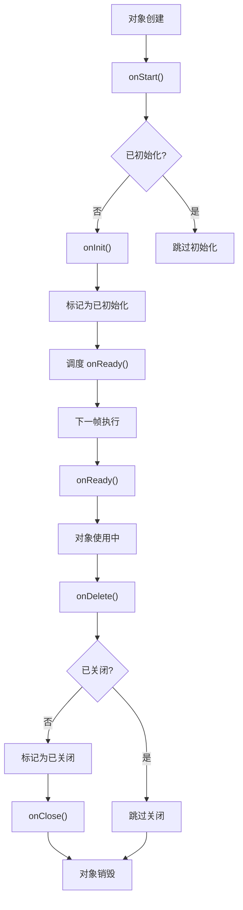

# GetLifeCycleMixin 详解

## 概述

`GetLifeCycleMixin` 是 GetX 框架中用于管理控制器生命周期的核心 mixin。它为所有需要生命周期管理的类（如 `GetxController`、`RxController`、`GetxService` 等）提供了统一的生命周期管理机制，确保资源能够正确地初始化和清理，避免内存泄漏。

`GetLifeCycleMixin` 通过 mixin 模式实现，使得任何类都可以通过混入这个 mixin 来获得完整的生命周期管理能力。它定义了从对象创建到销毁的完整生命周期流程，包括初始化、就绪、关闭等关键阶段。

## 核心功能

`GetLifeCycleMixin` 主要提供以下核心功能：

1. **生命周期管理**：提供 `onStart`、`onInit`、`onReady`、`onClose`、`onDelete` 等生命周期方法
2. **状态跟踪**：通过 `initialized` 和 `isClosed` 属性跟踪对象的初始化和关闭状态
3. **防止重复操作**：通过状态标志防止重复初始化和重复关闭
4. **框架集成**：与 GetX 的依赖注入系统无缝集成，自动管理生命周期

## Mixin 定义

### Mixin 声明

```dart 14:14:lib/get_instance/src/lifecycle.dart
mixin GetLifeCycleMixin {
```

**设计说明**：

- `mixin`：使用 Dart 的 mixin 关键字，允许其他类通过 `with` 关键字混入
- 无类型参数：这是一个通用的 mixin，适用于所有需要生命周期管理的类
- 无约束：不要求混入的类必须实现特定接口，提供了最大的灵活性

## 生命周期方法详解

### `onStart()` - 生命周期入口

```dart 41:53:lib/get_instance/src/lifecycle.dart
  /// Called at the exact moment the widget is allocated in memory.
  /// It uses an internal "callable" type, to avoid any @overrides in subclasses.
  /// This method should be internal and is required to define the
  /// lifetime cycle of the subclass.
  // @protected
  @mustCallSuper
  @nonVirtual
  void onStart() {
    // _checkIfAlreadyConfigured();
    if (_initialized) return;
    onInit();
    _initialized = true;
  }
```

**功能说明**：

- 生命周期管理的入口方法，在对象分配内存时被调用
- 防止重复初始化：通过 `_initialized` 标志确保只初始化一次
- 调用 `onInit()` 执行实际的初始化逻辑
- 标记对象为已初始化状态

**设计特点**：

- `@mustCallSuper`：要求子类在重写时必须调用 `super.onStart()`
- `@nonVirtual`：防止子类重写，确保生命周期流程的一致性
- 内部方法：虽然未标记为 `@protected`，但设计意图是作为内部方法使用

**调用时机**：由 GetX 的依赖注入系统在对象创建后自动调用，通常通过 `extension_instance.dart` 中的 `_startController()` 方法触发。

**使用场景**：开发者通常不需要直接调用此方法，它由框架自动管理。

### `onInit()` - 初始化方法

```dart 15:21:lib/get_instance/src/lifecycle.dart
  /// Called immediately after the widget is allocated in memory.
  /// You might use this to initialize something for the controller.
  @protected
  @mustCallSuper
  void onInit() {
    Engine.instance.addPostFrameCallback((_) => onReady());
  }
```

**功能说明**：

- 在对象分配内存后立即调用，用于执行初始化逻辑
- 自动调度 `onReady()`：通过 `Engine.instance.addPostFrameCallback()` 确保 `onReady()` 在下一帧执行
- 适合进行同步初始化操作

**参数**：无

**使用场景**：

- 初始化变量和数据结构
- 设置初始状态
- 注册监听器
- 执行不需要等待 UI 构建完成的初始化操作

**注意事项**：

- `@protected`：表示这是一个受保护的方法，建议在子类中重写而不是直接调用
- `@mustCallSuper`：重写时必须调用 `super.onInit()`，否则 `onReady()` 不会被自动调度
- 不应在此方法中执行导航操作或显示对话框，这些操作应在 `onReady()` 中执行

**使用示例**：

```dart
class MyController extends GetxController {
  late TextEditingController textController;
  late StreamSubscription subscription;

  @override
  void onInit() {
    super.onInit(); // 必须调用
    textController = TextEditingController();
    subscription = someStream.listen((data) {
      // 处理数据
    });
  }
}
```

### `onReady()` - 就绪回调

```dart 23:26:lib/get_instance/src/lifecycle.dart
  /// Called 1 frame after onInit(). It is the perfect place to enter
  /// navigation events, like snackbar, dialogs, or a new route, or
  /// async request.
  void onReady() {}
```

**功能说明**：

- 在 `onInit()` 执行后的一帧被调用
- 此时 UI 已经构建完成，可以安全地执行导航操作
- 适合执行异步操作和需要 UI 上下文的操作

**参数**：无

**调用时机**：通过 `Engine.instance.addPostFrameCallback()` 在下一帧执行，确保 UI 已经完全构建。

**使用场景**：

- 导航操作：打开新页面、显示对话框、显示 Snackbar
- 异步请求：发起网络请求、加载数据
- UI 相关操作：需要访问 BuildContext 的操作
- 需要等待 UI 构建完成的操作

**使用示例**：

```dart
class UserController extends GetxController {
  final userService = Get.find<UserService>();
  User? user;

  @override
  void onReady() {
    super.onReady();
    // 此时可以安全地执行导航操作
    loadUserData();
  }

  Future<void> loadUserData() async {
    user = await userService.getUser();
    update();
  }
}
```

**与 `onInit()` 的区别**：

- `onInit()`：同步初始化，UI 可能尚未构建完成
- `onReady()`：延迟一帧执行，UI 已构建完成，可以安全执行导航和异步操作

### `onClose()` - 资源清理方法

```dart 28:34:lib/get_instance/src/lifecycle.dart
  /// Called before [onDelete] method. [onClose] might be used to
  /// dispose resources used by the controller. Like closing events,
  /// or streams before the controller is destroyed.
  /// Or dispose objects that can potentially create some memory leaks,
  /// like TextEditingControllers, AnimationControllers.
  /// Might be useful as well to persist some data on disk.
  void onClose() {}
```

**功能说明**：

- 在对象销毁前被调用，用于清理资源
- 防止内存泄漏：关闭 Stream、取消订阅、释放控制器等
- 可选的数据持久化：可以在此方法中保存数据到磁盘

**参数**：无

**调用时机**：由 `onDelete()` 方法调用，在对象从内存中移除之前执行。

**使用场景**：

- 关闭 Stream 和订阅
- 释放 TextEditingController、AnimationController 等控制器
- 取消网络请求
- 移除监听器
- 保存数据到本地存储

**使用示例**：

```dart
class MyController extends GetxController {
  late TextEditingController textController;
  StreamSubscription? subscription;
  Timer? timer;

  @override
  void onInit() {
    super.onInit();
    textController = TextEditingController();
    subscription = someStream.listen((data) {});
    timer = Timer.periodic(Duration(seconds: 1), (_) {});
  }

  @override
  void onClose() {
    // 清理资源
    textController.dispose();
    subscription?.cancel();
    timer?.cancel();
    super.onClose(); // 建议调用，虽然当前实现是空方法
  }
}
```

### `onDelete()` - 销毁方法

```dart 60:67:lib/get_instance/src/lifecycle.dart
  // Called when the controller is removed from memory.
  @mustCallSuper
  @nonVirtual
  void onDelete() {
    if (_isClosed) return;
    _isClosed = true;
    onClose();
  }
```

**功能说明**：

- 对象从内存中移除时被调用
- 防止重复关闭：通过 `_isClosed` 标志确保只执行一次清理
- 调用 `onClose()` 执行实际的资源清理逻辑
- 标记对象为已关闭状态

**设计特点**：

- `@mustCallSuper`：要求子类在重写时必须调用 `super.onDelete()`
- `@nonVirtual`：防止子类重写，确保生命周期流程的一致性
- 内部方法：由框架自动调用，开发者通常不需要直接调用

**调用时机**：由 GetX 的依赖注入系统在对象销毁时自动调用，通常通过 `extension_instance.dart` 中的 `delete()` 方法触发。

**使用场景**：开发者通常不需要直接调用或重写此方法，它由框架自动管理。

## 状态管理

### `initialized` - 初始化状态

```dart 36:39:lib/get_instance/src/lifecycle.dart
  bool _initialized = false;

  /// Checks whether the controller has already been initialized.
  bool get initialized => _initialized;
```

**功能说明**：

- `_initialized`：私有字段，跟踪对象是否已初始化
- `initialized`：公共 getter，允许外部查询初始化状态
- 防止重复初始化：在 `onStart()` 中检查此标志，确保只初始化一次

**使用场景**：

- 检查控制器是否已初始化
- 防止重复初始化操作
- 调试和日志记录

**使用示例**：

```dart
final controller = Get.find<MyController>();
if (controller.initialized) {
  print('控制器已初始化');
} else {
  print('控制器尚未初始化');
}
```

### `isClosed` - 关闭状态

```dart 55:58:lib/get_instance/src/lifecycle.dart
  bool _isClosed = false;

  /// Checks whether the controller has already been closed.
  bool get isClosed => _isClosed;
```

**功能说明**：

- `_isClosed`：私有字段，跟踪对象是否已关闭
- `isClosed`：公共 getter，允许外部查询关闭状态
- 防止重复关闭：在 `onDelete()` 中检查此标志，确保只关闭一次

**使用场景**：

- 检查控制器是否已关闭
- 防止在已关闭的控制器上执行操作
- 调试和日志记录

**使用示例**：

```dart
final controller = Get.find<MyController>();
if (controller.isClosed) {
  print('控制器已关闭，不应再使用');
} else {
  controller.doSomething();
}
```

## 生命周期流程

### 完整的生命周期流程

GetX 控制器的完整生命周期流程如下：



### 生命周期时序

1. **创建阶段**：
   - 对象在内存中分配
   - `onStart()` 被调用
   - `onInit()` 被调用
   - `onReady()` 被调度到下一帧

2. **使用阶段**：
   - 对象处于活跃状态
   - 可以执行各种业务逻辑
   - `initialized = true`，`isClosed = false`

3. **销毁阶段**：
   - `onDelete()` 被调用
   - `onClose()` 被调用
   - 资源被清理
   - `isClosed = true`

## 与 GetX 系统的集成

### 在 GetxController 中的使用

```dart 26:26:lib/get_state_manager/src/simple/get_controllers.dart
abstract class GetxController extends ListNotifier with GetLifeCycleMixin {
```

`GetxController` 通过混入 `GetLifeCycleMixin` 获得生命周期管理能力，同时继承 `ListNotifier` 获得状态管理能力。

### 在 RxController 中的使用

```dart 132:132:lib/get_state_manager/src/simple/get_controllers.dart
abstract class RxController with GetLifeCycleMixin {}
```

`RxController` 是一个轻量级的控制器，只提供生命周期管理，适合只需要响应式变量的场景。

### 在 GetxService 中的使用

```dart 87:87:lib/get_instance/src/lifecycle.dart
abstract class GetxService with GetLifeCycleMixin, GetxServiceMixin {}
```

`GetxService` 用于创建长期存在的服务，不会被自动销毁，只有通过 `Get.reset()` 才能移除。

### 在依赖注入系统中的调用

GetX 的依赖注入系统会自动管理生命周期：

```dart 246:260:lib/get_instance/src/extension_instance.dart
  S _startController<S>({String? tag}) {
    final key = _getKey(S, tag);
    final i = _singl[key]!.getDependency() as S;
    if (i is GetLifeCycleMixin) {
      i.onStart();
      if (tag == null) {
        Get.log('Instance "$S" has been initialized');
      } else {
        Get.log('Instance "$S" with tag "$tag" has been initialized');
      }
      if (!_singl[key]!.isSingleton!) {
        RouterReportManager.instance.appendRouteByCreate(i);
      }
    }
    return i;
  }
```

当通过 `Get.find()` 或 `Get.put()` 获取控制器时，如果控制器实现了 `GetLifeCycleMixin`，系统会自动调用 `onStart()` 方法。

销毁时的调用：

```dart 390:393:lib/get_instance/src/extension_instance.dart
    if (i is GetLifeCycleMixin) {
      i.onDelete();
      Get.log('"$newKey" onDelete() called');
    }
```

当通过 `Get.delete()` 删除控制器时，系统会自动调用 `onDelete()` 方法。

## 与其他 Mixin 的协作

### 与 ScrollMixin 的协作

```dart 70:118:lib/get_state_manager/src/simple/get_controllers.dart
mixin ScrollMixin on GetLifeCycleMixin {
  /// The scroll controller used to detect scroll position
  final ScrollController scroll = ScrollController();

  @override
  void onInit() {
    super.onInit();
    scroll.addListener(_listener);
  }

  // ... 其他代码 ...

  @override
  void onClose() {
    scroll.removeListener(_listener);
    scroll.dispose();
    super.onClose();
  }
}
```

`ScrollMixin` 要求混入的类必须实现 `GetLifeCycleMixin`，并在 `onInit()` 和 `onClose()` 中管理 ScrollController 的生命周期。

## 使用场景

### 基本控制器使用

```dart
class CounterController extends GetxController {
  var count = 0;

  void increment() {
    count++;
    update();
  }

  @override
  void onInit() {
    super.onInit();
    print('计数器控制器已初始化');
  }

  @override
  void onReady() {
    super.onReady();
    print('计数器控制器已就绪');
  }

  @override
  void onClose() {
    print('计数器控制器正在关闭');
    super.onClose();
  }
}
```

### 资源清理示例

```dart
class DataController extends GetxController {
  late TextEditingController searchController;
  StreamSubscription? dataSubscription;
  Timer? refreshTimer;

  @override
  void onInit() {
    super.onInit();
    searchController = TextEditingController();
    dataSubscription = dataStream.listen((data) {
      // 处理数据
    });
    refreshTimer = Timer.periodic(
      Duration(minutes: 5),
      (_) => refreshData(),
    );
  }

  @override
  void onClose() {
    // 清理所有资源
    searchController.dispose();
    dataSubscription?.cancel();
    refreshTimer?.cancel();
    super.onClose();
  }

  void refreshData() {
    // 刷新数据
  }
}
```

### 异步初始化示例

```dart
class UserController extends GetxController {
  User? user;
  bool isLoading = false;

  @override
  void onReady() {
    super.onReady();
    // 在 onReady 中执行异步操作
    loadUser();
  }

  Future<void> loadUser() async {
    isLoading = true;
    update();
    try {
      user = await userService.getUser();
    } catch (e) {
      Get.snackbar('错误', '加载用户失败');
    } finally {
      isLoading = false;
      update();
    }
  }
}
```

### 导航操作示例

```dart
class HomeController extends GetxController {
  @override
  void onReady() {
    super.onReady();
    // 在 onReady 中可以安全地执行导航操作
    showWelcomeDialog();
  }

  void showWelcomeDialog() {
    Get.dialog(
      AlertDialog(
        title: Text('欢迎'),
        content: Text('欢迎使用应用'),
        actions: [
          TextButton(
            onPressed: () => Get.back(),
            child: Text('确定'),
          ),
        ],
      ),
    );
  }
}
```

### 数据持久化示例

```dart
class SettingsController extends GetxController {
  final prefs = Get.find<SharedPreferences>();
  String theme = 'light';

  @override
  void onInit() {
    super.onInit();
    // 从本地存储加载设置
    theme = prefs.getString('theme') ?? 'light';
  }

  void changeTheme(String newTheme) {
    theme = newTheme;
    prefs.setString('theme', newTheme);
    update();
  }

  @override
  void onClose() {
    // 保存设置到本地存储
    prefs.setString('theme', theme);
    super.onClose();
  }
}
```

## 注意事项

### 1. @mustCallSuper 的重要性

所有标记了 `@mustCallSuper` 的方法在重写时必须调用 `super` 方法：

```dart
@override
void onInit() {
  super.onInit(); // 必须调用，否则 onReady() 不会被调度
  // 你的初始化代码
}

@override
void onClose() {
  // 你的清理代码
  super.onClose(); // 建议调用，保持一致性
}
```

**不调用 `super.onInit()` 的后果**：

- `onReady()` 不会被自动调度
- 可能导致生命周期流程异常
- 其他依赖 `onInit()` 行为的 mixin 可能无法正常工作

### 2. @nonVirtual 的作用

`onStart()` 和 `onDelete()` 被标记为 `@nonVirtual`，这意味着：

- 子类不能重写这些方法
- 确保生命周期流程的一致性
- 防止开发者破坏生命周期管理机制

如果需要自定义行为，应该重写 `onInit()` 和 `onClose()` 方法。

### 3. @protected 的含义

`onInit()` 被标记为 `@protected`：

- 表示这是一个受保护的方法
- 建议在子类中重写而不是直接调用
- 外部代码不应该直接调用此方法

### 4. Engine.instance.addPostFrameCallback 的工作原理

```dart 3:7:lib/get_core/src/flutter_engine.dart
class Engine {
  static WidgetsBinding get instance {
    return WidgetsFlutterBinding.ensureInitialized();
  }
}
```

`Engine.instance` 返回 Flutter 的 `WidgetsBinding` 实例，`addPostFrameCallback()` 是 Flutter 提供的方法，用于在当前帧渲染完成后执行回调。这确保了 `onReady()` 在 UI 完全构建后才执行。

### 5. 生命周期调用的顺序

正确的生命周期调用顺序：

1. `onStart()` - 由框架自动调用
2. `onInit()` - 在 `onStart()` 中调用
3. `onReady()` - 在下一帧通过回调调用
4. `onDelete()` - 由框架自动调用
5. `onClose()` - 在 `onDelete()` 中调用

### 6. 防止重复初始化和关闭

框架通过 `_initialized` 和 `_isClosed` 标志防止重复操作：

```dart
// 即使多次调用 onStart()，也只会初始化一次
controller.onStart(); // 初始化
controller.onStart(); // 被忽略，因为 _initialized = true

// 即使多次调用 onDelete()，也只会关闭一次
controller.onDelete(); // 关闭
controller.onDelete(); // 被忽略，因为 _isClosed = true
```

### 7. 不要在 onInit 中执行导航操作

`onInit()` 执行时 UI 可能尚未构建完成，因此不应在此方法中执行导航操作：

```dart
// 错误示例
@override
void onInit() {
  super.onInit();
  Get.to(NextPage()); // 可能导致错误
}

// 正确示例
@override
void onReady() {
  super.onReady();
  Get.to(NextPage()); // UI 已构建完成，安全
}
```

### 8. GetxService 的特殊性

`GetxService` 虽然也使用 `GetLifeCycleMixin`，但它不会被自动销毁：

```dart
abstract class GetxService with GetLifeCycleMixin, GetxServiceMixin {}
```

- `GetxService` 不会被 `Get.delete()` 删除（除非使用 `force: true`）
- 只有通过 `Get.reset()` 才能完全清除
- 适合用于长期存在的服务，如认证服务、配置服务等

### 9. 异步操作的处理

在生命周期方法中执行异步操作时，需要注意：

```dart
@override
void onReady() {
  super.onReady();
  // 异步操作
  loadData().then((data) {
    // 处理数据
  }).catchError((error) {
    // 处理错误
  });
}
```

如果控制器在异步操作完成前被销毁，应该取消操作或检查控制器状态：

```dart
@override
void onReady() {
  super.onReady();
  loadData().then((data) {
    if (!isClosed) {
      // 只有控制器未关闭时才处理数据
      this.data = data;
      update();
    }
  });
}
```

## 总结

`GetLifeCycleMixin` 是 GetX 框架生命周期管理的核心组件，为所有需要生命周期管理的类提供了统一的、可靠的机制。它通过定义清晰的生命周期阶段（初始化、就绪、关闭），确保了资源能够正确地分配和释放，避免了内存泄漏和资源浪费。

理解 `GetLifeCycleMixin` 的工作原理对于正确使用 GetX 框架非常重要，特别是生命周期方法的调用时机、`@mustCallSuper` 的使用、以及资源清理的最佳实践。这些知识将帮助你编写更加健壮、高效的 Flutter 应用。

## 参考资料

- [GetX 状态管理文档](https://github.com/jonataslaw/getx/blob/master/README.md)
- [GetxController 详解](lib/get_state_manager/src/simple/get_controllers.dart)
- [Dart Mixin 文档](https://dart.dev/guides/language/language-tour#adding-features-to-a-class-mixins)
- [Flutter WidgetsBinding 文档](https://api.flutter.dev/flutter/widgets/WidgetsBinding-class.html)
- [GetX 依赖注入文档](lib/get_instance/src/extension_instance.dart)
