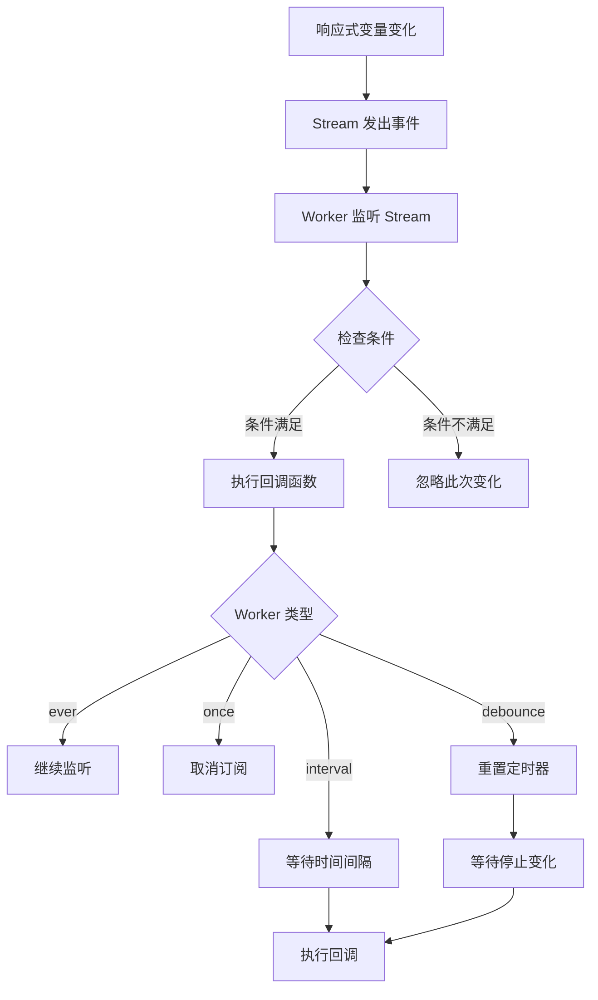
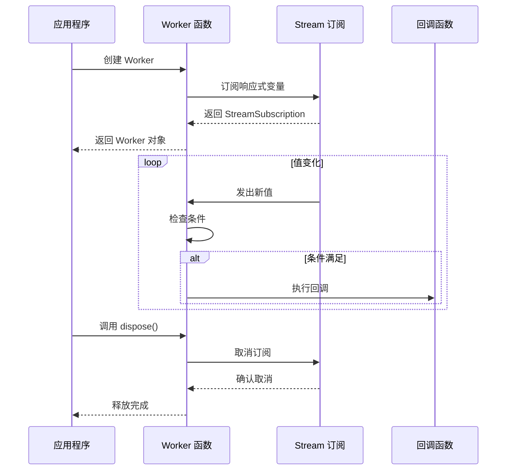
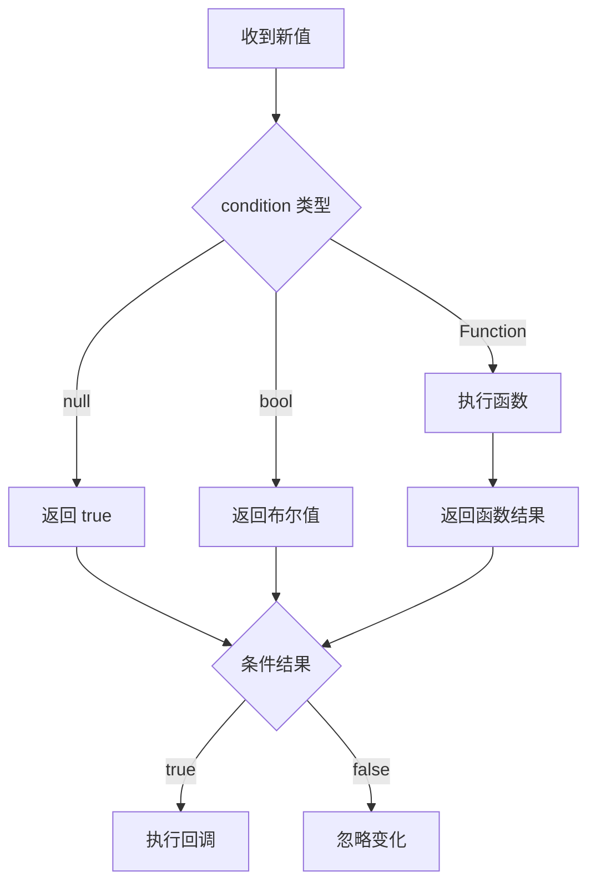

# Rx Workers 详解

## 概述

`rx_workers.dart` 是 GetX 响应式系统中用于监听和处理响应式变量变化的工具模块。它提供了一系列 Worker 函数，用于在响应式变量值发生变化时执行回调函数，支持条件触发、防抖、节流等多种模式。

Worker 是 GetX 响应式编程的重要组成部分，它基于 Dart 的 `Stream` 机制，通过订阅响应式变量的 Stream 来监听值的变化。每个 Worker 都返回一个 `Worker` 对象，可以通过调用 `dispose()` 方法来取消订阅，释放资源。

## 核心组件

### `_conditional()` - 条件判断辅助函数

```dart 8:13:lib/get_rx/src/rx_workers/rx_workers.dart
bool _conditional(dynamic condition) {
  if (condition == null) return true;
  if (condition is bool) return condition;
  if (condition is bool Function()) return condition();
  return true;
}
```

**功能说明**：

`_conditional()` 是一个内部辅助函数，用于统一处理条件判断逻辑。它支持三种类型的条件：

1. **`null`**：返回 `true`，表示无条件执行
2. **`bool`**：直接返回布尔值
3. **`bool Function()`**：执行函数并返回结果

这种设计使得 Worker 函数可以灵活地接受静态布尔值或动态函数作为条件，提高了 API 的易用性。

### `WorkerCallback<T>` - 回调函数类型定义

```dart 15:15:lib/get_rx/src/rx_workers/rx_workers.dart
typedef WorkerCallback<T> = Function(T callback);
```

**功能说明**：

`WorkerCallback<T>` 是一个类型别名，定义了 Worker 回调函数的签名。它接受一个类型为 `T` 的参数（响应式变量的新值），不返回值。

### `Workers` - Worker 集合管理类

```dart 17:28:lib/get_rx/src/rx_workers/rx_workers.dart
class Workers {
  Workers(this.workers);
  final List<Worker> workers;

  void dispose() {
    for (final worker in workers) {
      if (!worker._disposed) {
        worker.dispose();
      }
    }
  }
}
```

**功能说明**：

`Workers` 类用于管理多个 Worker 实例，提供批量释放资源的能力。这在需要同时管理多个 Worker 的场景中非常有用。

**主要方法**：

- `dispose()`：遍历所有 Worker 并调用它们的 `dispose()` 方法，自动跳过已释放的 Worker

### `Worker` - Worker 核心类

```dart 244:273:lib/get_rx/src/rx_workers/rx_workers.dart
class Worker {
  Worker(this.worker, this.type);

  /// subscription.cancel() callback
  final Future<void> Function() worker;

  /// type of worker (debounce, interval, ever)..
  final String type;
  bool _disposed = false;

  bool get disposed => _disposed;

  //final bool _verbose = true;
  void _log(String msg) {
    //  if (!_verbose) return;
    Get.log('$runtimeType $type $msg');
  }

  void dispose() {
    if (_disposed) {
      _log('already disposed');
      return;
    }
    _disposed = true;
    worker();
    _log('disposed');
  }

  void call() => dispose();
}
```

**功能说明**：

`Worker` 类是 Worker 系统的核心，封装了 Stream 订阅的生命周期管理。

**核心属性**：

- `worker`：一个返回 `Future<void>` 的函数，用于取消 Stream 订阅
- `type`：Worker 的类型标识（如 `'[ever]'`、`'[once]'`、`'[debounce]'` 等），用于日志记录
- `_disposed`：标记 Worker 是否已被释放

**主要方法**：

- `dispose()`：释放 Worker，取消 Stream 订阅。如果已经释放过，则直接返回
- `call()`：函数式调用语法，等同于 `dispose()`

**设计要点**：

- 使用 `_disposed` 标志防止重复释放，确保资源安全
- 通过 `_log()` 方法记录 Worker 的生命周期事件（当前被注释，但保留用于调试）
- 支持函数式调用 `worker()` 来释放资源

## Worker 函数详解

### `ever()` - 每次变化都触发

```dart 60:77:lib/get_rx/src/rx_workers/rx_workers.dart
Worker ever<T>(
  GetListenable<T> listener,
  WorkerCallback<T> callback, {
  dynamic condition = true,
  Function? onError,
  void Function()? onDone,
  bool? cancelOnError,
}) {
  StreamSubscription sub = listener.listen(
    (event) {
      if (_conditional(condition)) callback(event);
    },
    onError: onError,
    onDone: onDone,
    cancelOnError: cancelOnError,
  );
  return Worker(sub.cancel, '[ever]');
}
```

**功能说明**：

`ever()` 函数会在响应式变量每次发生变化时都触发回调函数，只要条件满足。它是所有 Worker 函数中最基础的一个。

**参数说明**：

- `listener`：要监听的响应式变量（`GetListenable<T>` 类型）
- `callback`：值变化时的回调函数
- `condition`：可选条件，可以是 `bool` 或 `bool Function()`，默认为 `true`
- `onError`：Stream 错误处理函数
- `onDone`：Stream 完成时的回调函数
- `cancelOnError`：发生错误时是否自动取消订阅

**使用场景**：

- 需要在每次值变化时都执行某些操作
- 需要根据条件选择性执行回调
- 需要监听响应式变量的所有变化

**工作原理**：

1. 调用 `listener.listen()` 订阅响应式变量的 Stream
2. 每次收到新值时，检查条件是否满足
3. 如果条件满足，执行回调函数
4. 返回 `Worker` 对象，用于管理订阅生命周期

### `everAll()` - 监听多个响应式变量

```dart 83:111:lib/get_rx/src/rx_workers/rx_workers.dart
Worker everAll(
  List<RxInterface> listeners,
  WorkerCallback callback, {
  dynamic condition = true,
  Function? onError,
  void Function()? onDone,
  bool? cancelOnError,
}) {
  final evers = <StreamSubscription>[];
  for (var i in listeners) {
    final sub = i.listen(
      (event) {
        if (_conditional(condition)) callback(event);
      },
      onError: onError,
      onDone: onDone,
      cancelOnError: cancelOnError,
    );
    evers.add(sub);
  }

  Future<void> cancel() async {
    for (var i in evers) {
      i.cancel();
    }
  }

  return Worker(cancel, '[everAll]');
}
```

**功能说明**：

`everAll()` 函数类似于 `ever()`，但可以同时监听多个响应式变量。当任何一个被监听的变量发生变化时，都会触发回调函数。

**参数说明**：

- `listeners`：要监听的响应式变量列表（`List<RxInterface>` 类型）
- `callback`：值变化时的回调函数
- `condition`：可选条件，对所有监听器共享
- `onError`、`onDone`、`cancelOnError`：Stream 相关参数

**使用场景**：

- 需要同时监听多个响应式变量的变化
- 当任意一个变量变化时都需要执行相同的操作
- 需要统一管理多个监听器的生命周期

**工作原理**：

1. 遍历 `listeners` 列表，为每个响应式变量创建 Stream 订阅
2. 将所有订阅保存在 `evers` 列表中
3. 创建一个统一的 `cancel()` 函数，用于取消所有订阅
4. 返回 `Worker` 对象，调用 `dispose()` 时会取消所有订阅

### `once()` - 只触发一次

```dart 134:158:lib/get_rx/src/rx_workers/rx_workers.dart
Worker once<T>(
  GetListenable<T> listener,
  WorkerCallback<T> callback, {
  dynamic condition = true,
  Function? onError,
  void Function()? onDone,
  bool? cancelOnError,
}) {
  late Worker ref;
  StreamSubscription? sub;
  sub = listener.listen(
    (event) {
      if (!_conditional(condition)) return;
      ref._disposed = true;
      ref._log('called');
      sub?.cancel();
      callback(event);
    },
    onError: onError,
    onDone: onDone,
    cancelOnError: cancelOnError,
  );
  ref = Worker(sub.cancel, '[once]');
  return ref;
}
```

**功能说明**：

`once()` 函数只会在条件满足时执行一次回调，执行后自动取消订阅。这对于只需要在特定条件下执行一次操作的场景非常有用。

**参数说明**：

参数与 `ever()` 相同。

**使用场景**：

- 只需要在条件满足时执行一次操作
- 需要在特定值出现时执行一次性任务
- 需要自动清理订阅，避免内存泄漏

**工作原理**：

1. 创建 Stream 订阅
2. 当收到新值且条件满足时：
   - 标记 Worker 为已释放状态
   - 记录日志
   - 立即取消订阅
   - 执行回调函数
3. 使用 `late` 关键字处理循环引用问题（`ref` 需要在创建 `Worker` 之前使用）

**设计要点**：

- 使用 `late Worker ref` 和 `StreamSubscription? sub` 来处理循环引用
- 执行回调后立即取消订阅，确保只执行一次

### `interval()` - 间隔触发

```dart 177:200:lib/get_rx/src/rx_workers/rx_workers.dart
Worker interval<T>(
  GetListenable<T> listener,
  WorkerCallback<T> callback, {
  Duration time = const Duration(seconds: 1),
  dynamic condition = true,
  Function? onError,
  void Function()? onDone,
  bool? cancelOnError,
}) {
  var debounceActive = false;
  StreamSubscription sub = listener.listen(
    (event) async {
      if (debounceActive || !_conditional(condition)) return;
      debounceActive = true;
      await Future.delayed(time);
      debounceActive = false;
      callback(event);
    },
    onError: onError,
    onDone: onDone,
    cancelOnError: cancelOnError,
  );
  return Worker(sub.cancel, '[interval]');
}
```

**功能说明**：

`interval()` 函数会在响应式变量变化后，等待指定的时间间隔，然后执行回调。如果在等待期间又有新的变化，会忽略这些变化，只处理第一个变化。

**参数说明**：

- `time`：等待的时间间隔，默认为 1 秒
- 其他参数与 `ever()` 相同

**使用场景**：

- 需要限制回调函数的执行频率
- 需要在值变化后延迟执行操作
- 需要忽略短时间内频繁的变化，只处理第一次变化

**工作原理**：

1. 使用 `debounceActive` 标志来跟踪是否正在等待
2. 当收到新值且条件满足时：
   - 如果正在等待，直接返回（忽略此次变化）
   - 设置 `debounceActive = true`
   - 等待指定的时间间隔
   - 设置 `debounceActive = false`
   - 执行回调函数

**注意事项**：

- `interval()` 处理的是**第一个**变化，如果在等待期间有多次变化，只会处理第一次
- 使用 `async/await` 实现异步等待

### `debounce()` - 防抖触发

```dart 221:242:lib/get_rx/src/rx_workers/rx_workers.dart
Worker debounce<T>(
  GetListenable<T> listener,
  WorkerCallback<T> callback, {
  Duration? time,
  Function? onError,
  void Function()? onDone,
  bool? cancelOnError,
}) {
  final newDebouncer =
      Debouncer(delay: time ?? const Duration(milliseconds: 800));
  StreamSubscription sub = listener.listen(
    (event) {
      newDebouncer(() {
        callback(event);
      });
    },
    onError: onError,
    onDone: onDone,
    cancelOnError: cancelOnError,
  );
  return Worker(sub.cancel, '[debounce]');
}
```

**功能说明**：

`debounce()` 函数会在响应式变量停止变化一段时间后执行回调，使用的是最后一次变化的值。这对于处理用户输入等场景非常有用。

**参数说明**：

- `time`：防抖延迟时间，默认为 800 毫秒
- 其他参数与 `ever()` 相同

**使用场景**：

- 搜索框输入：等待用户停止输入后再执行搜索
- 表单验证：等待用户停止输入后再验证
- 防止频繁的网络请求（Anti-DDoS）
- 窗口大小调整：等待用户停止调整后再重新布局

**工作原理**：

1. 创建 `Debouncer` 实例，设置延迟时间
2. 每次收到新值时，调用 `newDebouncer()`，它会：
   - 取消之前的定时器（如果存在）
   - 创建新的定时器，在延迟时间后执行回调
3. 如果在这段时间内又有新值，会再次取消并重新计时
4. 只有在停止变化一段时间后，才会执行回调

**与 `interval()` 的区别**：

- `interval()`：处理**第一个**变化，忽略后续变化
- `debounce()`：处理**最后一个**变化，等待变化停止

## 使用示例

### `ever()` 使用示例

```dart
class CountController extends GetxController {
  final count = 0.obs;
  Worker? worker;

  @override
  void onInit() {
    super.onInit();
    // 只有当 count > 5 时才执行回调
    worker = ever(count, (value) {
      print('计数器变化为: $value');
      if (value == 10) {
        worker?.dispose(); // 达到 10 时释放 Worker
      }
    }, condition: () => count.value > 5);
  }

  void increment() => count.value++;
}
```

### `everAll()` 使用示例

```dart
class FormController extends GetxController {
  final username = ''.obs;
  final email = ''.obs;
  final password = ''.obs;
  Worker? worker;

  @override
  void onInit() {
    super.onInit();
    // 监听多个字段，任意一个变化时都执行验证
    worker = everAll(
      [username, email, password],
      (value) {
        validateForm();
      },
      condition: () => username.value.isNotEmpty &&
          email.value.isNotEmpty &&
          password.value.isNotEmpty,
    );
  }

  void validateForm() {
    // 执行表单验证逻辑
  }
}
```

### `once()` 使用示例

```dart
class LoginController extends GetxController {
  final loginStatus = LoginStatus.initial.obs;
  Worker? worker;

  @override
  void onInit() {
    super.onInit();
    // 只在登录成功时执行一次欢迎消息
    worker = once(loginStatus, (status) {
      if (status == LoginStatus.success) {
        Get.snackbar('欢迎', '登录成功！');
      }
    }, condition: () => loginStatus.value == LoginStatus.success);
  }
}
```

### `interval()` 使用示例

```dart
class SearchController extends GetxController {
  final query = ''.obs;
  Worker? worker;

  @override
  void onInit() {
    super.onInit();
    // 每次查询变化后等待 1 秒再执行搜索
    worker = interval(
      query,
      (value) {
        performSearch(value);
      },
      time: const Duration(seconds: 1),
      condition: () => query.value.length >= 3, // 至少 3 个字符
    );
  }

  void performSearch(String query) {
    // 执行搜索逻辑
  }
}
```

### `debounce()` 使用示例

```dart
class SearchController extends GetxController {
  final searchQuery = ''.obs;
  Worker? worker;

  @override
  void onInit() {
    super.onInit();
    // 等待用户停止输入 500 毫秒后再执行搜索
    worker = debounce(
      searchQuery,
      (value) {
        if (value.isNotEmpty) {
          performSearch(value);
        }
      },
      time: const Duration(milliseconds: 500),
    );
  }

  void performSearch(String query) {
    // 执行搜索逻辑
  }
}
```

## 工作原理

### Stream 订阅机制

所有 Worker 函数都基于 Dart 的 `Stream` 机制工作。响应式变量（如 `Rx<T>`）实现了 `GetListenable<T>` 接口，该接口提供了 `listen()` 方法，返回 `StreamSubscription<T>`。



### Worker 生命周期



### 条件判断流程



## 最佳实践

### 1. 及时释放 Worker

Worker 会持有 Stream 订阅，如果不及时释放，可能导致内存泄漏。建议在以下时机释放：

- 在 `GetxController` 的 `onClose()` 方法中释放
- 在不再需要监听时立即释放
- 在条件满足后自动释放（如 `once()` 的使用场景）

```dart
class MyController extends GetxController {
  Worker? worker;

  @override
  void onInit() {
    super.onInit();
    worker = ever(count, (value) {
      // 处理逻辑
    });
  }

  @override
  void onClose() {
    worker?.dispose(); // 重要：释放 Worker
    super.onClose();
  }
}
```

### 2. 使用 `Workers` 管理多个 Worker

如果需要管理多个 Worker，可以使用 `Workers` 类：

```dart
class MyController extends GetxController {
  Workers? workers;

  @override
  void onInit() {
    super.onInit();
    workers = Workers([
      ever(count1, (value) {}),
      ever(count2, (value) {}),
      debounce(query, (value) {}),
    ]);
  }

  @override
  void onClose() {
    workers?.dispose(); // 一次性释放所有 Worker
    super.onClose();
  }
}
```

### 3. 合理选择 Worker 类型

- **`ever()`**：需要监听所有变化时使用
- **`once()`**：只需要执行一次时使用
- **`interval()`**：需要限制执行频率，处理第一次变化时使用
- **`debounce()`**：需要等待停止变化，处理最后一次变化时使用（如搜索、输入验证）

### 4. 使用条件参数优化性能

通过 `condition` 参数可以避免不必要的回调执行：

```dart
// 好的做法：只在值大于 0 时执行
worker = ever(count, (value) {
  // 处理逻辑
}, condition: () => count.value > 0);

// 避免：在回调中判断
worker = ever(count, (value) {
  if (count.value > 0) { // 不推荐：回调仍会被调用
    // 处理逻辑
  }
});
```

### 5. 错误处理

Worker 支持错误处理，可以在创建时指定 `onError` 回调：

```dart
worker = ever(
  data,
  (value) {
    // 处理逻辑
  },
  onError: (error) {
    print('发生错误: $error');
    // 错误处理逻辑
  },
);
```

### 6. 避免在回调中修改被监听的变量

在 Worker 回调中修改被监听的变量可能导致无限循环：

```dart
// 危险：可能导致无限循环
worker = ever(count, (value) {
  count.value++; // 不要这样做！
});

// 安全：使用条件或延迟
worker = ever(count, (value) {
  if (value < 10) {
    Future.microtask(() => count.value++); // 使用 Future 延迟
  }
});
```

## 总结

`rx_workers.dart` 提供了强大的响应式变量监听机制，通过不同的 Worker 函数可以满足各种场景的需求：

- **`ever()`**：基础监听，每次变化都触发
- **`everAll()`**：批量监听，同时监听多个变量
- **`once()`**：一次性执行，自动清理
- **`interval()`**：节流处理，限制执行频率
- **`debounce()`**：防抖处理，等待停止变化

理解 Worker 的工作原理和最佳实践，可以帮助开发者更好地使用 GetX 的响应式系统，编写出高效、可维护的代码。

## 参考资料

- [GetX 状态管理文档](https://github.com/jonataslaw/getx/blob/master/README.md)
- [GetListenable 详解](lib/get_state_manager/src/rx_flutter/rx_notifier.dart_get-listenable.md)
- [RxInterface 详解](lib/get_rx/src/rx_types/rx_core/rx_interface.dart_rx-interface.md)
- [Dart Stream 文档](https://dart.dev/guides/libraries/library-tour#streams)
