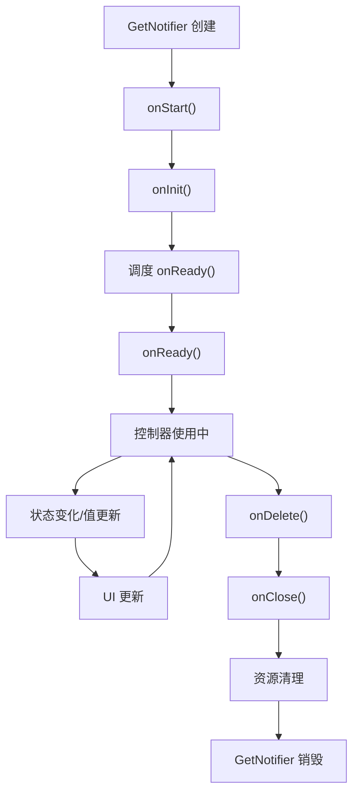

# GetNotifier 详解

## 概述

`GetNotifier<T>` 是 GetX 框架中结合了状态管理、监听器机制和生命周期管理的抽象控制器基类。它继承自 `Value<T>`（获得状态管理和监听器管理能力），并混入 `GetLifeCycleMixin`（获得生命周期管理能力），为需要完整状态和生命周期管理的控制器提供了统一的基础实现。

`GetNotifier<T>` 通过巧妙的设计，将状态管理、监听器管理和生命周期管理结合在一起，使得开发者可以专注于业务逻辑，而无需手动管理复杂的状态转换和资源清理。它特别适用于需要异步操作状态管理和生命周期回调的场景。

## 核心功能

`GetNotifier<T>` 主要提供以下核心功能：

1. **状态管理**：通过继承 `Value<T>` 和混入 `StateMixin<T>`，提供基于 `GetStatus` 的状态管理能力
2. **监听器管理**：通过继承 `Value<T>` 和 `ListNotifier`，提供完整的监听器添加、移除和管理功能
3. **生命周期管理**：通过混入 `GetLifeCycleMixin`，提供完整的生命周期管理能力
4. **自动资源清理**：生命周期结束时自动清理资源，避免内存泄漏
5. **状态驱动的 UI**：通过 `obx()` 扩展方法简化状态驱动的 UI 构建
6. **异步操作支持**：通过 `futurize()` 方法简化异步操作的状态管理

## 类定义

### 类声明

```dart 229:233:lib/get_state_manager/src/rx_flutter/rx_notifier.dart
/// GetNotifier has a native status and state implementation, with the
/// Get Lifecycle
abstract class GetNotifier<T> extends Value<T> with GetLifeCycleMixin {
  GetNotifier(super.initial);
}
```

**设计说明**：

- `abstract`：抽象类，不能直接实例化，必须通过子类继承使用
- `extends Value<T>`：继承自 `Value<T>`，获得状态管理和监听器管理能力
- `with GetLifeCycleMixin`：混入 `GetLifeCycleMixin`，获得生命周期管理能力
- 泛型 `<T>`：支持任意类型的状态数据
- 构造函数：接受初始值并通过 `super.initial` 传递给 `Value<T>`

**为什么使用抽象类**：

- 强制开发者创建子类，确保每个控制器都有明确的业务逻辑
- 提供统一的接口和默认实现，减少重复代码
- 防止直接实例化，确保控制器通过依赖注入系统管理

**继承关系**：

- `Value<T>`：提供状态管理和监听器管理能力
  - `ListNotifier`：提供监听器注册和通知机制
  - `StateMixin<T>`：提供基于 `GetStatus` 的状态管理
  - `ValueListenable<T?>`：提供与 Flutter 原生组件集成的能力
- `GetLifeCycleMixin`：提供生命周期管理功能

## 与相关类的关系

### 与 Value 的关系

`GetNotifier<T>` 继承自 `Value<T>`，因此获得了以下能力：

1. **状态管理**：通过 `StateMixin<T>` 提供的状态管理功能（`status`、`state`、`setSuccess()` 等）
2. **监听器管理**：通过 `ListNotifier` 提供的监听器管理功能（`addListener()`、`removeListener()`、`refresh()` 等）
3. **值管理**：直接管理值的存储和更新（`value` getter/setter）
4. **函数式调用**：函数式调用和更新语法（`call()`、`update()` 方法）
5. **Flutter 集成**：通过 `ValueListenable<T?>` 接口与 Flutter 原生组件集成

**设计优势**：

通过继承 `Value<T>`，`GetNotifier<T>` 无需重复实现状态管理和监听器管理的逻辑，保持了代码的简洁性和可维护性。

### 与 GetLifeCycleMixin 的关系

`GetNotifier<T>` 混入 `GetLifeCycleMixin`，因此获得了以下生命周期管理能力：

1. **生命周期方法**：`onInit()`、`onReady()`、`onClose()` 等生命周期回调
2. **状态跟踪**：`initialized` 和 `isClosed` 属性跟踪对象的初始化和关闭状态
3. **防止重复操作**：通过状态标志防止重复初始化和重复关闭
4. **框架集成**：与 GetX 的依赖注入系统无缝集成，自动管理生命周期

**生命周期流程**：



详细的生命周期说明请参考 [GetLifeCycleMixin 详解](lib/get_instance/src/lifecycle.dart_get-lifecycle-mixin.md)。

### 与 StateMixin 的关系

`GetNotifier<T>` 通过继承 `Value<T>` 间接获得了 `StateMixin<T>` 的所有功能：

1. **状态管理**：`status`、`state`、`value` 等属性
2. **便捷方法**：`setSuccess()`、`setError()`、`setLoading()`、`setEmpty()` 等方法
3. **异步操作支持**：`futurize()` 方法
4. **UI 构建扩展**：`obx()` 扩展方法

## 生命周期管理

### 生命周期方法

通过混入 `GetLifeCycleMixin`，`GetNotifier<T>` 提供了完整的生命周期管理能力：

1. **onStart()**：生命周期入口，由框架自动调用
2. **onInit()**：初始化方法，在对象创建后立即调用
3. **onReady()**：就绪回调，在 UI 构建完成后调用（1 帧后）
4. **onClose()**：资源清理方法，在对象销毁前调用
5. **onDelete()**：销毁方法，由框架自动调用

### 生命周期使用示例

```dart
class UserController extends GetNotifier<User?> {
  UserController() : super(null);

  @override
  void onInit() {
    super.onInit();
    // 初始化逻辑
    print('UserController 初始化');
  }

  @override
  void onReady() {
    super.onReady();
    // 在 UI 构建完成后执行
    print('UserController 就绪');
    fetchUser();
  }

  @override
  void onClose() {
    // 清理资源
    print('UserController 关闭');
    super.onClose();
  }

  Future<void> fetchUser() async {
    setLoading();
    try {
      final user = await userService.fetchUser();
      setSuccess(user);
    } catch (e) {
      setError(e.toString());
    }
  }
}
```

### 状态跟踪

`GetLifeCycleMixin` 提供了状态跟踪属性：

- `initialized`：是否已初始化
- `isClosed`：是否已关闭

这些属性可以帮助防止重复操作：

```dart
class MyController extends GetNotifier<String> {
  MyController() : super('初始值');

  void performOperation() {
    if (isClosed) {
      print('控制器已关闭，无法执行操作');
      return;
    }
    // 执行操作
  }
}
```

## 状态管理机制

### 状态管理的使用

`GetNotifier<T>` 通过 `StateMixin<T>` 提供完整的状态管理功能：

```dart
class ProductController extends GetNotifier<List<Product>> {
  ProductController() : super([]);

  @override
  void onReady() {
    super.onReady();
    loadProducts();
  }

  void loadProducts() {
    setLoading();
    futurize(
      () => productService.fetchProducts(),
      initialData: [],
      errorMessage: '加载产品列表失败',
    );
  }
}
```

### 状态与生命周期的结合

状态管理和生命周期管理可以很好地结合使用：

```dart
class DataController extends GetNotifier<Data?> {
  DataController() : super(null);

  @override
  void onInit() {
    super.onInit();
    // 初始化时可以设置初始状态
    setLoading();
  }

  @override
  void onReady() {
    super.onReady();
    // 在 onReady 中开始加载数据
    loadData();
  }

  @override
  void onClose() {
    // 清理资源时可以重置状态
    setEmpty();
    super.onClose();
  }

  Future<void> loadData() async {
    try {
      final data = await dataService.fetchData();
      setSuccess(data);
    } catch (e) {
      setError(e.toString());
    }
  }
}
```

## 使用场景

### 1. API 请求控制器

`GetNotifier<T>` 特别适合用于 API 请求控制器：

```dart
class UserController extends GetNotifier<User?> {
  UserController() : super(null);

  @override
  void onReady() {
    super.onReady();
    fetchUser();
  }

  Future<void> fetchUser() async {
    setLoading();
    try {
      final user = await userService.getUser();
      setSuccess(user);
    } catch (e) {
      setError(e.toString());
    }
  }

  Future<void> updateUser(User user) async {
    setLoading();
    try {
      final updated = await userService.updateUser(user);
      setSuccess(updated);
    } catch (e) {
      setError(e.toString());
    }
  }
}

// 在 widget 中使用
class UserPage extends StatelessWidget {
  @override
  Widget build(BuildContext context) {
    final controller = Get.put(UserController());

    return Scaffold(
      body: controller.obx(
        (user) => UserProfile(user: user),
        onLoading: CircularProgressIndicator(),
        onError: (error) => Text('错误: $error'),
      ),
    );
  }
}
```

### 2. 使用 futurize() 简化异步操作

`futurize()` 方法可以简化异步操作的状态管理：

```dart
class ProductController extends GetNotifier<List<Product>> {
  ProductController() : super([]);

  @override
  void onReady() {
    super.onReady();
    loadProducts();
  }

  void loadProducts() {
    futurize(
      () => productService.fetchProducts(),
      initialData: [],
      errorMessage: '加载产品列表失败',
    );
  }

  void refreshProducts() {
    futurize(
      () => productService.fetchProducts(),
      errorMessage: '刷新产品列表失败',
    );
  }
}

// 在 widget 中使用
controller.obx(
  (products) => ListView.builder(
    itemCount: products.length,
    itemBuilder: (context, index) => ProductItem(products[index]),
  ),
)
```

### 3. 复杂状态管理

`GetNotifier<T>` 可以用于复杂的状态管理场景：

```dart
class SearchController extends GetNotifier<List<Result>> {
  SearchController() : super([]);

  void search(String query) {
    if (query.isEmpty) {
      setEmpty();
      return;
    }

    setLoading();
    futurize(
      () => searchService.search(query),
      useEmpty: true,
    );
  }

  void clear() {
    setEmpty();
  }
}

// 在 widget 中使用
controller.obx(
  (results) => SearchResults(results: results),
  onLoading: SearchLoadingIndicator(),
  onError: (error) => SearchErrorWidget(error: error),
  onEmpty: EmptySearchWidget(),
)
```

### 4. 条件状态更新

根据不同的条件设置不同的状态：

```dart
class FormController extends GetNotifier<FormData> {
  FormController() : super(FormData());

  Future<void> submit() async {
    setLoading();
    try {
      final result = await formService.submit(value);
      if (result.isEmpty) {
        setEmpty();
      } else {
        setSuccess(result);
      }
    } catch (e) {
      setError(e.toString());
    }
  }
}
```

### 5. 资源管理

在生命周期方法中管理资源：

```dart
class TimerController extends GetNotifier<int> {
  TimerController() : super(0);
  
  Timer? _timer;

  @override
  void onReady() {
    super.onReady();
    _startTimer();
  }

  @override
  void onClose() {
    _timer?.cancel();
    _timer = null;
    super.onClose();
  }

  void _startTimer() {
    _timer = Timer.periodic(Duration(seconds: 1), (timer) {
      update((value) => (value ?? 0) + 1);
    });
  }
}
```

## 代码示例

### 基本使用

```dart
class CounterController extends GetNotifier<int> {
  CounterController() : super(0);

  void increment() {
    update((value) => (value ?? 0) + 1);
  }

  void decrement() {
    update((value) => (value ?? 0) - 1);
  }

  void reset() {
    value = 0;
  }
}

// 使用
final controller = Get.put(CounterController());

// 在 widget 中使用
Obx(() => Text('计数: ${controller.value}'))

// 或使用 obx 扩展方法
controller.obx(
  (count) => Text('计数: $count'),
)
```

### 完整 API 请求示例

```dart
class UserController extends GetNotifier<User?> {
  UserController() : super(null);

  @override
  void onInit() {
    super.onInit();
    // 初始化逻辑
    print('UserController 初始化');
  }

  @override
  void onReady() {
    super.onReady();
    // UI 构建完成后加载数据
    fetchUser();
  }

  @override
  void onClose() {
    // 清理资源
    print('UserController 关闭');
    super.onClose();
  }

  Future<void> fetchUser() async {
    setLoading();
    try {
      final user = await userService.getUser();
      setSuccess(user);
    } catch (e) {
      setError(e.toString());
    }
  }

  Future<void> updateUser(User user) async {
    setLoading();
    try {
      final updated = await userService.updateUser(user);
      setSuccess(updated);
    } catch (e) {
      setError(e.toString());
    }
  }
}

// 在 widget 中使用
class UserPage extends StatelessWidget {
  @override
  Widget build(BuildContext context) {
    final controller = Get.put(UserController());

    return Scaffold(
      appBar: AppBar(title: Text('用户信息')),
      body: controller.obx(
        (user) => UserProfile(user: user),
        onLoading: Center(child: CircularProgressIndicator()),
        onError: (error) => Center(
          child: Column(
            mainAxisAlignment: MainAxisAlignment.center,
            children: [
              Text('错误: $error'),
              ElevatedButton(
                onPressed: () => controller.fetchUser(),
                child: Text('重试'),
              ),
            ],
          ),
        ),
      ),
    );
  }
}
```

### 使用 futurize() 简化异步操作

```dart
class ProductController extends GetNotifier<List<Product>> {
  ProductController() : super([]);

  @override
  void onReady() {
    super.onReady();
    loadProducts();
  }

  void loadProducts() {
    futurize(
      () => productService.fetchProducts(),
      initialData: [],
      errorMessage: '加载产品列表失败',
    );
  }

  void refreshProducts() {
    futurize(
      () => productService.fetchProducts(),
      errorMessage: '刷新产品列表失败',
    );
  }
}

// 在 widget 中使用
class ProductPage extends StatelessWidget {
  @override
  Widget build(BuildContext context) {
    final controller = Get.put(ProductController());

    return Scaffold(
      appBar: AppBar(
        title: Text('产品列表'),
        actions: [
          IconButton(
            icon: Icon(Icons.refresh),
            onPressed: () => controller.refreshProducts(),
          ),
        ],
      ),
      body: controller.obx(
        (products) => ListView.builder(
          itemCount: products.length,
          itemBuilder: (context, index) => ProductItem(products[index]),
        ),
        onLoading: Center(child: CircularProgressIndicator()),
        onError: (error) => Center(child: Text('错误: $error')),
        onEmpty: Center(child: Text('暂无产品')),
      ),
    );
  }
}
```

### 复杂状态管理示例

```dart
class SearchController extends GetNotifier<List<Result>> {
  SearchController() : super([]);

  void search(String query) {
    if (query.isEmpty) {
      setEmpty();
      return;
    }

    setLoading();
    futurize(
      () => searchService.search(query),
      useEmpty: true,
    );
  }

  void clear() {
    setEmpty();
  }
}

// 在 widget 中使用
class SearchPage extends StatelessWidget {
  @override
  Widget build(BuildContext context) {
    final controller = Get.put(SearchController());
    final searchController = TextEditingController();

    return Scaffold(
      appBar: AppBar(
        title: TextField(
          controller: searchController,
          decoration: InputDecoration(
            hintText: '搜索...',
          ),
          onSubmitted: (query) => controller.search(query),
        ),
        actions: [
          IconButton(
            icon: Icon(Icons.search),
            onPressed: () => controller.search(searchController.text),
          ),
          IconButton(
            icon: Icon(Icons.clear),
            onPressed: () {
              searchController.clear();
              controller.clear();
            },
          ),
        ],
      ),
      body: controller.obx(
        (results) => SearchResults(results: results),
        onLoading: Center(child: CircularProgressIndicator()),
        onError: (error) => Center(child: Text('错误: $error')),
        onEmpty: Center(child: Text('请输入搜索关键词')),
      ),
    );
  }
}
```

## 与 GetxController 的对比

### 相同点

1. 都提供了生命周期管理能力（通过 `GetLifeCycleMixin`）
2. 都提供了监听器管理能力（通过 `ListNotifier`）
3. 都支持依赖注入系统管理

### 不同点

1. **状态管理**：
   - `GetxController` 不提供内置的状态管理功能，需要通过 `update()` 方法手动通知更新
   - `GetNotifier<T>` 提供完整的状态管理功能（`status`、`state`、`setSuccess()` 等）

2. **使用场景**：
   - `GetxController` 更适合简单的状态管理场景，需要手动控制更新时机
   - `GetNotifier<T>` 更适合需要状态管理的异步操作场景（如 API 请求）

3. **UI 更新方式**：
   - `GetxController` 需要使用 `GetBuilder` widget 或手动调用 `update()` 方法
   - `GetNotifier<T>` 可以使用 `obx()` 扩展方法自动根据状态更新 UI

4. **代码复杂度**：
   - `GetxController` 需要手动管理状态转换逻辑
   - `GetNotifier<T>` 通过 `StateMixin` 自动管理状态转换

## 注意事项

### 1. 必须调用 super 方法

在重写生命周期方法时，必须调用 `super` 方法：

```dart
class MyController extends GetNotifier<String> {
  MyController() : super('初始值');

  @override
  void onInit() {
    // 自定义初始化逻辑
    print('初始化');
    
    // 必须调用 super.onInit()
    super.onInit();
  }

  @override
  void onReady() {
    // 自定义就绪逻辑
    print('就绪');
    
    // 必须调用 super.onReady()
    super.onReady();
  }

  @override
  void onClose() {
    // 自定义清理逻辑
    print('清理');
    
    // 必须调用 super.onClose()
    super.onClose();
  }
}
```

### 2. 状态初始化的时机

状态初始化应该在合适的生命周期方法中进行：

```dart
class DataController extends GetNotifier<Data?> {
  DataController() : super(null);

  @override
  void onInit() {
    super.onInit();
    // 可以在 onInit 中设置初始状态
    setLoading();
  }

  @override
  void onReady() {
    super.onReady();
    // 在 onReady 中开始加载数据（UI 已构建）
    loadData();
  }
}
```

### 3. 资源清理

在 `onClose()` 方法中清理资源：

```dart
class TimerController extends GetNotifier<int> {
  TimerController() : super(0);
  
  Timer? _timer;
  StreamSubscription? _subscription;

  @override
  void onReady() {
    super.onReady();
    _startTimer();
    _subscribeToStream();
  }

  @override
  void onClose() {
    // 清理定时器
    _timer?.cancel();
    _timer = null;
    
    // 取消订阅
    _subscription?.cancel();
    _subscription = null;
    
    super.onClose();
  }
}
```

### 4. 状态管理的使用时机

状态管理应该在异步操作中使用：

```dart
class UserController extends GetNotifier<User?> {
  UserController() : super(null);

  // 推荐：使用状态管理
  Future<void> fetchUser() async {
    setLoading();
    try {
      final user = await userService.getUser();
      setSuccess(user);
    } catch (e) {
      setError(e.toString());
    }
  }

  // 不推荐：直接设置值，不会更新状态
  void setUserDirectly(User user) {
    value = user; // 不会更新状态，只是更新值
  }
}
```

### 5. obx() 的依赖追踪

`obx()` 使用 `Observer` 自动追踪状态变化，确保状态变化时 UI 自动更新：

```dart
// obx() 会自动追踪 status 和 value 的变化
controller.obx(
  (state) => Text(state.name),
)
```

### 6. 防止重复操作

使用 `isClosed` 属性防止在控制器关闭后执行操作：

```dart
class MyController extends GetNotifier<String> {
  MyController() : super('初始值');

  void performOperation() {
    if (isClosed) {
      print('控制器已关闭，无法执行操作');
      return;
    }
    // 执行操作
  }
}
```

### 7. 依赖注入

`GetNotifier<T>` 应该通过 GetX 的依赖注入系统管理：

```dart
// 推荐：使用 Get.put() 或 Get.lazyPut()
final controller = Get.put(UserController());

// 或在路由中绑定
GetPage(
  name: '/user',
  page: () => UserPage(),
  binding: BindingsBuilder(() {
    Get.lazyPut(() => UserController());
  }),
)
```

### 8. 性能优化建议

- **避免频繁状态切换**：在批量操作时，避免频繁调用状态更新方法
- **合理使用 obx()**：只在需要状态驱动 UI 的地方使用 `obx()`
- **避免在 obx() 中执行重计算**：将复杂计算移到控制器中

```dart
// 性能较差
controller.obx((state) => Text(complexCalculation(state)))

// 性能较好
// 在控制器中
final displayText = ''.obs;
void updateDisplay() {
  displayText.value = complexCalculation(value);
}
// 在 widget 中
controller.obx((state) => Text(controller.displayText.value))
```

## 总结

`GetNotifier<T>` 是 GetX 框架中结合了状态管理、监听器机制和生命周期管理的抽象控制器基类。它通过继承 `Value<T>` 获得状态管理和监听器管理能力，通过混入 `GetLifeCycleMixin` 获得生命周期管理能力，为需要完整状态和生命周期管理的控制器提供了统一的基础实现。

`GetNotifier<T>` 特别适用于需要异步操作状态管理的场景，通过 `StateMixin` 提供的状态管理功能和 `obx()` 扩展方法，开发者可以轻松构建状态驱动的 UI，而无需手动管理复杂的状态转换和资源清理。

理解 `GetNotifier<T>` 的工作原理对于正确使用 GetX 框架的状态管理功能非常重要，特别是生命周期方法的使用时机、状态管理的使用方式、资源清理的注意事项以及性能优化的最佳实践。这些知识将帮助你编写更加健壮、易维护的 Flutter 应用。

## 参考资料

- [Value 详解](lib/get_state_manager/src/rx_flutter/rx_notifier.dart_value.md)
- [StateMixin 详解](lib/get_state_manager/src/rx_flutter/rx_notifier.dart_state-mixin.md)
- [GetLifeCycleMixin 详解](lib/get_instance/src/lifecycle.dart_get-lifecycle-mixin.md)
- [GetxController 详解](lib/get_state_manager/src/simple/get_controllers.dart_getx-controller.md)
- [ListNotifier 实现](lib/get_state_manager/src/simple/list_notifier.dart)
- [GetX 状态管理文档](https://github.com/jonataslaw/getx/blob/master/README.md)
- [GetNotifier 源码](lib/get_state_manager/src/rx_flutter/rx_notifier.dart)
