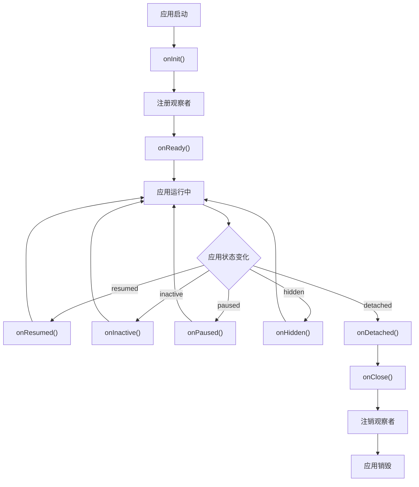

# FullLifeCycleMixin 详解

## 概述

`FullLifeCycleMixin` 是 GetX 框架中提供完整生命周期回调的混入类。它为 `FullLifeCycleController` 提供了应用生命周期事件处理、内存压力处理和可访问性变化处理能力，将 Flutter 的 `WidgetsBindingObserver` 接口转换为更友好的回调方法。

`FullLifeCycleMixin` 通过自动管理观察者的注册和注销，简化了应用生命周期观察的使用，开发者只需要重写相应的回调方法即可响应系统事件，无需关心观察者的管理细节。

## 核心功能

`FullLifeCycleMixin` 主要提供以下核心功能：

1. **观察者管理**：自动在 `onInit()` 中注册观察者，在 `onClose()` 中注销观察者
2. **应用生命周期处理**：将 `didChangeAppLifecycleState()` 转换为 `onResumed()`、`onPaused()` 等回调方法
3. **内存压力处理**：将 `didHaveMemoryPressure()` 转换为 `onMemoryPressure()` 回调方法
4. **可访问性变化处理**：将 `didChangeAccessibilityFeatures()` 转换为 `onAccessibilityChanged()` 回调方法
5. **生命周期方法增强**：重写 `onInit()` 和 `onClose()` 方法，确保观察者正确注册和注销

## 混入定义

### 混入声明

```dart 246:246:lib/get_state_manager/src/simple/get_controllers.dart
mixin FullLifeCycleMixin on FullLifeCycleController {
```

**设计说明**：

- `mixin`：混入类型，不能直接实例化，必须与 `FullLifeCycleController` 一起使用
- `on FullLifeCycleController`：约束条件，要求混入的类必须继承 `FullLifeCycleController`

**为什么使用混入**：

- 灵活性：可以与 `StateMixin` 等其他混入组合使用
- 复用性：可以在多个控制器类中复用生命周期处理逻辑
- 解耦：将生命周期处理逻辑与控制器逻辑分离

**为什么需要 FullLifeCycleController**：

- `FullLifeCycleController` 混入了 `WidgetsBindingObserver`，具备了观察者的能力
- `FullLifeCycleMixin` 需要访问 `WidgetsBindingObserver` 的方法
- 通过 `on FullLifeCycleController` 约束确保混入的类具备观察者能力

## 观察者管理

### 注册观察者

`FullLifeCycleMixin` 在 `onInit()` 中自动注册观察者：

```dart 247:252:lib/get_state_manager/src/simple/get_controllers.dart
  @mustCallSuper
  @override
  void onInit() {
    super.onInit();
    Engine.instance.addObserver(this);
  }
```

**功能说明**：

- `@mustCallSuper`：标记必须调用 `super.onInit()`，确保父类的初始化逻辑执行
- `super.onInit()`：调用父类的 `onInit()` 方法，确保 `GetxController` 的初始化逻辑执行
- `Engine.instance.addObserver(this)`：将当前控制器注册为观察者

**Engine.instance 说明**：

```dart 3:7:lib/get_core/src/flutter_engine.dart
class Engine {
  static WidgetsBinding get instance {
    return WidgetsFlutterBinding.ensureInitialized();
  }
}
```

`Engine.instance` 返回 Flutter 的 `WidgetsBinding` 实例，`addObserver()` 方法用于注册应用生命周期观察者。

### 注销观察者

`FullLifeCycleMixin` 在 `onClose()` 中自动注销观察者：

```dart 254:259:lib/get_state_manager/src/simple/get_controllers.dart
  @mustCallSuper
  @override
  void onClose() {
    Engine.instance.removeObserver(this);
    super.onClose();
  }
```

**功能说明**：

- `@mustCallSuper`：标记必须调用 `super.onClose()`，确保父类的清理逻辑执行
- `Engine.instance.removeObserver(this)`：将当前控制器从观察者列表中移除
- `super.onClose()`：调用父类的 `onClose()` 方法，确保 `GetxController` 的清理逻辑执行

**为什么先注销观察者再调用 super.onClose()**：

- 确保在控制器销毁前停止接收系统事件
- 避免在清理过程中收到意外的生命周期回调
- 防止内存泄漏

## 应用生命周期处理

### didChangeAppLifecycleState() 方法

`FullLifeCycleMixin` 重写了 `didChangeAppLifecycleState()` 方法，将应用生命周期状态转换为友好的回调方法：

```dart 261:281:lib/get_state_manager/src/simple/get_controllers.dart
  @mustCallSuper
  @override
  void didChangeAppLifecycleState(AppLifecycleState state) {
    switch (state) {
      case AppLifecycleState.resumed:
        onResumed();
        break;
      case AppLifecycleState.inactive:
        onInactive();
        break;
      case AppLifecycleState.paused:
        onPaused();
        break;
      case AppLifecycleState.detached:
        onDetached();
        break;
      case AppLifecycleState.hidden:
        onHidden();
        break;
    }
  }
```

**功能说明**：

- `@mustCallSuper`：标记必须调用 `super.didChangeAppLifecycleState()`，但这里没有调用，因为 `WidgetsBindingObserver` 的默认实现是空的
- 根据 `AppLifecycleState` 的值调用相应的回调方法
- 提供更语义化的方法名，比直接使用 `didChangeAppLifecycleState()` 更易理解

### 应用生命周期状态

`AppLifecycleState` 包含以下状态：

1. **resumed**：应用可见且可交互（前台）
2. **inactive**：应用处于非活动状态，不接收用户输入
3. **paused**：应用不可见，在后台运行
4. **detached**：应用即将被销毁
5. **hidden**：应用被隐藏（如设备锁屏）

### 生命周期回调方法

#### onResumed()

```dart 295:297:lib/get_state_manager/src/simple/get_controllers.dart
  /// Called when the system reports that the app is visible and interactive.
  /// This is called when the app returns to the foreground.
  void onResumed() {}
```

**调用时机**：

- 应用从后台回到前台
- 应用首次启动并可见
- 从其他应用切换回当前应用

**使用场景**：

- 恢复网络请求
- 刷新数据
- 恢复定时器
- 重新连接 WebSocket

#### onPaused()

```dart 299:301:lib/get_state_manager/src/simple/get_controllers.dart
  /// Called when the app is not currently visible to the user, not responding to
  /// user input, and running in the background.
  void onPaused() {}
```

**调用时机**：

- 应用进入后台
- 用户切换到其他应用
- 设备锁屏（某些平台）

**使用场景**：

- 暂停网络请求
- 保存数据
- 暂停定时器
- 断开 WebSocket 连接

#### onInactive()

```dart 303:306:lib/get_state_manager/src/simple/get_controllers.dart
  /// Called when the app is in an inactive state and is not receiving user input.
  /// For example, when a phone call is received or when the app is in a
  /// multi-window mode.
  void onInactive() {}
```

**调用时机**：

- 应用处于非活动状态
- 收到电话或通知
- 多窗口模式下失去焦点

**使用场景**：

- 暂停动画
- 暂停音频播放
- 保存临时状态

#### onDetached()

```dart 308:310:lib/get_state_manager/src/simple/get_controllers.dart
  /// Called before the app is destroyed.
  /// This is the final callback the app will receive before it is terminated.
  void onDetached() {}
```

**调用时机**：

- 应用即将被销毁
- 系统准备终止应用进程

**使用场景**：

- 保存关键数据
- 清理资源
- 发送统计数据

#### onHidden()

```dart 312:313:lib/get_state_manager/src/simple/get_controllers.dart
  /// Called when the app is hidden (e.g., when the device is locked).
  void onHidden() {}
```

**调用时机**：

- 设备锁屏
- 应用被隐藏

**使用场景**：

- 暂停敏感操作
- 隐藏敏感信息
- 保存状态

### 生命周期流程



## 内存压力处理

### didHaveMemoryPressure() 方法

`FullLifeCycleMixin` 重写了 `didHaveMemoryPressure()` 方法，将内存压力事件转换为友好的回调方法：

```dart 283:287:lib/get_state_manager/src/simple/get_controllers.dart
  @override
  void didHaveMemoryPressure() {
    super.didHaveMemoryPressure();
    onMemoryPressure();
  }
```

**功能说明**：

- `super.didHaveMemoryPressure()`：调用父类的实现（`WidgetsBindingObserver` 的默认实现是空的）
- `onMemoryPressure()`：调用自定义的回调方法

### onMemoryPressure() 方法

```dart 315:318:lib/get_state_manager/src/simple/get_controllers.dart
  /// Called when the system is running low on memory.
  /// Override this method to release caches or other resources that aren't
  /// critical for the app to function.
  void onMemoryPressure() {}
```

**调用时机**：

- 系统内存不足
- 系统需要释放内存

**使用场景**：

- 清理图片缓存
- 清理数据缓存
- 释放非关键资源
- 取消非关键请求

**注意事项**：

- 只释放非关键资源，不要释放关键数据
- 快速执行，避免阻塞主线程
- 释放后可能需要重新加载数据

## 可访问性变化处理

### didChangeAccessibilityFeatures() 方法

`FullLifeCycleMixin` 重写了 `didChangeAccessibilityFeatures()` 方法，将可访问性变化事件转换为友好的回调方法：

```dart 289:293:lib/get_state_manager/src/simple/get_controllers.dart
  @override
  void didChangeAccessibilityFeatures() {
    super.didChangeAccessibilityFeatures();
    onAccessibilityChanged();
  }
```

**功能说明**：

- `super.didChangeAccessibilityFeatures()`：调用父类的实现（`WidgetsBindingObserver` 的默认实现是空的）
- `onAccessibilityChanged()`：调用自定义的回调方法

### onAccessibilityChanged() 方法

```dart 320:322:lib/get_state_manager/src/simple/get_controllers.dart
  /// Called when the system changes the set of currently active accessibility
  /// features.
  void onAccessibilityChanged() {}
```

**调用时机**：

- 系统可访问性设置变化
- 用户启用/禁用可访问性功能

**使用场景**：

- 更新 UI 样式（高对比度、粗体文本等）
- 调整字体大小
- 启用/禁用动画
- 调整颜色方案

**可访问性功能**：

- `highContrast`：高对比度模式
- `boldText`：粗体文本
- `reduceMotion`：减少动画
- `invertColors`：反转颜色

## 与 FullLifeCycleController 的关系

### 配合使用

`FullLifeCycleMixin` 必须与 `FullLifeCycleController` 一起使用：

```dart
class MyController extends FullLifeCycleController with FullLifeCycleMixin {
  @override
  void onResumed() {
    // 可以正常响应生命周期变化
  }
}
```

**为什么需要配合使用**：

- `FullLifeCycleController` 混入了 `WidgetsBindingObserver`，具备了观察者的能力
- `FullLifeCycleMixin` 负责观察者的注册和注销
- `FullLifeCycleMixin` 将 `WidgetsBindingObserver` 的方法转换为更友好的回调方法

### 不使用 FullLifeCycleMixin 的情况

如果直接使用 `FullLifeCycleController` 而不使用 `FullLifeCycleMixin`，需要手动管理观察者和实现 `WidgetsBindingObserver` 的方法：

```dart
class MyController extends FullLifeCycleController {
  @override
  void onInit() {
    super.onInit();
    Engine.instance.addObserver(this); // 手动注册
  }

  @override
  void onClose() {
    Engine.instance.removeObserver(this); // 手动注销
    super.onClose();
  }

  @override
  void didChangeAppLifecycleState(AppLifecycleState state) {
    // 手动处理生命周期变化
    switch (state) {
      case AppLifecycleState.resumed:
        // 处理 resumed 状态
        break;
      // ...
    }
  }
}
```

这种方式更复杂，不推荐使用。

## 使用场景

### 基本生命周期观察示例

```dart
class TimerController extends FullLifeCycleController with FullLifeCycleMixin {
  Timer? _timer;
  int _seconds = 0;

  @override
  void onReady() {
    super.onReady();
    startTimer();
  }

  void startTimer() {
    _timer = Timer.periodic(Duration(seconds: 1), (timer) {
      _seconds++;
      update();
    });
  }

  @override
  void onPaused() {
    // 应用进入后台时暂停计时器
    _timer?.cancel();
  }

  @override
  void onResumed() {
    // 应用回到前台时恢复计时器
    startTimer();
  }

  @override
  void onClose() {
    _timer?.cancel();
    super.onClose();
  }

  int get seconds => _seconds;
}
```

### 网络请求管理示例

```dart
class ApiController extends FullLifeCycleController with FullLifeCycleMixin {
  CancelToken? _cancelToken;
  List<Item> _items = [];
  bool _isLoading = false;

  @override
  void onReady() {
    super.onReady();
    fetchItems();
  }

  Future<void> fetchItems() async {
    _isLoading = true;
    _cancelToken = CancelToken();
    update();

    try {
      final response = await apiService.getItems(cancelToken: _cancelToken);
      _items = response.data;
    } catch (e) {
      if (e is CancelException) {
        return; // 请求被取消，不处理错误
      }
      // 处理其他错误
    } finally {
      _isLoading = false;
      update();
    }
  }

  @override
  void onPaused() {
    // 应用进入后台时取消正在进行的请求
    _cancelToken?.cancel('应用进入后台');
  }

  @override
  void onResumed() {
    // 应用回到前台时重新获取数据
    if (_items.isEmpty) {
      fetchItems();
    }
  }

  @override
  void onClose() {
    _cancelToken?.cancel('控制器销毁');
    super.onClose();
  }
}
```

### 内存压力处理示例

```dart
class ImageCacheController extends FullLifeCycleController with FullLifeCycleMixin {
  final Map<String, CachedImage> _imageCache = {};
  final int _maxCacheSize = 100;

  void cacheImage(String url, CachedImage image) {
    if (_imageCache.length >= _maxCacheSize) {
      // 移除最旧的缓存
      final firstKey = _imageCache.keys.first;
      _imageCache.remove(firstKey);
    }
    _imageCache[url] = image;
  }

  CachedImage? getCachedImage(String url) {
    return _imageCache[url];
  }

  @override
  void onMemoryPressure() {
    // 系统内存压力时清理所有缓存
    _imageCache.clear();
    update();
  }

  @override
  void onClose() {
    _imageCache.clear();
    super.onClose();
  }
}
```

### 可访问性响应示例

```dart
class ThemeController extends FullLifeCycleController with FullLifeCycleMixin {
  bool _isHighContrast = false;
  bool _isBoldText = false;
  double _fontScale = 1.0;

  @override
  void onInit() {
    super.onInit();
    _updateAccessibilitySettings();
  }

  void _updateAccessibilitySettings() {
    final binding = WidgetsBinding.instance;
    _isHighContrast = binding.accessibilityFeatures.highContrast;
    _isBoldText = binding.accessibilityFeatures.boldText;
    _fontScale = binding.accessibilityFeatures.textScaleFactor;
    update();
  }

  @override
  void onAccessibilityChanged() {
    // 可访问性设置变化时更新
    _updateAccessibilitySettings();
  }

  bool get isHighContrast => _isHighContrast;
  bool get isBoldText => _isBoldText;
  double get fontScale => _fontScale;
}
```

### 复杂场景示例

```dart
class MediaPlayerController extends FullLifeCycleController with FullLifeCycleMixin {
  VideoPlayerController? _videoController;
  bool _isPlaying = false;
  Duration _position = Duration.zero;

  @override
  void onReady() {
    super.onReady();
    _initializeVideo();
  }

  Future<void> _initializeVideo() async {
    _videoController = VideoPlayerController.network('video_url');
    await _videoController!.initialize();
    _videoController!.addListener(_onVideoPositionChanged);
    update();
  }

  void _onVideoPositionChanged() {
    _position = _videoController!.value.position;
    update();
  }

  void play() {
    _videoController?.play();
    _isPlaying = true;
    update();
  }

  void pause() {
    _videoController?.pause();
    _isPlaying = false;
    update();
  }

  @override
  void onPaused() {
    // 应用进入后台时暂停播放
    if (_isPlaying) {
      pause();
    }
  }

  @override
  void onHidden() {
    // 设备锁屏时暂停播放
    if (_isPlaying) {
      pause();
    }
  }

  @override
  void onMemoryPressure() {
    // 内存压力时释放视频资源
    _videoController?.dispose();
    _videoController = null;
    _isPlaying = false;
    update();
  }

  @override
  void onClose() {
    _videoController?.removeListener(_onVideoPositionChanged);
    _videoController?.dispose();
    super.onClose();
  }
}
```

## 注意事项

### 1. 必须调用 super 方法

重写 `onInit()` 和 `onClose()` 方法时，必须调用 `super` 方法：

```dart
@override
void onInit() {
  super.onInit(); // 必须调用，否则观察者不会注册
  // 你的初始化代码
}

@override
void onClose() {
  // 你的清理代码
  super.onClose(); // 必须调用，否则观察者不会注销
}
```

**不调用 super 方法的后果**：

- 观察者不会注册，生命周期回调不会被调用
- 观察者不会注销，可能导致内存泄漏
- 父类的初始化/清理逻辑不会执行

### 2. 生命周期回调的执行顺序

生命周期回调的执行顺序：

1. `onInit()` - 控制器初始化，注册观察者
2. `onReady()` - UI 构建完成
3. `onResumed()` / `onPaused()` 等 - 应用生命周期变化
4. `onClose()` - 控制器销毁，注销观察者

### 3. 生命周期状态的转换

应用生命周期状态的转换顺序：

- `resumed` ↔ `inactive` ↔ `paused`
- `resumed` → `hidden` → `paused`
- `paused` → `detached`

**注意事项**：

- 不是所有状态转换都会发生
- 不同平台的状态转换可能不同
- 应该处理所有可能的状态，而不仅仅是最常见的

### 4. 内存压力处理的时机

`onMemoryPressure()` 可能在应用生命周期的任何时候被调用：

```dart
@override
void onMemoryPressure() {
  // 可能在 onResumed() 之后调用
  // 也可能在 onPaused() 之后调用
  // 应该快速执行，避免阻塞
  _cache.clear();
}
```

### 5. 可访问性变化的处理

`onAccessibilityChanged()` 在可访问性设置变化时调用，应该立即更新 UI：

```dart
@override
void onAccessibilityChanged() {
  _updateAccessibilitySettings();
  update(); // 立即更新 UI
}
```

### 6. 避免在生命周期回调中执行耗时操作

生命周期回调应该快速执行，避免阻塞主线程：

```dart
// 不推荐
@override
void onResumed() {
  // 耗时操作
  processLargeData();
}

// 推荐
@override
void onResumed() {
  // 快速标记状态
  _shouldRefresh = true;
  // 在下一帧执行耗时操作
  WidgetsBinding.instance.addPostFrameCallback((_) {
    processLargeData();
  });
}
```

### 7. 与 StateMixin 的组合使用

`FullLifeCycleMixin` 可以与 `StateMixin` 组合使用（通过 `SuperController`）：

```dart
class MyController extends SuperController<Data> {
  @override
  void onResumed() {
    // 应用回到前台时刷新数据
    fetchData();
  }

  Future<void> fetchData() async {
    setLoading();
    try {
      final data = await apiService.getData();
      setSuccess(data);
    } catch (e) {
      setError(e.toString());
    }
  }
}
```

### 8. Engine.instance 的使用

`Engine.instance` 返回 `WidgetsBinding` 实例，用于注册和注销观察者：

```dart 3:7:lib/get_core/src/flutter_engine.dart
class Engine {
  static WidgetsBinding get instance {
    return WidgetsFlutterBinding.ensureInitialized();
  }
}
```

**注意事项**：

- `Engine.instance` 是单例，全局共享
- `addObserver()` 和 `removeObserver()` 必须成对调用
- 不要在多个地方重复注册同一个观察者

## 总结

`FullLifeCycleMixin` 是 GetX 框架中提供完整生命周期回调的混入类。它为 `FullLifeCycleController` 提供了应用生命周期事件处理、内存压力处理和可访问性变化处理能力，将 Flutter 的 `WidgetsBindingObserver` 接口转换为更友好的回调方法。

理解 `FullLifeCycleMixin` 的工作原理对于正确使用 GetX 框架的应用生命周期管理功能非常重要，特别是观察者的注册和注销机制、生命周期回调方法的实现、以及资源管理的最佳实践。这些知识将帮助你编写更加健壮、响应式的 Flutter 应用。

## 参考资料

- [FullLifeCycleController 详解](lib/get_state_manager/src/simple/get_controllers.dart_full-lifecycle-controller.md)
- [GetxController 详解](lib/get_state_manager/src/simple/get_controllers.dart_getx-controller.md)
- [SuperController 详解](lib/get_state_manager/src/simple/get_controllers.dart_super-controller.md)
- [GetLifeCycleMixin 详解](lib/get_instance/src/lifecycle.dart_get-lifecycle-mixin.md)
- [Engine 源码](lib/get_core/src/flutter_engine.dart)
- [GetX 状态管理文档](https://github.com/jonataslaw/getx/blob/master/README.md)
- [FullLifeCycleMixin 源码](lib/get_state_manager/src/simple/get_controllers.dart)
