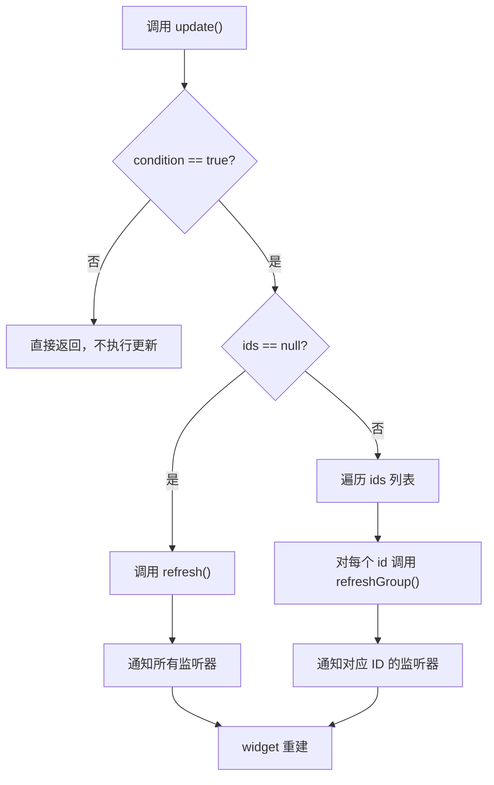
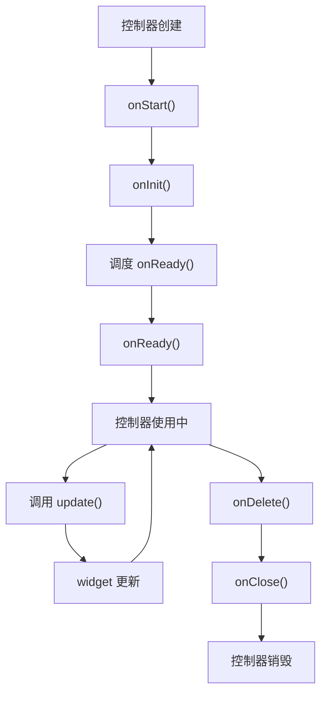

# GetxController 详解

## 概述

`GetxController` 是 GetX 框架中用于状态管理的核心控制器基类。它为所有需要手动控制 UI 更新的控制器提供了统一的状态管理机制，通过 `update()` 方法通知依赖的 widget 进行重建，实现精确的 UI 更新控制。

`GetxController` 通过继承 `ListNotifier` 和混入 `GetLifeCycleMixin`，同时提供了监听器管理和生命周期管理能力。这种设计使得控制器既能管理状态变化，又能自动处理资源的初始化和清理，避免内存泄漏。

## 核心功能

`GetxController` 主要提供以下核心功能：

1. **状态管理**：通过 `update()` 方法通知 UI 更新，支持全量更新和选择性更新
2. **生命周期管理**：通过混入 `GetLifeCycleMixin` 获得完整的生命周期管理能力
3. **监听器管理**：通过继承 `ListNotifier` 获得监听器注册和通知机制
4. **选择性更新**：支持通过 ID 更新特定的 widget，提高性能

## 类定义

### 类声明

```dart 26:26:lib/get_state_manager/src/simple/get_controllers.dart
abstract class GetxController extends ListNotifier with GetLifeCycleMixin {
```

**设计说明**：

- `abstract`：抽象类，不能直接实例化，必须通过子类继承使用
- `extends ListNotifier`：继承 `ListNotifier`，获得监听器管理能力
- `with GetLifeCycleMixin`：混入 `GetLifeCycleMixin`，获得生命周期管理能力

**继承关系**：

- `ListNotifier`：提供监听器管理功能，包括 `addListener()`、`removeListener()`、`refresh()`、`refreshGroup()` 等方法
- `GetLifeCycleMixin`：提供生命周期管理功能，包括 `onInit()`、`onReady()`、`onClose()` 等方法

**为什么使用抽象类**：

- 强制开发者创建子类，确保每个控制器都有明确的业务逻辑
- 提供统一的接口和默认实现，减少重复代码
- 防止直接实例化，确保控制器通过依赖注入系统管理

## update() 方法详解

### 方法定义

```dart 37:48:lib/get_state_manager/src/simple/get_controllers.dart
  void update([List<Object>? ids, bool condition = true]) {
    if (!condition) {
      return;
    }
    if (ids == null) {
      refresh();
    } else {
      for (final id in ids) {
        refreshGroup(id);
      }
    }
  }
```

**功能说明**：

- 通知所有注册的监听器进行 UI 更新
- 支持条件更新：通过 `condition` 参数控制是否执行更新
- 支持选择性更新：通过 `ids` 参数只更新特定的 widget

### 参数说明

#### `ids` - 可选参数，widget ID 列表

- **类型**：`List<Object>?`
- **默认值**：`null`
- **作用**：指定要更新的 widget ID 列表。如果为 `null`，则更新所有依赖该控制器的 widget

**使用场景**：

- 当只需要更新页面中的特定 widget 时，使用 ID 可以避免不必要的重建
- 提高性能，减少不必要的 UI 更新
- 适用于复杂的页面，其中不同部分可能依赖不同的状态

**示例**：

```dart
// 更新所有 widget
controller.update();

// 只更新 ID 为 'counter' 的 widget
controller.update(['counter']);

// 更新多个特定 widget
controller.update(['counter', 'text', 'button']);
```

#### `condition` - 条件参数

- **类型**：`bool`
- **默认值**：`true`
- **作用**：控制是否执行更新。如果为 `false`，方法直接返回，不执行任何更新操作

**使用场景**：

- 根据业务逻辑条件决定是否更新 UI
- 避免在特定状态下触发不必要的更新
- 实现条件渲染逻辑

**示例**：

```dart
// 只在计数器小于 10 时更新
controller.update(null, counter < 10);

// 只在用户已登录时更新
controller.update(['userInfo'], isLoggedIn);

// 组合使用
controller.update(['counter'], counter > 0 && counter < 100);
```

### 更新逻辑

#### 全量更新（`ids == null`）

当 `ids` 为 `null` 时，调用 `refresh()` 方法：

```dart 46:50:lib/get_state_manager/src/simple/list_notifier.dart
  @protected
  void refresh() {
    assert(_debugAssertNotDisposed());
    _notifyUpdate();
  }
```

`refresh()` 会通知所有注册的监听器，导致所有依赖该控制器的 widget 重建。

#### 选择性更新（`ids != null`）

当 `ids` 不为 `null` 时，遍历 ID 列表，对每个 ID 调用 `refreshGroup()` 方法：

```dart 123:126:lib/get_state_manager/src/simple/list_notifier.dart
  @protected
  void refreshGroup(Object id) {
    assert(_debugAssertNotDisposed());
    _notifyGroupUpdate(id);
  }
```

`refreshGroup()` 只会通知注册了特定 ID 的监听器，只有对应的 widget 会重建。

### 工作流程



## 与 ListNotifier 的关系

### 继承关系

`GetxController` 继承自 `ListNotifier`，获得了以下能力：

1. **监听器管理**：`addListener()`、`removeListener()`、`containsListener()`
2. **更新通知**：`refresh()`、`refreshGroup()`
3. **资源管理**：`dispose()`、`isDisposed`

### refresh() 方法

```dart 46:50:lib/get_state_manager/src/simple/list_notifier.dart
  @protected
  void refresh() {
    assert(_debugAssertNotDisposed());
    _notifyUpdate();
  }
```

**功能**：通知所有注册的监听器，触发所有依赖该控制器的 widget 重建。

**调用时机**：当 `update()` 方法被调用且 `ids` 为 `null` 时。

### refreshGroup() 方法

```dart 123:126:lib/get_state_manager/src/simple/list_notifier.dart
  @protected
  void refreshGroup(Object id) {
    assert(_debugAssertNotDisposed());
    _notifyGroupUpdate(id);
  }
```

**功能**：通知注册了特定 ID 的监听器，只触发对应 widget 的重建。

**调用时机**：当 `update()` 方法被调用且 `ids` 不为 `null` 时。

### 监听器注册机制

`GetBuilder` widget 在构建时会注册监听器：

```dart 507:511:lib/get_state_manager/src/simple/get_state.dart
    if (localController is GetxController) {
      _remove?.call();
      _remove = (widget.id == null)
          ? localController.addListener(filter)
          : localController.addListenerId(widget.id, filter);
    }
```

- 如果 `GetBuilder` 没有指定 `id`，则通过 `addListener()` 注册全局监听器
- 如果 `GetBuilder` 指定了 `id`，则通过 `addListenerId()` 注册 ID 监听器

## 与 GetLifeCycleMixin 的关系

### 生命周期方法

通过混入 `GetLifeCycleMixin`，`GetxController` 获得了完整的生命周期管理能力：

1. **onInit()**：初始化方法，在对象创建后立即调用
2. **onReady()**：就绪回调，在 UI 构建完成后调用
3. **onClose()**：资源清理方法，在对象销毁前调用
4. **onDelete()**：销毁方法，由框架自动调用

### 生命周期流程



详细的生命周期说明请参考 [GetLifeCycleMixin 详解](lib/get_instance/src/lifecycle.dart_get-lifecycle-mixin.md)。

## 使用场景

### 基本计数器示例

```dart
class CounterController extends GetxController {
  int count = 0;

  void increment() {
    count++;
    update(); // 通知所有依赖的 widget 更新
  }

  void decrement() {
    count--;
    update();
  }
}

// 在 widget 中使用
GetBuilder<CounterController>(
  init: CounterController(),
  builder: (controller) => Text('${controller.count}'),
)
```

### 带 ID 的选择性更新示例

```dart
class UserController extends GetxController {
  String name = 'John';
  int age = 30;

  void updateName(String newName) {
    name = newName;
    update(['name']); // 只更新 ID 为 'name' 的 widget
  }

  void updateAge(int newAge) {
    age = newAge;
    update(['age']); // 只更新 ID 为 'age' 的 widget
  }

  void updateBoth() {
    update(['name', 'age']); // 更新多个 widget
  }
}

// 在 widget 中使用
GetBuilder<UserController>(
  id: 'name',
  builder: (controller) => Text(controller.name),
)

GetBuilder<UserController>(
  id: 'age',
  builder: (controller) => Text('${controller.age}'),
)
```

### 条件更新示例

```dart
class FormController extends GetxController {
  String email = '';
  bool isValid = false;

  void setEmail(String value) {
    email = value;
    isValid = _validateEmail(value);
    // 只在邮箱有效时更新 UI
    update(['email'], isValid);
  }

  bool _validateEmail(String email) {
    return email.contains('@');
  }
}
```

### 复杂场景示例

```dart
class ProductController extends GetxController {
  List<Product> products = [];
  bool isLoading = false;
  String? error;

  @override
  void onReady() {
    super.onReady();
    loadProducts();
  }

  Future<void> loadProducts() async {
    isLoading = true;
    error = null;
    update(['loading', 'error']); // 更新加载和错误状态

    try {
      products = await productService.fetchProducts();
      isLoading = false;
      update(['products', 'loading']); // 更新产品列表和加载状态
    } catch (e) {
      error = e.toString();
      isLoading = false;
      update(['error', 'loading']); // 更新错误和加载状态
    }
  }

  void addProduct(Product product) {
    products.add(product);
    update(['products']); // 只更新产品列表
  }
}

// 在 widget 中使用
GetBuilder<ProductController>(
  id: 'loading',
  builder: (controller) => controller.isLoading
      ? CircularProgressIndicator()
      : SizedBox.shrink(),
)

GetBuilder<ProductController>(
  id: 'products',
  builder: (controller) => ListView.builder(
    itemCount: controller.products.length,
    itemBuilder: (context, index) {
      return ProductItem(controller.products[index]);
    },
  ),
)
```

## 与其他控制器的对比

### GetxController vs RxController

| 特性 | GetxController | RxController |
|------|----------------|--------------|
| 状态更新方式 | 手动调用 `update()` | 自动响应式更新 |
| 使用场景 | 需要精确控制更新时机 | 只需要响应式变量 |
| 性能 | 可以精确控制更新范围 | 自动追踪依赖 |
| 复杂度 | 需要手动管理更新 | 自动管理更新 |

**选择建议**：

- 使用 `GetxController`：需要手动控制更新时机，或者需要选择性更新特定 widget
- 使用 `RxController`：只需要响应式变量，不需要手动更新

### GetxController vs StateController

`StateController` 继承自 `GetxController` 并混入 `StateMixin`，提供了加载、错误、成功等状态管理能力：

```dart 157:157:lib/get_state_manager/src/simple/get_controllers.dart
abstract class StateController<T> extends GetxController with StateMixin<T> {}
```

**使用场景**：

- `GetxController`：简单的状态管理，不需要加载/错误状态
- `StateController`：异步操作需要管理加载、错误、成功状态

## 注意事项

### 1. update() 的调用时机

`update()` 方法应该在状态发生变化后立即调用：

```dart
// 正确示例
void increment() {
  count++;
  update(); // 在状态变化后立即调用
}

// 错误示例
void increment() {
  count++;
  // 忘记调用 update()，UI 不会更新
}
```

### 2. ID 的使用规范

- ID 应该是唯一的，避免冲突
- 使用有意义的 ID 名称，提高代码可读性
- 确保 `GetBuilder` 的 `id` 与 `update()` 中的 ID 一致

```dart
// 正确示例
GetBuilder<Controller>(
  id: 'counter',
  builder: (controller) => Text('${controller.count}'),
)

controller.update(['counter']); // ID 一致

// 错误示例
GetBuilder<Controller>(
  id: 'counter',
  builder: (controller) => Text('${controller.count}'),
)

controller.update(['count']); // ID 不一致，widget 不会更新
```

### 3. 性能优化建议

- **使用 ID 进行选择性更新**：只更新需要更新的 widget，避免不必要的重建
- **合理使用 condition 参数**：避免在不需要时触发更新
- **避免在循环中频繁调用 update()**：可以批量更新后统一调用

```dart
// 性能较差
void loadData() {
  for (var item in items) {
    processItem(item);
    update(); // 每次循环都更新，性能差
  }
}

// 性能较好
void loadData() {
  for (var item in items) {
    processItem(item);
  }
  update(); // 批量处理完成后统一更新
}
```

### 4. 与响应式变量的区别

`GetxController` 的 `update()` 方法需要手动调用，而响应式变量（`.obs`）会自动更新：

```dart
// GetxController 方式
class Controller extends GetxController {
  int count = 0;
  void increment() {
    count++;
    update(); // 需要手动调用
  }
}

// 响应式变量方式
class Controller extends GetxController {
  var count = 0.obs;
  void increment() {
    count++; // 自动更新，不需要调用 update()
  }
}
```

**选择建议**：

- 使用 `update()`：需要精确控制更新时机，或者需要选择性更新
- 使用响应式变量：简单的状态管理，不需要手动控制

### 5. 生命周期方法的调用

重写生命周期方法时，必须调用 `super` 方法：

```dart
@override
void onInit() {
  super.onInit(); // 必须调用
  // 你的初始化代码
}

@override
void onClose() {
  // 你的清理代码
  super.onClose(); // 建议调用
}
```

### 6. 避免在 onInit 中调用 update()

`onInit()` 执行时 UI 可能尚未构建完成，此时调用 `update()` 可能无效：

```dart
// 不推荐
@override
void onInit() {
  super.onInit();
  loadData();
  update(); // UI 可能尚未构建，更新可能无效
}

// 推荐
@override
void onReady() {
  super.onReady();
  loadData(); // 在 onReady 中执行，UI 已构建完成
}
```

### 7. GetBuilder 的 init 参数

`GetBuilder` 的 `init` 参数只在第一次使用时设置，后续使用不需要设置：

```dart
// 第一次使用，需要 init
GetBuilder<CounterController>(
  init: CounterController(),
  builder: (controller) => Text('${controller.count}'),
)

// 后续使用，不需要 init
GetBuilder<CounterController>(
  builder: (controller) => Text('${controller.count}'),
)
```

## 总结

`GetxController` 是 GetX 框架中状态管理的核心组件，它通过继承 `ListNotifier` 和混入 `GetLifeCycleMixin`，提供了完整的监听器管理和生命周期管理能力。`update()` 方法是其核心功能，支持全量更新和选择性更新，能够精确控制 UI 的更新时机和范围。

理解 `GetxController` 的工作原理对于正确使用 GetX 框架非常重要，特别是 `update()` 方法的调用时机、ID 的使用规范、以及性能优化建议。这些知识将帮助你编写更加高效、健壮的 Flutter 应用。

## 参考资料

- [GetLifeCycleMixin 详解](lib/get_instance/src/lifecycle.dart_get-lifecycle-mixin.md)
- [ListNotifier 详解](lib/get_state_manager/src/simple/list_notifier.dart)
- [GetX 状态管理文档](https://github.com/jonataslaw/getx/blob/master/README.md)
- [GetxController 源码](lib/get_state_manager/src/simple/get_controllers.dart)
