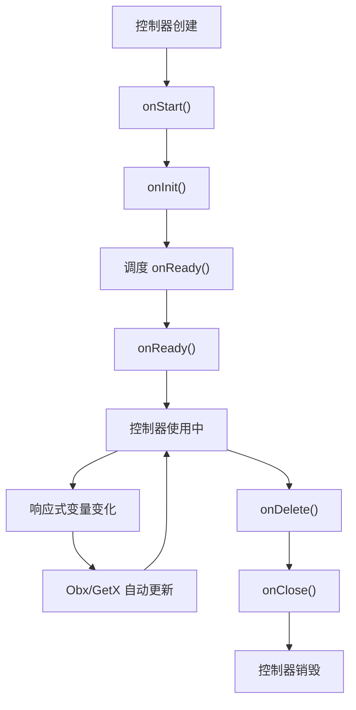

# RxController 详解

## 概述

`RxController` 是 GetX 框架中用于响应式状态管理的轻量级控制器基类。它为只需要响应式变量而不需要手动控制 UI 更新的场景提供了简洁的解决方案，通过混入 `GetLifeCycleMixin` 获得生命周期管理能力，同时依赖响应式变量（`.obs`）自动处理 UI 更新。

`RxController` 是 `GetxController` 的轻量级替代品，它不继承 `ListNotifier`，因此没有 `update()` 方法。这种设计使得控制器更加简洁，专注于响应式编程模式，让状态变化自动触发 UI 更新，无需手动调用更新方法。

## 核心功能

`RxController` 主要提供以下核心功能：

1. **生命周期管理**：通过混入 `GetLifeCycleMixin` 获得完整的生命周期管理能力
2. **响应式状态管理**：配合响应式变量（`.obs`）实现自动 UI 更新
3. **轻量级设计**：不包含手动更新机制，减少代码复杂度
4. **自动依赖追踪**：响应式变量自动追踪依赖，只在值真正改变时更新 UI

## 类定义

### 类声明

```dart 132:132:lib/get_state_manager/src/simple/get_controllers.dart
abstract class RxController with GetLifeCycleMixin {}
```

**设计说明**：

- `abstract`：抽象类，不能直接实例化，必须通过子类继承使用
- `with GetLifeCycleMixin`：混入 `GetLifeCycleMixin`，获得生命周期管理能力
- **不继承 `ListNotifier`**：与 `GetxController` 不同，`RxController` 不提供手动更新机制

**混入关系**：

- `GetLifeCycleMixin`：提供生命周期管理功能，包括 `onInit()`、`onReady()`、`onClose()` 等方法

**为什么使用抽象类**：

- 强制开发者创建子类，确保每个控制器都有明确的业务逻辑
- 提供统一的接口和默认实现，减少重复代码
- 防止直接实例化，确保控制器通过依赖注入系统管理

**为什么只混入 `GetLifeCycleMixin`**：

- 轻量级设计：不需要手动更新机制时，避免不必要的复杂性
- 响应式优先：专注于响应式编程模式，让状态变化自动触发更新
- 性能优化：减少不必要的监听器管理开销

## 与 GetLifeCycleMixin 的关系

### 生命周期方法

通过混入 `GetLifeCycleMixin`，`RxController` 获得了完整的生命周期管理能力：

1. **onInit()**：初始化方法，在对象创建后立即调用
2. **onReady()**：就绪回调，在 UI 构建完成后调用
3. **onClose()**：资源清理方法，在对象销毁前调用
4. **onDelete()**：销毁方法，由框架自动调用

### 生命周期流程



详细的生命周期说明请参考 [GetLifeCycleMixin 详解](lib/get_instance/src/lifecycle.dart_get-lifecycle-mixin.md)。

## 响应式变量工作原理

### .obs 扩展

响应式变量通过 `.obs` 扩展创建，为各种类型提供了响应式包装：

```dart 310:333:lib/get_rx/src/rx_types/rx_core/rx_impl.dart
extension StringExtension on String {
  /// Returns a `RxString` with [this] `String` as initial value.
  RxString get obs => RxString(this);
}

extension IntExtension on int {
  /// Returns a `RxInt` with [this] `int` as initial value.
  RxInt get obs => RxInt(this);
}

extension DoubleExtension on double {
  /// Returns a `RxDouble` with [this] `double` as initial value.
  RxDouble get obs => RxDouble(this);
}

extension BoolExtension on bool {
  /// Returns a `RxBool` with [this] `bool` as initial value.
  RxBool get obs => RxBool(this);
}

extension RxT<T extends Object> on T {
  /// Returns a `Rx` instance with [this] `T` as initial value.
  Rx<T> get obs => Rx<T>(this);
}
```

**工作原理**：

1. `.obs` 扩展将普通值包装为响应式对象（`RxString`、`RxInt`、`Rx<T>` 等）
2. 响应式对象实现了 `RxInterface<T>` 接口，提供了值监听和通知机制
3. 当响应式变量的值发生变化时，会自动通知所有注册的监听器
4. `Obx` 和 `GetX` widget 会自动注册为监听器，并在值变化时重建

### 自动更新机制

响应式变量的自动更新机制：

1. **值变化检测**：响应式对象内部维护当前值，通过 `value` setter 检测变化
2. **变化通知**：当值真正改变时，通过内部的 `Stream` 或通知机制通知监听器
3. **智能重建**：`Obx` 和 `GetX` widget 只在值真正改变时才重建，避免不必要的更新
4. **依赖追踪**：自动追踪 widget 中使用的响应式变量，只在这些变量变化时更新

### Obx 和 GetX widget

`Obx` 和 `GetX` widget 用于监听响应式变量的变化：

```dart 17:33:lib/get_state_manager/src/rx_flutter/rx_obx_widget.dart
/// The simplest reactive widget in GetX.
///
/// Just pass your Rx variable in the root scope of the callback to have it
/// automatically registered for changes.
///
/// final _name = "GetX".obs;
/// Obx(() => Text( _name.value )),... ;
class Obx extends ObxWidget {
  final WidgetCallback builder;

  const Obx(this.builder, {super.key});

  @override
  Widget build(BuildContext context) {
    return builder();
  }
}
```

**使用方式**：

- `Obx(() => Widget)`：最简单的响应式 widget，自动追踪回调中使用的响应式变量
- `GetX<Controller>(builder: (controller) => Widget)`：用于注入控制器并监听其响应式变量

## 与 GetxController 的对比

### 核心区别

| 特性 | RxController | GetxController |
|------|-------------|----------------|
| 继承关系 | 只混入 `GetLifeCycleMixin` | 继承 `ListNotifier` + 混入 `GetLifeCycleMixin` |
| 更新方式 | 响应式变量自动更新 | 手动调用 `update()` 方法 |
| 状态管理 | 使用 `.obs` 响应式变量 | 使用普通变量 + `update()` |
| 监听器管理 | 无（由响应式变量管理） | 有（通过 `ListNotifier`） |
| 使用场景 | 只需要响应式变量 | 需要手动控制更新时机 |
| 性能 | 自动依赖追踪，精确更新 | 可以精确控制更新范围 |
| 复杂度 | 更简单，自动管理 | 需要手动管理更新 |

### 选择建议

**使用 `RxController` 的场景**：

- 只需要响应式变量，不需要手动控制更新时机
- 希望代码更简洁，减少手动更新调用
- 状态变化应该自动触发 UI 更新
- 适合大多数响应式编程场景

**使用 `GetxController` 的场景**：

- 需要手动控制更新时机，例如批量更新后统一刷新
- 需要选择性更新特定 widget（通过 ID）
- 需要条件更新（通过 `condition` 参数）
- 状态管理逻辑复杂，需要精确控制更新范围

### 代码对比

**RxController 方式**：

```dart
class CounterController extends RxController {
  var count = 0.obs; // 响应式变量

  void increment() {
    count++; // 自动更新，无需调用 update()
  }
}

// 在 widget 中使用
Obx(() => Text('${controller.count.value}'))
```

**GetxController 方式**：

```dart
class CounterController extends GetxController {
  int count = 0; // 普通变量

  void increment() {
    count++;
    update(); // 需要手动调用 update()
  }
}

// 在 widget 中使用
GetBuilder<CounterController>(
  builder: (controller) => Text('${controller.count}'),
)
```

## 使用场景

### 基本计数器示例

```dart
class CounterController extends RxController {
  var count = 0.obs;

  void increment() {
    count++; // 自动更新 UI
  }

  void decrement() {
    count--; // 自动更新 UI
  }
}

// 在 widget 中使用
class CounterPage extends StatelessWidget {
  final controller = Get.put(CounterController());

  @override
  Widget build(BuildContext context) {
    return Scaffold(
      body: Center(
        child: Obx(() => Text('${controller.count.value}')),
      ),
      floatingActionButton: FloatingActionButton(
        onPressed: controller.increment,
        child: Icon(Icons.add),
      ),
    );
  }
}
```

### 用户信息管理示例

```dart
class UserController extends RxController {
  final name = 'John'.obs;
  final age = 30.obs;
  final email = 'john@example.com'.obs;

  void updateName(String newName) {
    name.value = newName; // 自动更新 UI
  }

  void updateAge(int newAge) {
    age.value = newAge; // 自动更新 UI
  }

  void updateProfile(String newName, int newAge, String newEmail) {
    name.value = newName;
    age.value = newAge;
    email.value = newEmail;
    // 所有变化都会自动触发 UI 更新
  }
}

// 在 widget 中使用
Obx(() => Column(
  children: [
    Text('Name: ${controller.name.value}'),
    Text('Age: ${controller.age.value}'),
    Text('Email: ${controller.email.value}'),
  ],
))
```

### 列表管理示例

```dart
class ProductController extends RxController {
  final products = <Product>[].obs;
  final isLoading = false.obs;

  @override
  void onReady() {
    super.onReady();
    loadProducts();
  }

  Future<void> loadProducts() async {
    isLoading.value = true;
    try {
      final fetchedProducts = await productService.fetchProducts();
      products.value = fetchedProducts; // 自动更新 UI
    } catch (e) {
      // 错误处理
    } finally {
      isLoading.value = false; // 自动更新 UI
    }
  }

  void addProduct(Product product) {
    products.add(product); // RxList 自动更新 UI
  }

  void removeProduct(Product product) {
    products.remove(product); // RxList 自动更新 UI
  }
}

// 在 widget 中使用
Obx(() => controller.isLoading.value
    ? CircularProgressIndicator()
    : ListView.builder(
        itemCount: controller.products.length,
        itemBuilder: (context, index) {
          return ProductItem(controller.products[index]);
        },
      ))
```

### 复杂状态管理示例

```dart
class FormController extends RxController {
  final email = ''.obs;
  final password = ''.obs;
  final isSubmitting = false.obs;
  final errorMessage = ''.obs;

  // 计算属性（使用 getter）
  bool get isValid => email.value.isNotEmpty && password.value.isNotEmpty;

  void setEmail(String value) {
    email.value = value;
    errorMessage.value = ''; // 清除错误信息
  }

  void setPassword(String value) {
    password.value = value;
    errorMessage.value = ''; // 清除错误信息
  }

  Future<void> submit() async {
    if (!isValid) {
      errorMessage.value = '请填写所有字段';
      return;
    }

    isSubmitting.value = true;
    errorMessage.value = '';

    try {
      await authService.login(email.value, password.value);
      // 登录成功
    } catch (e) {
      errorMessage.value = e.toString();
    } finally {
      isSubmitting.value = false;
    }
  }
}

// 在 widget 中使用
Obx(() => Column(
  children: [
    TextField(
      onChanged: controller.setEmail,
      decoration: InputDecoration(labelText: 'Email'),
    ),
    TextField(
      onChanged: controller.setPassword,
      decoration: InputDecoration(labelText: 'Password'),
    ),
    if (controller.errorMessage.value.isNotEmpty)
      Text(controller.errorMessage.value, style: TextStyle(color: Colors.red)),
    ElevatedButton(
      onPressed: controller.isSubmitting.value ? null : controller.submit,
      child: controller.isSubmitting.value
          ? CircularProgressIndicator()
          : Text('登录'),
    ),
  ],
))
```

## 注意事项

### 1. 响应式变量的访问

访问响应式变量的值需要使用 `.value`：

```dart
// 正确示例
var count = 0.obs;
print(count.value); // 访问值
count.value = 10; // 设置值

// 错误示例
print(count); // 这会打印 RxInt 对象，而不是值
count = 10; // 这会替换整个响应式对象，而不是更新值
```

### 2. Obx 中的响应式变量

在 `Obx` 中，可以直接访问响应式变量的 `.value`，`Obx` 会自动追踪：

```dart
// 正确示例
Obx(() => Text('${controller.count.value}'))

// 也可以直接使用（会自动调用 .value）
Obx(() => Text('${controller.count}'))
```

### 3. 自定义类的响应式变量

对于自定义类，直接修改对象属性不会触发更新，需要使用 `refresh()` 或 `update()`：

```dart
class User {
  String name;
  int age;
  User({required this.name, required this.age});
}

class UserController extends RxController {
  final user = User(name: 'John', age: 30).obs;

  void updateName(String newName) {
    user.value.name = newName;
    user.refresh(); // 需要手动刷新
  }

  // 或者使用 update 方法
  void updateNameBetter(String newName) {
    user.update((u) {
      u.name = newName; // 在回调中修改
    }); // update 方法会自动刷新
  }
}
```

### 4. 生命周期方法的调用

重写生命周期方法时，必须调用 `super` 方法：

```dart
@override
void onInit() {
  super.onInit(); // 必须调用
  // 你的初始化代码
}

@override
void onClose() {
  // 你的清理代码
  super.onClose(); // 建议调用
}
```

### 5. 避免在 onInit 中访问响应式变量

`onInit()` 执行时 UI 可能尚未构建完成，此时访问响应式变量可能无效：

```dart
// 不推荐
@override
void onInit() {
  super.onInit();
  loadData(); // UI 可能尚未构建，更新可能无效
}

// 推荐
@override
void onReady() {
  super.onReady();
  loadData(); // UI 已构建完成，可以安全更新
}
```

### 6. 响应式变量的初始化

响应式变量应该在声明时初始化，或者在构造函数中初始化：

```dart
// 推荐：声明时初始化
class Controller extends RxController {
  final count = 0.obs;
  final name = ''.obs;
}

// 也可以在构造函数中初始化
class Controller extends RxController {
  late final count = 0.obs;
  late final name = ''.obs;

  Controller({int? initialCount, String? initialName}) {
    if (initialCount != null) count.value = initialCount;
    if (initialName != null) name.value = initialName;
  }
}
```

### 7. 性能优化建议

- **使用 `Obx` 而非 `GetX`**：`Obx` 更轻量，适合简单的响应式更新
- **避免在 `Obx` 中使用复杂计算**：将复杂计算移到控制器中
- **合理使用响应式变量**：不要将所有变量都设为响应式，只对需要 UI 更新的变量使用
- **避免深层嵌套**：避免在响应式对象中嵌套过多层级

```dart
// 性能较差
Obx(() => Text('${controller.complexCalculation()}')) // 每次重建都计算

// 性能较好
// 在控制器中
final result = 0.obs;
void calculate() {
  result.value = complexCalculation(); // 只在需要时计算
}
// 在 widget 中
Obx(() => Text('${controller.result.value}'))
```

### 8. 与 GetxController 的混合使用

可以在同一个控制器中同时使用响应式变量和 `update()` 方法（如果继承 `GetxController`）：

```dart
class HybridController extends GetxController {
  var count = 0.obs; // 响应式变量
  String name = ''; // 普通变量

  void increment() {
    count++; // 自动更新
  }

  void updateName(String newName) {
    name = newName;
    update(); // 手动更新
  }
}
```

## 总结

`RxController` 是 GetX 框架中响应式状态管理的轻量级解决方案，它通过混入 `GetLifeCycleMixin` 提供生命周期管理能力，配合响应式变量（`.obs`）实现自动 UI 更新。与 `GetxController` 相比，`RxController` 更加简洁，专注于响应式编程模式，适合大多数只需要响应式变量的场景。

理解 `RxController` 的工作原理对于正确使用 GetX 框架的响应式功能非常重要，特别是响应式变量的创建和使用、`Obx` 和 `GetX` widget 的使用方式、以及性能优化建议。这些知识将帮助你编写更加高效、简洁的 Flutter 应用。

## 参考资料

- [GetxController 详解](lib/get_state_manager/src/simple/get_controllers.dart_getx-controller.md)
- [GetLifeCycleMixin 详解](lib/get_instance/src/lifecycle.dart_get-lifecycle-mixin.md)
- [响应式变量实现](lib/get_rx/src/rx_types/rx_core/rx_impl.dart)
- [Obx widget 实现](lib/get_state_manager/src/rx_flutter/rx_obx_widget.dart)
- [GetX 状态管理文档](https://github.com/jonataslaw/getx/blob/master/README.md)
- [RxController 源码](lib/get_state_manager/src/simple/get_controllers.dart)
