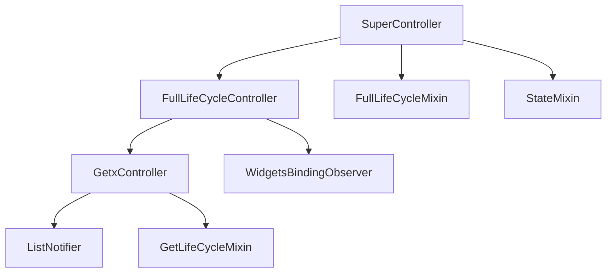

# SuperController 详解

## 概述

`SuperController` 是 GetX 框架中结合完整生命周期管理和状态管理的控制器基类。它通过继承 `FullLifeCycleController` 和混入 `FullLifeCycleMixin`、`StateMixin<T>`，为控制器同时提供了应用生命周期观察能力和标准化的异步状态管理机制。

`SuperController` 特别适用于需要同时处理应用生命周期变化和异步操作状态的复杂场景，例如在应用回到前台时刷新数据、在应用进入后台时暂停请求、以及管理异步操作的加载、成功、错误等状态。

## 核心功能

`SuperController` 主要提供以下核心功能：

1. **应用生命周期观察**：通过 `FullLifeCycleController` 和 `FullLifeCycleMixin` 观察应用的生命周期状态变化
2. **标准化状态管理**：通过 `StateMixin<T>` 管理加载、成功、错误、空数据等状态
3. **生命周期管理**：通过继承 `GetxController` 获得完整的生命周期管理能力
4. **监听器管理**：通过继承 `ListNotifier` 获得监听器注册和通知机制
5. **便捷状态方法**：提供 `setSuccess()`、`setError()`、`setLoading()`、`setEmpty()` 等便捷方法
6. **异步操作支持**：通过 `futurize()` 方法简化异步操作的状态管理
7. **UI 构建扩展**：通过 `obx()` 扩展方法简化状态驱动的 UI 构建

## 类定义

### 类声明

```dart 188:189:lib/get_state_manager/src/simple/get_controllers.dart
abstract class SuperController<T> extends FullLifeCycleController
    with FullLifeCycleMixin, StateMixin<T> {}
```

**设计说明**：

- `abstract`：抽象类，不能直接实例化，必须通过子类继承使用
- `extends FullLifeCycleController`：继承 `FullLifeCycleController`，获得应用生命周期观察能力
- `with FullLifeCycleMixin`：混入 `FullLifeCycleMixin`，获得生命周期回调方法
- `with StateMixin<T>`：混入 `StateMixin<T>`，获得状态管理能力
- `<T>`：泛型参数，表示状态管理的数据类型

**继承关系**：

- `FullLifeCycleController`：提供应用生命周期观察能力
- `GetxController`：提供 `update()` 方法和生命周期管理（通过 `FullLifeCycleController` 继承）
- `ListNotifier`：提供监听器管理功能（通过 `GetxController` 继承）
- `GetLifeCycleMixin`：提供生命周期管理功能（通过 `GetxController` 混入）
- `WidgetsBindingObserver`：提供应用生命周期观察功能（通过 `FullLifeCycleController` 混入）

**混入关系**：

- `FullLifeCycleMixin`：提供生命周期回调方法（`onResumed()`、`onPaused()` 等）
- `StateMixin<T>`：提供状态管理功能（`status`、`state`、`setSuccess()` 等）

**为什么使用抽象类**：

- 强制开发者创建子类，确保每个控制器都有明确的业务逻辑
- 提供统一的接口和默认实现，减少重复代码
- 防止直接实例化，确保控制器通过依赖注入系统管理

**为什么继承 FullLifeCycleController**：

- 应用生命周期观察：获得应用生命周期观察能力
- 状态管理：获得 `update()` 方法和监听器注册机制
- 统一接口：与其他控制器保持一致的接口

**为什么混入 FullLifeCycleMixin**：

- 生命周期回调：获得 `onResumed()`、`onPaused()` 等回调方法
- 观察者管理：自动管理观察者的注册和注销

**为什么混入 StateMixin**：

- 状态管理：获得标准化的状态管理机制
- 类型安全：通过泛型提供类型安全的状态管理
- 便捷方法：提供 `setSuccess()`、`setError()` 等便捷方法

## 继承关系

### 完整的继承链



**继承层次说明**：

1. **SuperController<T>**：最顶层，结合了生命周期管理和状态管理
2. **FullLifeCycleController**：提供应用生命周期观察能力
3. **GetxController**：提供状态管理和生命周期管理
4. **ListNotifier**：提供监听器管理
5. **GetLifeCycleMixin**：提供基本生命周期管理
6. **WidgetsBindingObserver**：提供应用生命周期观察接口

**混入说明**：

1. **FullLifeCycleMixin**：将 `WidgetsBindingObserver` 的方法转换为回调方法
2. **StateMixin<T>**：提供标准化的状态管理机制

## 与 FullLifeCycleController 的关系

### 继承关系

`SuperController` 继承自 `FullLifeCycleController`，获得了以下能力：

1. **应用生命周期观察**：可以响应应用的前台/后台切换
2. **状态管理**：可以手动调用 `update()` 方法通知 UI 更新
3. **生命周期管理**：`onInit()`、`onReady()`、`onClose()` 等生命周期方法
4. **监听器管理**：通过 `ListNotifier` 获得监听器注册和通知机制

### 使用对比

**FullLifeCycleController 方式**：

```dart
class UserController extends FullLifeCycleController with FullLifeCycleMixin {
  User? user;
  bool isLoading = false;
  String? error;

  @override
  void onResumed() {
    fetchUser();
  }

  Future<void> fetchUser() async {
    isLoading = true;
    error = null;
    update();
    try {
      user = await userService.getUser();
    } catch (e) {
      error = e.toString();
    } finally {
      isLoading = false;
      update();
    }
  }
}
```

**SuperController 方式**：

```dart
class UserController extends SuperController<User> {
  @override
  void onResumed() {
    fetchUser();
  }

  Future<void> fetchUser() async {
    setLoading();
    try {
      final user = await userService.getUser();
      setSuccess(user);
    } catch (e) {
      setError(e.toString());
    }
  }
}
```

**优势**：

- 代码更简洁：无需手动管理 `isLoading`、`error` 等状态变量
- 类型安全：通过泛型提供类型安全的状态管理
- 标准化：使用标准的状态类型，便于 UI 构建

## 与 StateController 的关系

### 功能对比

`SuperController` 和 `StateController` 都混入了 `StateMixin<T>`，提供相同的状态管理能力，但 `SuperController` 还提供了应用生命周期观察能力：

| 特性 | SuperController | StateController |
|------|----------------|-----------------|
| 状态管理 | 支持（StateMixin） | 支持（StateMixin） |
| 应用生命周期观察 | 支持 | 不支持 |
| 内存压力监听 | 支持 | 不支持 |
| 可访问性变化监听 | 支持 | 不支持 |
| 使用场景 | 需要响应应用生命周期 + 异步状态管理 | 只需要异步状态管理 |

### 使用对比

**StateController 方式**：

```dart
class UserController extends StateController<User> {
  @override
  void onReady() {
    super.onReady();
    fetchUser();
  }

  Future<void> fetchUser() async {
    setLoading();
    try {
      final user = await userService.getUser();
      setSuccess(user);
    } catch (e) {
      setError(e.toString());
    }
  }
}
```

**SuperController 方式**：

```dart
class UserController extends SuperController<User> {
  @override
  void onReady() {
    super.onReady();
    fetchUser();
  }

  @override
  void onResumed() {
    // 应用回到前台时刷新数据
    fetchUser();
  }

  Future<void> fetchUser() async {
    setLoading();
    try {
      final user = await userService.getUser();
      setSuccess(user);
    } catch (e) {
      setError(e.toString());
    }
  }
}
```

**选择建议**：

- 使用 `StateController`：只需要异步状态管理，不需要响应应用生命周期
- 使用 `SuperController`：需要响应应用生命周期，且需要管理异步操作的加载/错误状态

## 使用场景

### 基本 API 请求示例

```dart
class UserController extends SuperController<User> {
  @override
  void onReady() {
    super.onReady();
    fetchUser();
  }

  @override
  void onResumed() {
    // 应用回到前台时刷新数据
    if (status.isSuccess) {
      fetchUser();
    }
  }

  Future<void> fetchUser() async {
    setLoading();
    try {
      final user = await userService.getUser();
      setSuccess(user);
    } catch (e) {
      setError(e.toString());
    }
  }
}

// 在 widget 中使用
class UserPage extends GetView<UserController> {
  @override
  Widget build(BuildContext context) {
    return Scaffold(
      appBar: AppBar(title: Text('用户信息')),
      body: controller.obx(
        (user) => UserProfile(user: user),
        onLoading: CircularProgressIndicator(),
        onError: (error) => Text('错误: $error'),
        onEmpty: Text('暂无数据'),
      ),
    );
  }
}
```

### 使用 futurize() 简化异步操作

```dart
class ProductController extends SuperController<List<Product>> {
  @override
  void onReady() {
    super.onReady();
    loadProducts();
  }

  @override
  void onResumed() {
    // 应用回到前台时刷新产品列表
    loadProducts();
  }

  @override
  void onPaused() {
    // 应用进入后台时取消请求
    // futurize() 会自动处理取消逻辑
  }

  void loadProducts() {
    futurize(
      () => productService.fetchProducts(),
      initialData: [],
      errorMessage: '加载产品列表失败',
    );
  }

  void refreshProducts() {
    loadProducts();
  }
}

// 在 widget 中使用
class ProductPage extends GetView<ProductController> {
  @override
  Widget build(BuildContext context) {
    return Scaffold(
      appBar: AppBar(
        title: Text('产品列表'),
        actions: [
          IconButton(
            icon: Icon(Icons.refresh),
            onPressed: controller.refreshProducts,
          ),
        ],
      ),
      body: controller.obx(
        (products) => ListView.builder(
          itemCount: products.length,
          itemBuilder: (context, index) => ProductItem(products[index]),
        ),
        onLoading: Center(child: CircularProgressIndicator()),
        onError: (error) => Center(child: Text('错误: $error')),
        onEmpty: Center(child: Text('暂无产品')),
      ),
    );
  }
}
```

### 复杂状态管理示例

```dart
class SearchController extends SuperController<List<SearchResult>> {
  String _query = '';
  CancelToken? _cancelToken;

  void search(String query) {
    _query = query;
    if (query.isEmpty) {
      setEmpty();
      return;
    }

    // 取消之前的请求
    _cancelToken?.cancel('新的搜索请求');
    _cancelToken = CancelToken();

    futurize(
      () => searchService.search(query, cancelToken: _cancelToken),
      useEmpty: true,
    );
  }

  @override
  void onPaused() {
    // 应用进入后台时取消搜索请求
    _cancelToken?.cancel('应用进入后台');
  }

  void clear() {
    _query = '';
    setEmpty();
  }

  String get query => _query;
}

// 在 widget 中使用
class SearchPage extends GetView<SearchController> {
  final _searchController = TextEditingController();

  @override
  Widget build(BuildContext context) {
    return Scaffold(
      appBar: AppBar(
        title: TextField(
          controller: _searchController,
          decoration: InputDecoration(
            hintText: '搜索...',
            border: InputBorder.none,
          ),
          onSubmitted: controller.search,
        ),
        actions: [
          IconButton(
            icon: Icon(Icons.clear),
            onPressed: () {
              _searchController.clear();
              controller.clear();
            },
          ),
        ],
      ),
      body: controller.obx(
        (results) => SearchResults(results: results),
        onLoading: SearchLoadingIndicator(),
        onError: (error) => SearchErrorWidget(error: error),
        onEmpty: EmptySearchWidget(),
      ),
    );
  }
}
```

### 表单提交示例

```dart
class LoginController extends SuperController<AuthResult> {
  final emailController = TextEditingController();
  final passwordController = TextEditingController();

  Future<void> login() async {
    if (emailController.text.isEmpty || passwordController.text.isEmpty) {
      setError('请填写邮箱和密码');
      return;
    }

    futurize(
      () => authService.login(
        emailController.text,
        passwordController.text,
      ),
      errorMessage: '登录失败，请检查邮箱和密码',
    );
  }

  @override
  void onResumed() {
    // 应用回到前台时，如果登录失败，可以重新尝试
    if (status.isError) {
      // 可以选择清除错误状态或保持错误状态
    }
  }

  @override
  void onClose() {
    emailController.dispose();
    passwordController.dispose();
    super.onClose();
  }
}

// 在 widget 中使用
class LoginPage extends GetView<LoginController> {
  @override
  Widget build(BuildContext context) {
    return Scaffold(
      body: controller.obx(
        (result) {
          // 登录成功后导航
          WidgetsBinding.instance.addPostFrameCallback((_) {
            Get.offAllNamed('/home');
          });
          return LoginForm(controller: controller);
        },
        onLoading: Center(child: CircularProgressIndicator()),
        onError: (error) => Column(
          children: [
            LoginForm(controller: controller),
            Padding(
              padding: EdgeInsets.all(16),
              child: Text(
                error,
                style: TextStyle(color: Colors.red),
              ),
            ),
          ],
        ),
      ),
    );
  }
}
```

### 分页加载示例

```dart
class PostController extends SuperController<List<Post>> {
  int _page = 1;
  bool _hasMore = true;
  CancelToken? _cancelToken;

  @override
  void onReady() {
    super.onReady();
    loadPosts();
  }

  @override
  void onResumed() {
    // 应用回到前台时，如果数据为空，重新加载
    if (status.isSuccess && value.isEmpty) {
      refresh();
    }
  }

  @override
  void onPaused() {
    // 应用进入后台时取消请求
    _cancelToken?.cancel('应用进入后台');
  }

  Future<void> loadPosts({bool refresh = false}) async {
    if (refresh) {
      _page = 1;
      _hasMore = true;
    }

    if (!_hasMore) return;

    _cancelToken?.cancel('新的加载请求');
    _cancelToken = CancelToken();

    setLoading();
    try {
      final posts = await postService.getPosts(
        page: _page,
        cancelToken: _cancelToken,
      );
      if (posts.isEmpty) {
        _hasMore = false;
        if (refresh || value.isEmpty) {
          setEmpty();
        }
      } else {
        final currentPosts = refresh ? posts : [...value, ...posts];
        setSuccess(currentPosts);
        _page++;
      }
    } catch (e) {
      if (e is CancelException) {
        return; // 请求被取消，不处理错误
      }
      setError(e.toString());
    }
  }

  void loadMore() {
    loadPosts();
  }

  void refresh() {
    loadPosts(refresh: true);
  }
}

// 在 widget 中使用
class PostPage extends GetView<PostController> {
  @override
  Widget build(BuildContext context) {
    return Scaffold(
      appBar: AppBar(title: Text('文章列表')),
      body: RefreshIndicator(
        onRefresh: controller.refresh,
        child: controller.obx(
          (posts) => ListView.builder(
            itemCount: posts.length + 1,
            itemBuilder: (context, index) {
              if (index == posts.length) {
                return LoadMoreButton(onPressed: controller.loadMore);
              }
              return PostItem(post: posts[index]);
            },
          ),
          onLoading: Center(child: CircularProgressIndicator()),
          onError: (error) => Center(child: Text('错误: $error')),
          onEmpty: Center(child: Text('暂无文章')),
        ),
      ),
    );
  }
}
```

### 内存压力处理示例

```dart
class CacheController extends SuperController<Map<String, CachedData>> {
  final Map<String, CachedData> _cache = {};

  @override
  void onReady() {
    super.onReady();
    loadCache();
  }

  Future<void> loadCache() async {
    setLoading();
    try {
      final cache = await cacheService.loadCache();
      setSuccess(cache);
      _cache = cache;
    } catch (e) {
      setError(e.toString());
    }
  }

  void cacheData(String key, CachedData data) {
    _cache[key] = data;
    setSuccess(Map.from(_cache));
  }

  CachedData? getCachedData(String key) {
    return _cache[key];
  }

  @override
  void onMemoryPressure() {
    // 系统内存压力时清理缓存
    _cache.clear();
    setSuccess({});
  }

  @override
  void onClose() {
    _cache.clear();
    super.onClose();
  }
}
```

## 与其他控制器的对比

### SuperController vs StateController

| 特性 | SuperController | StateController |
|------|----------------|-----------------|
| 状态管理 | 标准化状态管理（loading/success/error/empty） | 标准化状态管理（loading/success/error/empty） |
| 应用生命周期观察 | 支持 | 不支持 |
| 内存压力监听 | 支持 | 不支持 |
| 可访问性变化监听 | 支持 | 不支持 |
| 使用场景 | 需要响应应用生命周期 + 异步状态管理 | 只需要异步状态管理 |
| 复杂度 | 较复杂 | 较简单 |

**选择建议**：

- 使用 `StateController`：只需要异步状态管理，不需要响应应用生命周期
- 使用 `SuperController`：需要响应应用生命周期，且需要管理异步操作的加载/错误状态

### SuperController vs FullLifeCycleController

| 特性 | SuperController | FullLifeCycleController |
|------|----------------|------------------------|
| 状态管理 | 标准化状态管理（loading/success/error/empty） | 手动管理状态变量 |
| 应用生命周期观察 | 支持 | 支持 |
| 内存压力监听 | 支持 | 支持 |
| 可访问性变化监听 | 支持 | 支持 |
| 使用场景 | 需要响应应用生命周期 + 异步状态管理 | 需要响应应用生命周期，状态管理简单 |
| 代码简洁性 | 更简洁，无需手动管理状态 | 需要手动管理多个状态变量 |

**选择建议**：

- 使用 `FullLifeCycleController`：需要响应应用生命周期，状态管理较简单
- 使用 `SuperController`：需要响应应用生命周期，且需要管理异步操作的加载/错误状态

### SuperController vs GetxController

| 特性 | SuperController | GetxController |
|------|----------------|----------------|
| 状态管理 | 标准化状态管理（loading/success/error/empty） | 手动管理状态变量 |
| 应用生命周期观察 | 支持 | 不支持 |
| 使用场景 | 需要响应应用生命周期 + 异步状态管理 | 简单状态管理 |

**选择建议**：

- 使用 `GetxController`：简单状态管理，不需要响应应用生命周期
- 使用 `SuperController`：需要响应应用生命周期，且需要管理异步操作的加载/错误状态

## 注意事项

### 1. 泛型类型的使用

`SuperController<T>` 的泛型类型应该与状态数据类型一致：

```dart
// 正确示例
class UserController extends SuperController<User> {
  // state 类型为 User
}

// 错误示例
class UserController extends SuperController<User> {
  // 如果状态数据是 List<User>，应该使用 SuperController<List<User>>
}
```

### 2. 生命周期方法的调用

重写生命周期方法时，必须调用 `super` 方法：

```dart
@override
void onInit() {
  super.onInit(); // 必须调用
  // 你的初始化代码
}

@override
void onReady() {
  super.onReady(); // 必须调用
  // 你的就绪代码，通常在这里调用异步操作
  fetchData();
}

@override
void onClose() {
  // 你的清理代码
  super.onClose(); // 建议调用
}
```

### 3. 应用生命周期回调的实现

实现应用生命周期回调时，应该考虑所有可能的状态：

```dart
@override
void onResumed() {
  // 应用回到前台时的处理
  if (status.isSuccess) {
    // 可以刷新数据
    fetchData();
  }
}

@override
void onPaused() {
  // 应用进入后台时的处理
  // 可以取消请求、保存数据等
}
```

### 4. 异步操作的调用时机

建议在 `onReady()` 中调用异步操作，而不是 `onInit()`：

```dart
// 不推荐
@override
void onInit() {
  super.onInit();
  fetchData(); // UI 可能尚未构建完成
}

// 推荐
@override
void onReady() {
  super.onReady();
  fetchData(); // UI 已构建完成，可以安全更新
}
```

### 5. obx() 的使用

`obx()` 方法会自动根据状态显示对应的 UI，无需手动判断状态：

```dart
// 推荐：使用 obx()
controller.obx(
  (data) => SuccessWidget(data),
  onLoading: LoadingWidget(),
  onError: (error) => ErrorWidget(error),
  onEmpty: EmptyWidget(),
)

// 不推荐：手动判断状态
if (controller.status.isLoading) {
  return LoadingWidget();
} else if (controller.status.isError) {
  return ErrorWidget(controller.status.errorMessage);
} else if (controller.status.isSuccess) {
  return SuccessWidget(controller.value);
}
```

### 6. futurize() 的错误处理

`futurize()` 会自动捕获异常，但建议在业务逻辑中处理特定错误：

```dart
// 基本使用
controller.futurize(() => apiService.fetchData());

// 如果需要特定错误处理
Future<void> fetchData() async {
  setLoading();
  try {
    final data = await apiService.fetchData();
    if (data.isEmpty) {
      setEmpty();
    } else {
      setSuccess(data);
    }
  } catch (e) {
    if (e is NetworkException) {
      setError('网络连接失败');
    } else if (e is AuthException) {
      setError('认证失败，请重新登录');
    } else {
      setError(e.toString());
    }
  }
}
```

### 7. 状态重置

在某些场景下，可能需要重置状态：

```dart
class FormController extends SuperController<FormResult> {
  void reset() {
    setLoading(); // 重置为加载状态
    // 或
    setEmpty(); // 重置为空状态
  }
}
```

### 8. 与 update() 方法的混合使用

`SuperController` 继承自 `GetxController`，因此也可以使用 `update()` 方法：

```dart
class HybridController extends SuperController<User> {
  String additionalInfo = '';

  Future<void> fetchUser() async {
    setLoading();
    try {
      final user = await userService.getUser();
      setSuccess(user);
      // 同时更新其他状态
      additionalInfo = '用户已加载';
      update(); // 可以手动调用 update() 更新其他部分
    } catch (e) {
      setError(e.toString());
    }
  }
}
```

### 9. 性能优化建议

- **避免频繁状态切换**：在批量操作时，避免频繁调用状态更新方法
- **合理使用 obx()**：只在需要状态驱动 UI 的地方使用 `obx()`
- **避免在 obx() 中执行重计算**：将复杂计算移到控制器中
- **合理使用应用生命周期回调**：避免在生命周期回调中执行耗时操作

```dart
// 性能较差
controller.obx((state) => Text(complexCalculation(state)))

// 性能较好
// 在控制器中
final displayText = ''.obs;
void updateDisplay() {
  displayText.value = complexCalculation(value);
}
// 在 widget 中
controller.obx((state) => Text(controller.displayText.value))
```

## 总结

`SuperController` 是 GetX 框架中结合完整生命周期管理和状态管理的强大控制器基类。它通过继承 `FullLifeCycleController` 和混入 `FullLifeCycleMixin`、`StateMixin<T>`，为控制器同时提供了应用生命周期观察能力和标准化的异步状态管理机制，支持加载、成功、错误、空数据和自定义状态。

理解 `SuperController` 的工作原理对于正确使用 GetX 框架的复杂状态管理功能非常重要，特别是与 `StateController` 和 `FullLifeCycleController` 的区别、状态管理方法的使用时机、应用生命周期回调的实现、以及 `futurize()` 方法的参数配置。这些知识将帮助你编写更加健壮、易维护的 Flutter 应用。

## 参考资料

- [FullLifeCycleController 详解](lib/get_state_manager/src/simple/get_controllers.dart_full-lifecycle-controller.md)
- [FullLifeCycleMixin 详解](lib/get_state_manager/src/simple/get_controllers.dart_full-lifecycle-mixin.md)
- [StateController 详解](lib/get_state_manager/src/simple/get_controllers.dart_state-controller.md)
- [StateMixin 详解](lib/get_state_manager/src/rx_flutter/rx_notifier.dart_state-mixin.md)
- [GetxController 详解](lib/get_state_manager/src/simple/get_controllers.dart_getx-controller.md)
- [GetLifeCycleMixin 详解](lib/get_instance/src/lifecycle.dart_get-lifecycle-mixin.md)
- [GetX 状态管理文档](https://github.com/jonataslaw/getx/blob/master/README.md)
- [SuperController 源码](lib/get_state_manager/src/simple/get_controllers.dart)
