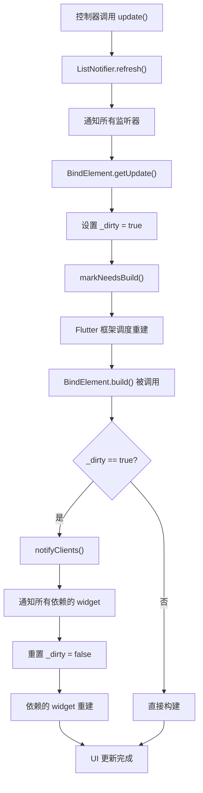
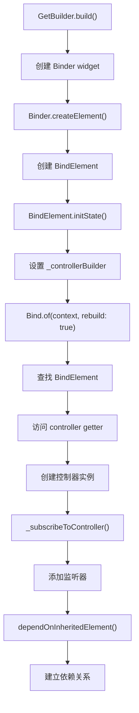

# Binder 和 BindElement 详解

## 概述

`Binder` 是一个继承自 `InheritedWidget` 的 widget，用于在 widget 树中提供控制器实例。`BindElement` 是 `InheritedElement` 的子类，负责管理控制器的创建、订阅和生命周期。它们是 GetX 状态管理系统中基于控制器更新机制的核心组件，通过 `InheritedWidget` 机制实现依赖注入和自动更新。

`Binder` 和 `BindElement` 是 `GetBuilder` 的基础实现。当 `GetBuilder` 被创建时，它会创建一个 `Binder` widget，`Binder` 创建对应的 `BindElement` 来管理控制器的生命周期。当控制器调用 `update()` 方法时，`BindElement` 会通知所有依赖它的 widget 进行重建。

## 核心功能

`Binder` 和 `BindElement` 主要提供以下核心功能：

1. **依赖注入**：通过 `InheritedWidget` 机制在 widget 树中提供控制器实例
2. **控制器生命周期管理**：自动管理控制器的创建、订阅和销毁
3. **懒加载机制**：控制器在首次访问时才创建，支持延迟初始化
4. **全局/局部管理**：支持全局依赖注入和局部作用域管理
5. **自动更新机制**：当控制器调用 `update()` 时，自动触发依赖的 widget 重建
6. **选择性更新**：支持通过 `id` 参数实现选择性更新
7. **过滤更新**：支持通过 `filter` 函数实现条件更新

## Binder 类详解

### 类定义

```dart 370:418:lib/get_state_manager/src/simple/get_state.dart
class Binder<T> extends InheritedWidget {
  /// Create an inherited widget that updates its dependents when [controller]
  /// sends notifications.
  ///
  /// The [child] argument is required
  const Binder({
    super.key,
    required super.child,
    this.init,
    this.global = true,
    this.autoRemove = true,
    this.assignId = false,
    this.lazy = true,
    this.initState,
    this.filter,
    this.tag,
    this.dispose,
    this.id,
    this.didChangeDependencies,
    this.didUpdateWidget,
    this.create,
  });

  final InitBuilder<T>? init;
  final InstanceCreateBuilderCallback? create;
  final bool global;
  final Object? id;
  final String? tag;
  final bool lazy;
  final bool autoRemove;
  final bool assignId;
  final Object Function(T value)? filter;
  final void Function(BindElement<T> state)? initState,
      dispose,
      didChangeDependencies;
  final void Function(Binder<T> oldWidget, BindElement<T> state)?
      didUpdateWidget;

  @override
  bool updateShouldNotify(Binder<T> oldWidget) {
    return oldWidget.id != id ||
        oldWidget.global != global ||
        oldWidget.autoRemove != autoRemove ||
        oldWidget.assignId != assignId;
  }

  @override
  InheritedElement createElement() => BindElement<T>(this);
}
```

**设计特点**：

- **继承 InheritedWidget**：通过 `InheritedWidget` 机制在 widget 树中提供控制器
- **泛型支持**：支持任意类型的控制器（`T`）
- **常量构造函数**：使用 `const` 构造函数，支持编译时常量
- **自定义元素创建**：重写 `createElement()` 返回 `BindElement<T>`

### 参数说明

#### `init` - 初始化函数

- **类型**：`InitBuilder<T>?`
- **默认值**：`null`
- **说明**：用于创建控制器实例的函数。如果控制器已在依赖注入系统中注册，可以省略此参数

```dart
typedef InitBuilder<T> = T Function();
```

#### `create` - 创建函数

- **类型**：`InstanceCreateBuilderCallback?`
- **默认值**：`null`
- **说明**：接收 `BindElement` 作为参数，用于创建控制器实例的函数。与 `init` 的区别是 `create` 可以访问 `BindElement` 实例

```dart
typedef InstanceCreateBuilderCallback<S> = S Function(BuildContext _);
```

#### `global` - 全局控制器

- **类型**：`bool`
- **默认值**：`true`
- **说明**：是否使用全局控制器。如果为 `true`，控制器会被注册到全局依赖注入系统；如果为 `false`，控制器仅在当前 widget 树中可用

#### `lazy` - 懒加载

- **类型**：`bool`
- **默认值**：`true`
- **说明**：是否延迟创建控制器。如果为 `true`，使用 `Get.lazyPut()` 注册；如果为 `false`，使用 `Get.put()` 立即创建

#### `autoRemove` - 自动移除

- **类型**：`bool`
- **默认值**：`true`
- **说明**：当 widget 被销毁时，是否自动从依赖注入系统中移除控制器

#### `assignId` - 分配 ID

- **类型**：`bool`
- **默认值**：`false`
- **说明**：是否为控制器分配 ID

#### `id` - Widget ID

- **类型**：`Object?`
- **默认值**：`null`
- **说明**：用于选择性更新的 widget ID。当控制器调用 `update([id])` 时，只有匹配 ID 的 widget 会更新

#### `tag` - 控制器标签

- **类型**：`String?`
- **默认值**：`null`
- **说明**：用于区分同一类型的多个控制器实例

#### `filter` - 过滤函数

- **类型**：`Object Function(T value)?`
- **默认值**：`null`
- **说明**：用于过滤更新条件的函数。只有当过滤结果发生变化时，widget 才会更新

#### 生命周期回调

- **`initState`**：在 `BindElement` 初始化时调用
- **`dispose`**：在 `BindElement` 销毁时调用
- **`didChangeDependencies`**：在依赖变化时调用
- **`didUpdateWidget`**：在 widget 更新时调用

### `updateShouldNotify()` - 更新通知判断

```dart 408:414:lib/get_state_manager/src/simple/get_state.dart
  @override
  bool updateShouldNotify(Binder<T> oldWidget) {
    return oldWidget.id != id ||
        oldWidget.global != global ||
        oldWidget.autoRemove != autoRemove ||
        oldWidget.assignId != assignId;
  }
```

**功能说明**：

- 判断当 `Binder` widget 更新时，是否需要通知依赖的 widget
- 比较新旧 widget 的 `id`、`global`、`autoRemove`、`assignId` 属性
- 如果这些属性发生变化，返回 `true`，触发依赖的 widget 更新

**设计考虑**：

- 只比较影响依赖关系的属性，不比较 `init`、`create` 等不影响依赖的属性
- 当 `id` 变化时，需要重新订阅控制器

### `createElement()` - 创建元素

```dart 416:418:lib/get_state_manager/src/simple/get_state.dart
  @override
  InheritedElement createElement() => BindElement<T>(this);
```

**功能说明**：

- 重写了 `InheritedWidget` 的 `createElement()` 方法
- 返回 `BindElement<T>` 实例而不是默认的 `InheritedElement`
- `BindElement` 负责管理控制器的生命周期和更新机制

## BindElement 类详解

### 类定义

```dart 420:425:lib/get_state_manager/src/simple/get_state.dart
/// The BindElement is responsible for injecting dependencies into the widget
/// tree so that they can be observed
class BindElement<T> extends InheritedElement {
  BindElement(Binder<T> super.widget) {
    initState();
  }
```

**设计特点**：

- **继承 InheritedElement**：管理 `InheritedWidget` 的生命周期
- **构造函数初始化**：在构造函数中调用 `initState()`，确保控制器在元素创建时初始化

### 核心属性

#### `disposers` - 清理函数列表

```dart 427:427:lib/get_state_manager/src/simple/get_state.dart
  final disposers = <Disposer>[];
```

- **类型**：`List<Disposer>`
- **说明**：存储所有需要清理的函数，在 `dispose()` 时调用

#### `_controllerBuilder` - 控制器构建函数

```dart 429:429:lib/get_state_manager/src/simple/get_state.dart
  InitBuilder<T>? _controllerBuilder;
```

- **类型**：`InitBuilder<T>?`
- **说明**：用于创建控制器实例的函数，在 `initState()` 中设置

#### `_controller` - 控制器实例

```dart 431:431:lib/get_state_manager/src/simple/get_state.dart
  T? _controller;
```

- **类型**：`T?`
- **说明**：缓存的控制器实例，使用懒加载机制

#### `_isCreator` - 是否创建者

```dart 446:446:lib/get_state_manager/src/simple/get_state.dart
  bool? _isCreator = false;
```

- **类型**：`bool?`
- **说明**：标识当前 `BindElement` 是否是控制器的创建者。如果是创建者，在销毁时需要负责移除控制器

#### `_needStart` - 需要启动

```dart 447:447:lib/get_state_manager/src/simple/get_state.dart
  bool? _needStart = false;
```

- **类型**：`bool?`
- **说明**：标识控制器是否需要调用 `onStart()` 生命周期方法

#### `_wasStarted` - 已启动

```dart 448:448:lib/get_state_manager/src/simple/get_state.dart
  bool _wasStarted = false;
```

- **类型**：`bool`
- **说明**：标识控制器是否已经启动过

#### `_remove` - 移除监听器函数

```dart 449:449:lib/get_state_manager/src/simple/get_state.dart
  VoidCallback? _remove;
```

- **类型**：`VoidCallback?`
- **说明**：用于移除监听器的回调函数

#### `_filter` - 过滤值

```dart 450:450:lib/get_state_manager/src/simple/get_state.dart
  Object? _filter;
```

- **类型**：`Object?`
- **说明**：存储过滤函数的返回值，用于比较是否需要更新

### `controller` - 控制器访问器

```dart 433:444:lib/get_state_manager/src/simple/get_state.dart
  T get controller {
    if (_controller == null) {
      _controller = _controllerBuilder?.call();
      _subscribeToController();
      if (_controller == null) {
        throw BindError(controller: T, tag: widget.tag);
      }
      return _controller!;
    } else {
      return _controller!;
    }
  }
```

**功能说明**：

- 使用懒加载机制，只有在首次访问时才创建控制器
- 如果控制器未创建，调用 `_controllerBuilder` 创建控制器
- 创建后调用 `_subscribeToController()` 订阅控制器
- 如果创建失败，抛出 `BindError` 异常

**工作流程**：

1. 首次访问 `controller` 时，`_controller` 为 `null`
2. 调用 `_controllerBuilder?.call()` 创建控制器实例
3. 调用 `_subscribeToController()` 订阅控制器更新
4. 将控制器实例缓存到 `_controller`
5. 后续访问直接返回缓存的实例

### `initState()` - 初始化方法

```dart 452:489:lib/get_state_manager/src/simple/get_state.dart
  void initState() {
    widget.initState?.call(this);

    var isRegistered = Get.isRegistered<T>(tag: widget.tag);

    if (widget.global) {
      if (isRegistered) {
        if (Get.isPrepared<T>(tag: widget.tag)) {
          _isCreator = true;
        } else {
          _isCreator = false;
        }

        _controllerBuilder = () => Get.find<T>(tag: widget.tag);
      } else {
        _controllerBuilder =
            () => (widget.create?.call(this) ?? widget.init?.call());
        _isCreator = true;
        if (widget.lazy) {
          Get.lazyPut<T>(_controllerBuilder!, tag: widget.tag);
        } else {
          Get.put<T>(_controllerBuilder!(), tag: widget.tag);
        }
      }
    } else {
      if (widget.create != null) {
        _controllerBuilder = () => widget.create!.call(this);
        Get.spawn<T>(_controllerBuilder!, tag: widget.tag, permanent: false);
      } else {
        _controllerBuilder = widget.init;
      }
      _controllerBuilder =
          (widget.create != null ? () => widget.create!.call(this) : null) ??
              widget.init;
      _isCreator = true;
      _needStart = true;
    }
  }
```

**功能说明**：

- 初始化 `BindElement`，设置控制器构建函数
- 根据 `global` 参数决定控制器的创建方式
- 调用 `widget.initState` 回调（如果提供）

**全局控制器逻辑**（`global = true`）：

1. **已注册**：如果控制器已在依赖注入系统中注册
   - 检查是否已准备（`Get.isPrepared`）
   - 如果已准备，`_isCreator = true`；否则 `_isCreator = false`
   - 设置 `_controllerBuilder` 为 `Get.find<T>()`
2. **未注册**：如果控制器未注册
   - 设置 `_controllerBuilder` 为 `widget.create` 或 `widget.init`
   - `_isCreator = true`
   - 根据 `lazy` 参数决定使用 `Get.lazyPut()` 或 `Get.put()` 注册

**局部控制器逻辑**（`global = false`）：

1. 优先使用 `widget.create`，其次使用 `widget.init`
2. 如果使用 `widget.create`，调用 `Get.spawn()` 注册
3. `_isCreator = true`
4. `_needStart = true`（需要手动调用 `onStart()`）

### `_subscribeToController()` - 订阅控制器

```dart 491:521:lib/get_state_manager/src/simple/get_state.dart
  /// Register to listen Controller's events.
  /// It gets a reference to the remove() callback, to delete the
  /// setState "link" from the Controller.
  void _subscribeToController() {
    if (widget.filter != null) {
      _filter = widget.filter!(_controller as T);
    }
    final filter = _filter != null ? _filterUpdate : getUpdate;
    final localController = _controller;

    if (_needStart == true && localController is GetLifeCycleMixin) {
      localController.onStart();
      _needStart = false;
      _wasStarted = true;
    }

    if (localController is GetxController) {
      _remove?.call();
      _remove = (widget.id == null)
          ? localController.addListener(filter)
          : localController.addListenerId(widget.id, filter);
    } else if (localController is Listenable) {
      _remove?.call();
      localController.addListener(filter);
      _remove = () => localController.removeListener(filter);
    } else if (localController is StreamController) {
      _remove?.call();
      final stream = localController.stream.listen((_) => filter());
      _remove = () => stream.cancel();
    }
  }
```

**功能说明**：

- 订阅控制器的更新事件
- 根据控制器类型选择不同的订阅方式
- 如果设置了 `filter`，使用 `_filterUpdate`；否则使用 `getUpdate`
- 如果 `_needStart` 为 `true`，调用控制器的 `onStart()` 方法

**支持的控制器类型**：

1. **GetxController**：使用 `addListener()` 或 `addListenerId()` 订阅
2. **Listenable**：使用 `addListener()` 订阅（如 `ChangeNotifier`）
3. **StreamController**：监听 stream 事件

**工作流程**：

1. 如果设置了 `filter`，计算初始过滤值
2. 根据是否有 `filter` 选择更新函数
3. 如果需要启动，调用 `onStart()`
4. 根据控制器类型订阅更新事件
5. 保存移除监听器的回调函数

### `_filterUpdate()` - 过滤更新

```dart 523:529:lib/get_state_manager/src/simple/get_state.dart
  void _filterUpdate() {
    var newFilter = widget.filter!(_controller as T);
    if (newFilter != _filter) {
      _filter = newFilter;
      getUpdate();
    }
  }
```

**功能说明**：

- 当控制器更新时，重新计算过滤值
- 只有当过滤值发生变化时，才调用 `getUpdate()` 触发重建
- 用于实现条件更新，避免不必要的 widget 重建

**使用场景**：

- 只关心控制器的特定属性变化
- 需要根据条件决定是否更新 UI

### `dispose()` - 销毁方法

```dart 531:553:lib/get_state_manager/src/simple/get_state.dart
  void dispose() {
    widget.dispose?.call(this);
    if (_isCreator! || widget.assignId) {
      if (widget.autoRemove && Get.isRegistered<T>(tag: widget.tag)) {
        Get.delete<T>(tag: widget.tag);
      }
    }

    for (final disposer in disposers) {
      disposer();
    }

    disposers.clear();

    _remove?.call();
    _controller = null;
    _isCreator = null;
    _remove = null;
    _filter = null;
    _needStart = null;
    _controllerBuilder = null;
    _controller = null;
  }
```

**功能说明**：

- 清理所有资源，包括控制器、监听器和清理函数
- 如果当前元素是创建者，且 `autoRemove` 为 `true`，从依赖注入系统中移除控制器
- 调用所有清理函数，移除监听器
- 清空所有状态变量

**清理顺序**：

1. 调用 `widget.dispose` 回调（如果提供）
2. 如果是创建者，且 `autoRemove` 为 `true`，删除控制器
3. 调用所有 `disposers` 中的清理函数
4. 移除控制器监听器
5. 清空所有状态变量

### `update()` - 更新方法

```dart 560:569:lib/get_state_manager/src/simple/get_state.dart
  @override
  void update(Binder<T> newWidget) {
    final oldNotifier = widget.id;
    final newNotifier = newWidget.id;
    if (oldNotifier != newNotifier && _wasStarted) {
      _subscribeToController();
    }
    widget.didUpdateWidget?.call(widget, this);
    super.update(newWidget);
  }
```

**功能说明**：

- 当 `Binder` widget 更新时调用
- 如果 `id` 发生变化，重新订阅控制器
- 调用 `widget.didUpdateWidget` 回调（如果提供）

**设计考虑**：

- 只在 `id` 变化且控制器已启动时重新订阅
- 避免在控制器未启动时重复订阅

### `didChangeDependencies()` - 依赖变化

```dart 571:575:lib/get_state_manager/src/simple/get_state.dart
  @override
  void didChangeDependencies() {
    super.didChangeDependencies();
    widget.didChangeDependencies?.call(this);
  }
```

**功能说明**：

- 当依赖的 `InheritedWidget` 变化时调用
- 调用 `widget.didChangeDependencies` 回调（如果提供）

### `build()` - 构建方法

```dart 577:587:lib/get_state_manager/src/simple/get_state.dart
  @override
  Widget build() {
    if (_dirty) {
      notifyClients(widget);
    }
    // return Notifier.instance.notifyAppend(
    //   NotifyData(
    //       disposers: disposers, updater: getUpdate, throwException: false),
    return super.build();
    //);
  }
```

**功能说明**：

- 如果 `_dirty` 为 `true`，通知所有依赖的 widget 更新
- 调用父类的 `build()` 方法构建 widget

**设计考虑**：

- 使用 `_dirty` 标志避免重复通知
- 注释掉的代码显示了可能的响应式支持（未启用）

### `getUpdate()` - 更新触发

```dart 589:592:lib/get_state_manager/src/simple/get_state.dart
  void getUpdate() {
    _dirty = true;
    markNeedsBuild();
  }
```

**功能说明**：

- 当控制器调用 `update()` 时，此方法被调用
- 设置 `_dirty` 标志，标记需要更新
- 调用 `markNeedsBuild()` 触发 widget 重建

**工作流程**：

1. 控制器调用 `update()`
2. `getUpdate()` 被调用
3. 设置 `_dirty = true`
4. 调用 `markNeedsBuild()`
5. Flutter 框架在下次构建时调用 `build()`
6. `build()` 中检查 `_dirty`，调用 `notifyClients()`

### `notifyClients()` - 通知客户端

```dart 594:598:lib/get_state_manager/src/simple/get_state.dart
  @override
  void notifyClients(Binder<T> oldWidget) {
    super.notifyClients(oldWidget);
    _dirty = false;
  }
```

**功能说明**：

- 重写了 `InheritedElement` 的 `notifyClients()` 方法
- 通知所有依赖的 widget 更新
- 重置 `_dirty` 标志

### `unmount()` - 卸载方法

```dart 600:604:lib/get_state_manager/src/simple/get_state.dart
  @override
  void unmount() {
    dispose();
    super.unmount();
  }
```

**功能说明**：

- 当元素从 widget 树中卸载时调用
- 调用 `dispose()` 清理资源
- 调用父类的 `unmount()` 方法

## 与相关组件的关系

### 与 InheritedWidget 的关系

`Binder` 继承自 `InheritedWidget`，利用 Flutter 的依赖注入机制：

- **依赖提供**：`Binder` 在 widget 树中提供控制器实例
- **依赖查找**：子 widget 通过 `Bind.of<T>(context)` 查找控制器
- **依赖追踪**：通过 `dependOnInheritedElement()` 建立依赖关系
- **自动更新**：当 `Binder` 更新时，所有依赖的 widget 自动重建

### 与 GetBuilder 的关系

`GetBuilder` 使用 `Binder` 提供控制器：

```dart 65:84:lib/get_state_manager/src/simple/get_state.dart
  @override
  Widget build(BuildContext context) {
    return Binder(
      init: init == null ? null : () => init!,
      global: global,
      autoRemove: autoRemove,
      assignId: assignId,
      initState: initState,
      filter: filter,
      tag: tag,
      dispose: dispose,
      id: id,
      lazy: false,
      didChangeDependencies: didChangeDependencies,
      didUpdateWidget: didUpdateWidget,
      child: Builder(builder: (context) {
        final controller = Bind.of<T>(context, rebuild: true);
        return builder(controller);
      }),
    );
  }
```

**关系说明**：

- `GetBuilder` 创建 `Binder` widget
- `Binder` 创建 `BindElement` 管理控制器
- `GetBuilder` 通过 `Bind.of<T>()` 获取控制器

### 与 Bind.of() 的关系

`Bind.of()` 用于从 `BuildContext` 中查找控制器：

```dart 239:264:lib/get_state_manager/src/simple/get_state.dart
  static T of<T>(
    BuildContext context, {
    bool rebuild = false,
    // Object Function(T value)? filter,
  }) {
    final inheritedElement =
        context.getElementForInheritedWidgetOfExactType<Binder<T>>()
            as BindElement<T>?;

    if (inheritedElement == null) {
      throw BindError(controller: '$T', tag: null);
    }

    if (rebuild) {
      // var newFilter = filter?.call(inheritedElement.controller!);
      // if (newFilter != null) {
      //  context.dependOnInheritedElement(inheritedElement, aspect: newFilter);
      // } else {
      context.dependOnInheritedElement(inheritedElement);
      // }
    }

    final controller = inheritedElement.controller;

    return controller;
  }
```

**关系说明**：

- `Bind.of()` 查找最近的 `Binder<T>` 对应的 `BindElement<T>`
- 如果 `rebuild` 为 `true`，建立依赖关系
- 返回 `BindElement` 的控制器实例

### 与 GetxController 的关系

`BindElement` 订阅 `GetxController` 的更新：

- **订阅机制**：通过 `addListener()` 或 `addListenerId()` 订阅
- **更新触发**：当控制器调用 `update()` 时，`getUpdate()` 被调用
- **生命周期**：管理控制器的创建和销毁

## 更新机制详解

### 完整更新流程



### 依赖关系建立



### InheritedWidget 机制的应用

`Binder` 利用 `InheritedWidget` 机制实现依赖注入：

1. **提供依赖**：`Binder` 在 widget 树中提供控制器
2. **查找依赖**：子 widget 通过 `context.getElementForInheritedWidgetOfExactType<Binder<T>>()` 查找
3. **建立依赖**：调用 `context.dependOnInheritedElement()` 建立依赖关系
4. **通知更新**：当 `Binder` 更新时，`notifyClients()` 通知所有依赖的 widget

## 使用场景

### 在 GetBuilder 中的使用

`GetBuilder` 内部使用 `Binder` 提供控制器：

```dart
GetBuilder<CounterController>(
  init: CounterController(),
  builder: (controller) => Text('${controller.count}'),
)
```

**工作流程**：

1. `GetBuilder` 创建 `Binder<CounterController>`
2. `Binder` 创建 `BindElement` 管理控制器
3. `GetBuilder` 通过 `Bind.of<T>()` 获取控制器
4. 当控制器调用 `update()` 时，`GetBuilder` 自动重建

### 全局控制器管理

使用全局控制器，可以在应用的任何地方访问：

```dart
// 在应用启动时注册
Get.put(UserController(), permanent: true);

// 在任意位置使用
Binder<UserController>(
  builder: (controller) => Text(controller.name),
)
```

### 局部控制器管理

使用局部控制器，只在当前 widget 树中可用：

```dart
Binder<UserController>(
  global: false,
  init: () => UserController(),
  builder: (controller) => Text(controller.name),
)
```

### 选择性更新

通过 `id` 参数实现选择性更新：

```dart
class UserController extends GetxController {
  String name = 'John';
  int age = 30;

  void updateName(String newName) {
    name = newName;
    update(['name']);
  }

  void updateAge(int newAge) {
    age = newAge;
    update(['age']);
  }
}

// 只更新 name
Binder<UserController>(
  id: 'name',
  builder: (controller) => Text(controller.name),
)

// 只更新 age
Binder<UserController>(
  id: 'age',
  builder: (controller) => Text('${controller.age}'),
)
```

### 过滤更新

通过 `filter` 函数实现条件更新：

```dart
Binder<ProductController>(
  filter: (controller) => controller.searchQuery,
  builder: (controller) {
    final filtered = controller.products
        .where((p) => p.name.contains(controller.searchQuery ?? ''))
        .toList();
    return ListView.builder(
      itemCount: filtered.length,
      itemBuilder: (context, index) => ListTile(
        title: Text(filtered[index].name),
      ),
    );
  },
)
```

## 代码示例

### 基本使用

```dart
class CounterController extends GetxController {
  int count = 0;

  void increment() {
    count++;
    update();
  }
}

// 使用 Binder（通常通过 GetBuilder）
GetBuilder<CounterController>(
  init: CounterController(),
  builder: (controller) => Column(
    children: [
      Text('Count: ${controller.count}'),
      ElevatedButton(
        onPressed: () => controller.increment(),
        child: Text('Increment'),
      ),
    ],
  ),
)
```

### 全局控制器示例

```dart
// 在应用启动时注册
Get.put(UserController(), permanent: true);

// 在任意位置使用
GetBuilder<UserController>(
  builder: (controller) => Text(controller.name),
)
```

### 局部控制器示例

```dart
GetBuilder<UserController>(
  global: false,
  init: UserController(),
  builder: (controller) => Text(controller.name),
)
```

### 懒加载示例

```dart
// 使用 lazy: true（默认值）
GetBuilder<HeavyController>(
  init: () => HeavyController(),
  lazy: true, // 控制器在首次访问时才创建
  builder: (controller) => Text('Loaded'),
)
```

### 生命周期回调示例

```dart
GetBuilder<MyController>(
  init: MyController(),
  initState: (state) {
    print('Controller initialized');
  },
  dispose: (state) {
    print('Controller disposed');
  },
  didChangeDependencies: (state) {
    print('Dependencies changed');
  },
  didUpdateWidget: (oldWidget, state) {
    print('Widget updated');
  },
  builder: (controller) => Text('Hello'),
)
```

### 过滤更新示例

```dart
class ProductController extends GetxController {
  List<Product> products = [];
  String? searchQuery;

  void setSearchQuery(String query) {
    searchQuery = query;
    update(['products']);
  }
}

GetBuilder<ProductController>(
  init: ProductController(),
  filter: (controller) => controller.searchQuery,
  builder: (controller) {
    final filtered = controller.products
        .where((p) => p.name.contains(controller.searchQuery ?? ''))
        .toList();
    return ListView.builder(
      itemCount: filtered.length,
      itemBuilder: (context, index) => ListTile(
        title: Text(filtered[index].name),
      ),
    );
  },
)
```

## 注意事项

### 1. 控制器生命周期管理

`BindElement` 会自动管理控制器的生命周期，但需要注意：

```dart
// 正确：使用 autoRemove: true（默认值）
GetBuilder<CounterController>(
  init: CounterController(),
  autoRemove: true, // widget 销毁时自动移除控制器
  builder: (controller) => Text('${controller.count}'),
)

// 注意：如果控制器需要持久化，设置 autoRemove: false
GetBuilder<UserController>(
  init: UserController(),
  autoRemove: false, // widget 销毁时不移除控制器
  builder: (controller) => Text(controller.name),
)
```

### 2. 懒加载的使用

懒加载可以延迟控制器的创建，但需要注意：

```dart
// 懒加载：控制器在首次访问时才创建
GetBuilder<HeavyController>(
  init: () => HeavyController(),
  lazy: true, // 延迟创建
  builder: (controller) => Text('Loaded'),
)

// 立即创建：控制器在 Binder 创建时立即创建
GetBuilder<LightController>(
  init: LightController(),
  lazy: false, // 立即创建
  builder: (controller) => Text('Ready'),
)
```

### 3. 全局 vs 局部的选择

- **全局控制器**：需要在多个页面共享状态时使用
- **局部控制器**：只在当前页面使用，页面销毁时自动清理

```dart
// 全局控制器：可以在多个页面访问
Get.put(GlobalController(), permanent: true);

// 局部控制器：只在当前 widget 树中可用
GetBuilder<LocalController>(
  global: false,
  init: LocalController(),
  builder: (controller) => Text('Local'),
)
```

### 4. ID 的使用规范

使用 ID 进行选择性更新时，确保 `Binder` 的 `id` 与 `update()` 中的 ID 一致：

```dart
// 正确示例
GetBuilder<Controller>(
  id: 'counter',
  builder: (controller) => Text('${controller.count}'),
)

controller.update(['counter']); // ID 一致

// 错误示例
GetBuilder<Controller>(
  id: 'counter',
  builder: (controller) => Text('${controller.count}'),
)

controller.update(['count']); // ID 不一致，widget 不会更新
```

### 5. 过滤函数的使用

过滤函数应该返回可比较的值，避免不必要的更新：

```dart
// 正确：返回简单值
GetBuilder<Controller>(
  filter: (controller) => controller.count, // 返回 int
  builder: (controller) => Text('${controller.count}'),
)

// 注意：返回复杂对象可能导致频繁更新
GetBuilder<Controller>(
  filter: (controller) => controller.user, // 返回对象，每次都是新实例
  builder: (controller) => Text(controller.user.name),
)
```

### 6. 内存泄漏预防

确保在 `dispose()` 时正确清理资源：

- `BindElement` 会自动清理监听器和控制器
- 如果自定义了 `dispose` 回调，确保清理所有资源
- 避免在已销毁的 `BindElement` 上访问控制器

### 7. 性能优化建议

- **使用 ID 进行选择性更新**：只更新需要更新的 widget
- **合理使用 filter**：避免在 filter 中执行耗时操作
- **避免频繁创建控制器**：使用全局控制器或缓存机制
- **使用 const widget**：在 builder 中使用 `const` widget 减少重建

## 总结

`Binder` 和 `BindElement` 是 GetX 状态管理系统中基于控制器更新机制的核心组件。它们通过 `InheritedWidget` 机制实现依赖注入和自动更新，为 `GetBuilder` 提供了强大的状态管理能力。

`Binder` 和 `BindElement` 的主要优势在于：

1. **依赖注入**：通过 `InheritedWidget` 机制实现优雅的依赖注入
2. **生命周期管理**：自动管理控制器的创建、订阅和销毁
3. **懒加载支持**：支持延迟初始化，提高性能
4. **选择性更新**：通过 ID 实现精确的更新控制
5. **过滤更新**：通过 filter 函数实现条件更新
6. **全局/局部管理**：支持全局和局部两种管理方式

理解 `Binder` 和 `BindElement` 的工作原理对于深入理解 GetX 的状态管理系统非常重要。它们展示了如何通过 `InheritedWidget` 机制实现依赖注入和状态管理，这是 GetX 状态管理系统的重要组成部分。

## 参考资料

- [GetBuilder 详解](lib/get_state_manager/src/simple/get_state.dart_get-builder.md)
- [GetxController 详解](lib/get_state_manager/src/simple/get_controllers.dart_getx-controller.md)
- [Flutter InheritedWidget 文档](https://api.flutter.dev/flutter/widgets/InheritedWidget-class.html)
- [Flutter InheritedElement 文档](https://api.flutter.dev/flutter/widgets/InheritedElement-class.html)
- [GetX 状态管理文档](https://github.com/jonataslaw/getx/blob/master/README.md#state-management)
