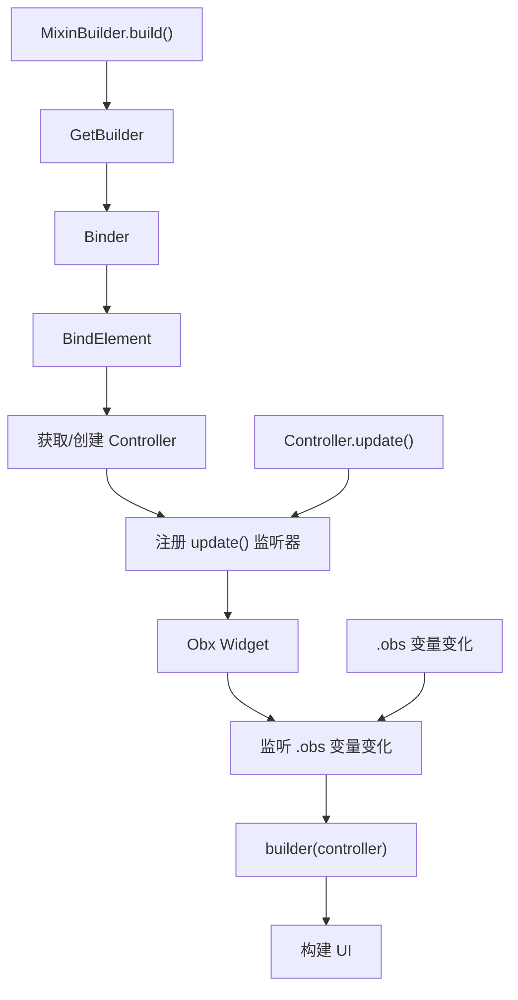

# MixinBuilder 代码讲解

## 概述

`MixinBuilder` 是 GetX 状态管理系统中一个特殊的 Widget，它结合了 `GetBuilder` 和 `Obx` 两种状态管理方式的功能。当你需要在同一个控制器中同时使用响应式变量（`.obs`）和手动更新（`update()`）时，`MixinBuilder` 是最佳选择。

### 定位与作用

`MixinBuilder` 的设计初衷是为了满足开发者同时使用两种状态管理机制的需求：

- **响应式更新**：通过 `.obs` 变量自动触发 UI 重建
- **手动更新**：通过 `update()` 方法手动触发 UI 重建

### 与其他组件的对比

GetX 提供了四种主要的状态管理 Widget：

1. **GetBuilder**：手动状态管理，通过 `update()` 触发重建，资源消耗最低
2. **GetX**：响应式状态管理，自动监听 `.obs` 变量变化
3. **Obx**：轻量级响应式 Widget，只监听其子 Widget 中使用的响应式变量
4. **MixinBuilder**：混合模式，同时支持响应式和手动更新，但资源消耗最高

## 代码结构分析

### 类定义

```dart 7:7:lib/get_state_manager/src/simple/mixin_builder.dart
class MixinBuilder<T extends GetxController> extends StatelessWidget {
```

`MixinBuilder` 是一个泛型类，继承自 `StatelessWidget`：

- **泛型约束**：`T extends GetxController` 确保只能使用继承自 `GetxController` 的控制器类型
- **继承关系**：继承自 `StatelessWidget`，是一个无状态的 Widget

### 属性说明

#### builder

```dart 9:9:lib/get_state_manager/src/simple/mixin_builder.dart
  final Widget Function(T) builder;
```

- **类型**：`Widget Function(T)`，接收控制器实例并返回 Widget
- **必需性**：使用 `@required` 注解标记为必需参数
- **作用**：定义如何根据控制器构建 UI

#### global

```dart 10:10:lib/get_state_manager/src/simple/mixin_builder.dart
  final bool global;
```

- **类型**：`bool`
- **默认值**：`true`
- **作用**：控制控制器的作用域
  - `true`：全局作用域，可以在整个应用中通过 `Get.find<T>()` 访问
  - `false`：局部作用域，仅在当前 Widget 树中可用

#### id

```dart 11:11:lib/get_state_manager/src/simple/mixin_builder.dart
  final String? id;
```

- **类型**：`String?`，可选参数
- **作用**：为 Widget 指定唯一标识符，用于精确控制更新范围
- **使用场景**：当控制器中有多个需要独立更新的部分时，可以通过 `id` 进行区分

#### autoRemove

```dart 12:12:lib/get_state_manager/src/simple/mixin_builder.dart
  final bool autoRemove;
```

- **类型**：`bool`
- **默认值**：`true`
- **作用**：控制 Widget 销毁时是否自动移除控制器
  - `true`：Widget 销毁时自动调用 `Get.delete<T>()` 移除控制器
  - `false`：Widget 销毁时保留控制器实例

#### 生命周期回调参数

```dart 13:17:lib/get_state_manager/src/simple/mixin_builder.dart
  final void Function(BindElement<T> state)? initState,
      dispose,
      didChangeDependencies;
  final void Function(Binder<T> oldWidget, BindElement<T> state)?
      didUpdateWidget;
```

这些回调函数允许你在 Widget 生命周期的不同阶段执行自定义逻辑：

- **initState**：Widget 初始化时调用
- **dispose**：Widget 销毁时调用
- **didChangeDependencies**：依赖项发生变化时调用
- **didUpdateWidget**：Widget 更新时调用，可以访问旧的 Widget 实例

#### init

```dart 18:18:lib/get_state_manager/src/simple/mixin_builder.dart
  final T? init;
```

- **类型**：`T?`，可选参数
- **作用**：提供控制器的初始实例
- **注意**：仅在第一次使用时创建，后续会复用已存在的实例

### 构造函数

```dart 20:31:lib/get_state_manager/src/simple/mixin_builder.dart
  const MixinBuilder({
    super.key,
    this.init,
    this.global = true,
    required this.builder,
    this.autoRemove = true,
    this.initState,
    this.dispose,
    this.id,
    this.didChangeDependencies,
    this.didUpdateWidget,
  });
```

构造函数使用 `const` 关键字，支持编译时常量优化。所有参数都有合理的默认值，只有 `builder` 是必需的。

## 实现原理

### 核心实现

```dart 33:45:lib/get_state_manager/src/simple/mixin_builder.dart
  @override
  Widget build(BuildContext context) {
    return GetBuilder<T>(
        init: init,
        global: global,
        autoRemove: autoRemove,
        initState: initState,
        dispose: dispose,
        id: id,
        didChangeDependencies: didChangeDependencies,
        didUpdateWidget: didUpdateWidget,
        builder: (controller) => Obx(() => builder.call(controller)));
  }
```

`MixinBuilder` 的实现非常巧妙，它采用了组合模式：

1. **外层使用 GetBuilder**：负责控制器的生命周期管理、依赖注入和手动更新机制
2. **内层使用 Obx**：负责响应式变量的监听和自动更新

### 工作流程



### 双重更新机制

`MixinBuilder` 实现了双重更新机制：

1. **GetBuilder 机制**：
   - 当调用 `controller.update()` 时，`GetBuilder` 会触发重建
   - 通过 `BindElement` 监听控制器的 `update()` 方法

2. **Obx 机制**：
   - 当 `.obs` 变量的值发生变化时，`Obx` 会自动触发重建
   - 通过响应式系统监听变量的变化

这两种机制可以同时工作，互不干扰。

## 使用示例

### 基本用法

```dart
class CounterController extends GetxController {
  // 响应式变量
  final count = 0.obs;
  
  // 普通变量
  int total = 0;
  
  // 响应式更新
  void incrementReactive() {
    count.value++;
  }
  
  // 手动更新
  void incrementManual() {
    total++;
    update(); // 手动触发更新
  }
}

// 在 Widget 中使用
MixinBuilder<CounterController>(
  init: CounterController(),
  builder: (controller) {
    return Column(
      children: [
        // 响应式变量会自动更新
        Text('Count: ${controller.count.value}'),
        // 手动更新的变量需要 update() 才会更新
        Text('Total: ${controller.total}'),
        ElevatedButton(
          onPressed: controller.incrementReactive,
          child: Text('响应式增加'),
        ),
        ElevatedButton(
          onPressed: controller.incrementManual,
          child: Text('手动增加'),
        ),
      ],
    );
  },
)
```

### 测试用例解析

参考测试文件 `test/state_manager/get_mixin_state_test.dart`：

```dart 92:110:test/state_manager/get_mixin_state_test.dart
class Controller extends GetxController {
  static Controller get to => Get.find();
  int count = 0;
  RxInt counter = 0.obs;
  RxDouble doubleNum = 0.0.obs;
  RxString string = "string".obs;
  RxList list = [].obs;
  RxMap map = {}.obs;
  RxBool boolean = true.obs;

  void increment() {
    counter.value++;
  }

  void increment2() {
    count++;
    update();
  }
}
```

这个测试用例展示了 `MixinBuilder` 的典型使用场景：

- **increment()**：修改响应式变量 `counter.value++`，会自动触发 UI 更新
- **increment2()**：修改普通变量 `count++` 后调用 `update()`，手动触发 UI 更新

在同一个 Widget 中，两种更新方式可以同时使用：

```dart 12:46:test/state_manager/get_mixin_state_test.dart
          builder: (controller) {
            return Column(
              children: [
                Text(
                  'Count: ${controller.counter.value}',
                ),
                Text(
                  'Count2: ${controller.count}',
                ),
                Text(
                  'Double: ${controller.doubleNum.value}',
                ),
                Text(
                  'String: ${controller.string.value}',
                ),
                Text(
                  'List: ${controller.list.length}',
                ),
                Text(
                  'Bool: ${controller.boolean.value}',
                ),
                TextButton(
                  child: const Text("increment"),
                  onPressed: () => controller.increment(),
                ),
                TextButton(
                  child: const Text("increment2"),
                  onPressed: () => controller.increment2(),
                )
              ],
            );
          },
```

### 使用 ID 进行精确更新

```dart
class MyController extends GetxController {
  String title = '初始标题';
  String subtitle = '初始副标题';
  
  void updateTitle() {
    title = '新标题';
    update(['title']); // 只更新 id 为 'title' 的 Widget
  }
  
  void updateSubtitle() {
    subtitle = '新副标题';
    update(['subtitle']); // 只更新 id 为 'subtitle' 的 Widget
  }
}

MixinBuilder<MyController>(
  init: MyController(),
  builder: (controller) {
    return Column(
      children: [
        MixinBuilder<MyController>(
          id: 'title',
          builder: (controller) => Text(controller.title),
        ),
        MixinBuilder<MyController>(
          id: 'subtitle',
          builder: (controller) => Text(controller.subtitle),
        ),
      ],
    );
  },
)
```

## 性能考虑

### 资源消耗

`MixinBuilder` 是四个状态管理 Widget 中资源消耗最高的，原因如下：

1. **双重订阅机制**：
   - 订阅了控制器的 `update()` 方法（通过 `GetBuilder`）
   - 订阅了响应式变量的变化（通过 `Obx`）

2. **内存开销**：
   - 需要维护两套监听机制
   - 响应式变量本身会创建 Stream 订阅

3. **CPU 开销**：
   - 需要同时处理两种更新机制
   - 响应式系统需要追踪依赖关系

### 适用场景建议

**适合使用 MixinBuilder 的场景**：

1. 控制器中同时存在响应式变量和普通变量
2. 需要逐步迁移现有代码，部分使用响应式，部分使用手动更新
3. 复杂的业务逻辑，需要灵活选择更新方式

**不适合使用 MixinBuilder 的场景**：

1. 只使用响应式变量：使用 `GetX` 或 `Obx` 更高效
2. 只使用手动更新：使用 `GetBuilder` 更高效
3. 性能敏感的场景：考虑拆分控制器，分别使用不同的 Widget

### 与其他组件的选择建议

| Widget | 更新方式 | 资源消耗 | 适用场景 |
|--------|---------|---------|---------|
| GetBuilder | 手动（update()） | 最低 | 简单状态，手动控制更新 |
| GetX | 响应式（.obs） | 中等 | 需要自动更新的响应式状态 |
| Obx | 响应式（.obs） | 较低 | 轻量级响应式更新 |
| MixinBuilder | 混合（两者都支持） | 最高 | 需要同时使用两种方式 |

**选择建议**：

- 优先使用 `GetBuilder` 或 `Obx`，它们更高效
- 只有在确实需要混合使用时才选择 `MixinBuilder`
- 考虑重构代码，统一使用一种更新方式

## 注意事项

### 必须使用 GetxController

`MixinBuilder` 的泛型约束要求控制器必须继承自 `GetxController`：

```dart
// ✅ 正确
class MyController extends GetxController {
  // ...
}

MixinBuilder<MyController>(
  builder: (controller) => Text('Hello'),
)

// ❌ 错误
class MyController {
  // ...
}

MixinBuilder<MyController>( // 编译错误：MyController 不继承 GetxController
  builder: (controller) => Text('Hello'),
)
```

**原因**：

- `GetxController` 提供了生命周期管理（`onInit()`、`onClose()` 等）
- `GetxController` 实现了 `update()` 方法
- `GetxController` 与 GetX 的依赖注入系统集成

### 生命周期管理

`MixinBuilder` 会自动管理控制器的生命周期：

1. **初始化**：如果控制器不存在，会根据 `init` 参数创建
2. **注册**：控制器会被注册到 GetX 的依赖注入系统
3. **销毁**：当 `autoRemove` 为 `true` 时，Widget 销毁会自动移除控制器

**最佳实践**：

```dart
MixinBuilder<MyController>(
  init: MyController(), // 只在第一次使用时创建
  autoRemove: true, // 自动清理，避免内存泄漏
  builder: (controller) {
    // 使用 controller
  },
)
```

### 避免不必要的重建

虽然 `MixinBuilder` 支持两种更新方式，但应该避免不必要的更新：

```dart
// ❌ 不好的做法：同时使用两种方式更新同一个值
class BadController extends GetxController {
  final count = 0.obs;
  
  void increment() {
    count.value++; // 响应式更新
    update(); // 手动更新（多余）
  }
}

// ✅ 好的做法：选择一种更新方式
class GoodController extends GetxController {
  final count = 0.obs;
  
  void increment() {
    count.value++; // 只使用响应式更新
  }
}
```

### 性能优化建议

1. **拆分控制器**：如果可能，将响应式变量和普通变量拆分到不同的控制器
2. **使用 Obx 局部更新**：对于只需要响应式更新的部分，使用 `Obx` 包裹
3. **避免过度使用**：不要在整个应用中都使用 `MixinBuilder`，只在需要的地方使用

```dart
// ✅ 优化后的代码
MixinBuilder<MyController>(
  builder: (controller) {
    return Column(
      children: [
        // 只需要响应式更新的部分使用 Obx
        Obx(() => Text('${controller.count.value}')),
        // 需要手动更新的部分使用普通 Widget
        Text('${controller.total}'),
      ],
    );
  },
)
```

## 总结

`MixinBuilder` 是 GetX 状态管理系统中的一个特殊组件，它通过组合 `GetBuilder` 和 `Obx` 实现了混合状态管理。虽然它的资源消耗较高，但在需要同时使用响应式和手动更新的场景中，它提供了灵活的解决方案。

**关键要点**：

1. `MixinBuilder` 结合了 `GetBuilder` 和 `Obx` 的功能
2. 支持同时使用响应式变量（`.obs`）和手动更新（`update()`）
3. 资源消耗最高，应谨慎使用
4. 必须使用继承自 `GetxController` 的控制器
5. 优先考虑使用更高效的 `GetBuilder` 或 `Obx`

在使用 `MixinBuilder` 时，应该根据实际需求权衡性能和灵活性，在大多数情况下，统一使用一种更新方式会更高效。
