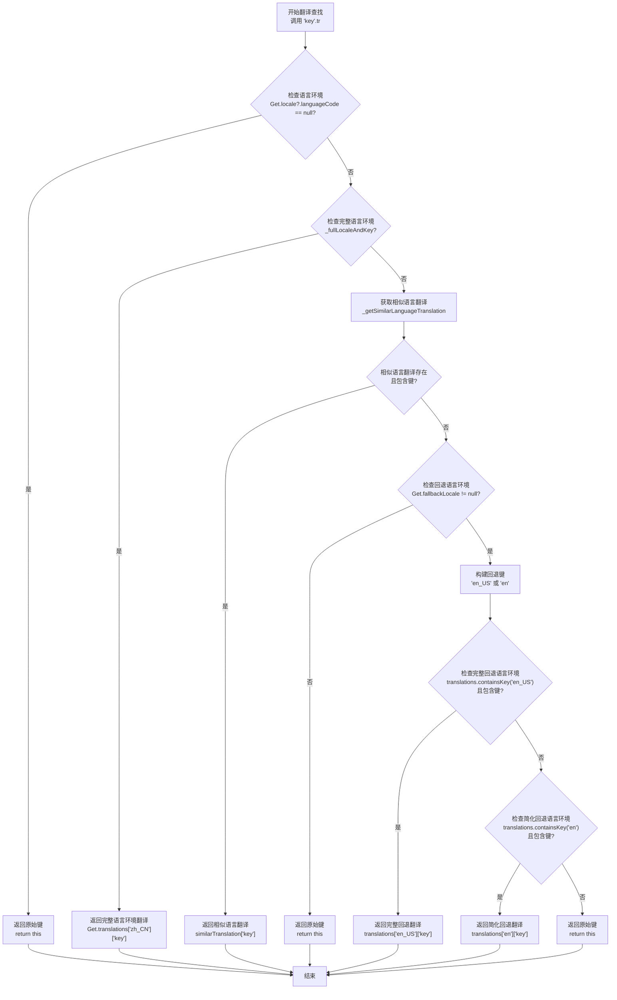

# tr 方法详解

## 概述

`tr` 是 GetX 国际化扩展中最重要的方法之一，它为 `String` 类型提供了一个 getter，用于根据当前语言环境获取翻译后的字符串。该方法实现了智能的翻译查找机制，能够按照优先级顺序查找翻译，并在找不到翻译时提供合理的回退策略。

### 方法签名

```dart 81:81:lib/get_utils/src/extensions/internacionalization.dart
  String get tr {
```

**说明**：`tr` 是一个 getter 方法，返回类型为 `String`。它不需要参数，直接通过字符串调用即可，例如 `'hello'.tr`。

### 核心功能

1. **智能翻译查找**：按照优先级顺序查找翻译
2. **语言环境匹配**：支持完整语言环境（语言代码_国家代码）和简化语言环境（仅语言代码）
3. **回退机制**：当找不到翻译时，使用回退语言环境的翻译
4. **安全处理**：当所有查找都失败时，返回原始键值

## 代码逐行讲解

### 第 81-88 行：方法定义和空值检查

```dart 81:88:lib/get_utils/src/extensions/internacionalization.dart
  String get tr {
    // print('language');
    // print(Get.locale!.languageCode);
    // print('contains');
    // print(Get.translations.containsKey(Get.locale!.languageCode));
    // print(Get.translations.keys);
    // Returns the key if locale is null.
    if (Get.locale?.languageCode == null) return this;
```

**逐行说明**：

- **第 81 行**：定义 `tr` getter 方法
- **第 82-86 行**：注释掉的调试代码，用于打印语言环境和翻译信息
- **第 87 行**：注释说明当语言环境为 null 时的处理逻辑
- **第 88 行**：检查当前语言环境的语言代码是否为 null。如果为 null，直接返回原始字符串（`this`），不进行任何翻译查找

**设计意图**：这是一个早期返回（early return）模式，避免在语言环境未设置时进行不必要的查找操作。

### 第 90-93 行：完整语言环境匹配

```dart 90:93:lib/get_utils/src/extensions/internacionalization.dart
    if (_fullLocaleAndKey) {
      return Get.translations[
          "${Get.locale!.languageCode}_${Get.locale!.countryCode}"]![this]!;
    }
```

**逐行说明**：

- **第 90 行**：检查 `_fullLocaleAndKey` 属性（详见辅助方法说明）。该属性检查是否存在完整语言环境（`语言代码_国家代码`）的翻译，并且该翻译中包含当前键
- **第 91-92 行**：如果找到完整语言环境的翻译，直接返回对应的翻译值。使用 `!` 操作符是因为 `_fullLocaleAndKey` 已经确保了这些值不为 null

**示例场景**：

```dart
// 当前语言环境：Locale('zh', 'CN')
// 翻译数据：{'zh_CN': {'hello': '你好'}}
// 调用：'hello'.tr
// 结果：返回 '你好'
```

### 第 94-96 行：相似语言环境匹配

```dart 94:96:lib/get_utils/src/extensions/internacionalization.dart
    final similarTranslation = _getSimilarLanguageTranslation;
    if (similarTranslation != null && similarTranslation.containsKey(this)) {
      return similarTranslation[this]!;
```

**逐行说明**：

- **第 94 行**：获取相似语言的翻译 Map。`_getSimilarLanguageTranslation` 会查找仅使用语言代码（不包含国家代码）的翻译
- **第 95 行**：检查相似语言翻译是否存在，并且包含当前键
- **第 96 行**：如果找到，返回相似语言的翻译值

**设计意图**：当找不到完整语言环境的翻译时，尝试使用仅语言代码的翻译。例如，如果当前是 `Locale('zh', 'TW')`，但只有 `'zh'` 的翻译，则使用 `'zh'` 的翻译。

**示例场景**：

```dart
// 当前语言环境：Locale('zh', 'TW')
// 翻译数据：{'zh': {'hello': '你好'}}  // 没有 zh_TW
// 调用：'hello'.tr
// 结果：返回 '你好'（使用 zh 的翻译）
```

### 第 97-98 行：注释说明

```dart 97:98:lib/get_utils/src/extensions/internacionalization.dart
      // If there is no corresponding language or corresponding key, return
      // the key.
```

**说明**：注释说明了当找不到对应语言或对应键时的处理逻辑——返回原始键值。

### 第 99-111 行：回退语言环境处理

```dart 99:111:lib/get_utils/src/extensions/internacionalization.dart
    } else if (Get.fallbackLocale != null) {
      final fallback = Get.fallbackLocale!;
      final key = "${fallback.languageCode}_${fallback.countryCode}";

      if (Get.translations.containsKey(key) &&
          Get.translations[key]!.containsKey(this)) {
        return Get.translations[key]![this]!;
      }
      if (Get.translations.containsKey(fallback.languageCode) &&
          Get.translations[fallback.languageCode]!.containsKey(this)) {
        return Get.translations[fallback.languageCode]![this]!;
      }
      return this;
```

**逐行说明**：

- **第 99 行**：检查是否设置了回退语言环境（`fallbackLocale`）
- **第 100 行**：获取回退语言环境对象
- **第 101 行**：构建完整回退语言环境的键（`语言代码_国家代码`）
- **第 103-105 行**：首先尝试查找完整回退语言环境的翻译（例如 `'en_US'`）
- **第 107-109 行**：如果完整回退语言环境不存在，尝试查找仅语言代码的回退翻译（例如 `'en'`）
- **第 111 行**：如果回退语言环境也找不到翻译，返回原始键值

**设计意图**：回退机制确保即使当前语言环境没有翻译，也能使用默认语言环境的翻译，避免显示原始键值。

**示例场景**：

```dart
// 当前语言环境：Locale('fr', 'FR')
// 回退语言环境：Locale('en', 'US')
// 翻译数据：{'en_US': {'hello': 'Hello'}}  // 没有 fr_FR
// 调用：'hello'.tr
// 结果：返回 'Hello'（使用回退语言环境的翻译）
```

### 第 112-114 行：最终回退

```dart 112:114:lib/get_utils/src/extensions/internacionalization.dart
    } else {
      return this;
    }
  }
```

**逐行说明**：

- **第 112-113 行**：如果所有查找都失败（没有回退语言环境或回退语言环境也找不到翻译），返回原始键值
- **第 114 行**：方法结束

**设计意图**：确保方法始终返回一个字符串，即使找不到任何翻译。

## 翻译查找流程

以下流程图展示了 `tr` 方法的完整翻译查找流程：



### 查找优先级总结

1. **完整语言环境**：`语言代码_国家代码`（如 `'zh_CN'`）
2. **相似语言环境**：仅 `语言代码`（如 `'zh'`）
3. **完整回退语言环境**：回退的 `语言代码_国家代码`（如 `'en_US'`）
4. **简化回退语言环境**：回退的仅 `语言代码`（如 `'en'`）
5. **原始键值**：如果所有查找都失败，返回原始键

## 辅助方法说明

### _fullLocaleAndKey

```dart 58:64:lib/get_utils/src/extensions/internacionalization.dart
  bool get _fullLocaleAndKey {
    return Get.translations.containsKey(
            "${Get.locale!.languageCode}_${Get.locale!.countryCode}") &&
        Get.translations[
                "${Get.locale!.languageCode}_${Get.locale!.countryCode}"]!
            .containsKey(this);
  }
```

**功能说明**：

- 检查是否存在完整语言环境的翻译数据
- 检查该翻译数据中是否包含当前键

**返回值**：

- `true`：存在完整语言环境翻译且包含当前键
- `false`：不存在完整语言环境翻译或不包含当前键

**使用场景**：

当当前语言环境是 `Locale('zh', 'CN')` 时，检查是否存在 `'zh_CN'` 的翻译，并且该翻译中包含要查找的键。

### _getSimilarLanguageTranslation

```dart 68:79:lib/get_utils/src/extensions/internacionalization.dart
  Map<String, String>? get _getSimilarLanguageTranslation {
    final translationsWithNoCountry = Get.translations
        .map((key, value) => MapEntry(key.split("_").first, value));
    final containsKey = translationsWithNoCountry
        .containsKey(Get.locale!.languageCode.split("_").first);

    if (!containsKey) {
      return null;
    }

    return translationsWithNoCountry[Get.locale!.languageCode.split("_").first];
  }
```

**功能说明**：

- 将翻译数据中的键从 `'语言代码_国家代码'` 转换为仅 `'语言代码'`
- 查找是否存在与当前语言代码匹配的翻译（忽略国家代码）

**返回值**：

- `Map<String, String>?`：如果找到相似语言的翻译，返回翻译 Map；否则返回 `null`

**工作原理**：

1. 遍历所有翻译数据，提取每个键的语言代码部分（`split("_").first`）
2. 创建一个新的 Map，键为语言代码，值为对应的翻译 Map
3. 检查是否存在与当前语言代码匹配的翻译
4. 如果存在，返回对应的翻译 Map

**使用场景**：

当当前语言环境是 `Locale('zh', 'TW')`，但翻译数据中只有 `'zh'` 的翻译时，使用 `'zh'` 的翻译作为相似语言翻译。

## 使用示例

### 示例 1：基本翻译

```dart
// 设置语言环境
Get.locale = Locale('zh', 'CN');

// 添加翻译
Get.addTranslations({
  'zh_CN': {
    'hello': '你好',
    'world': '世界',
  },
});

// 使用翻译
print('hello'.tr);  // 输出：你好
print('world'.tr);  // 输出：世界
```

### 示例 2：相似语言环境匹配

```dart
// 设置语言环境（台湾）
Get.locale = Locale('zh', 'TW');

// 添加翻译（只有简体中文，没有繁体中文）
Get.addTranslations({
  'zh': {
    'hello': '你好',
  },
});

// 使用翻译（会使用相似语言 'zh' 的翻译）
print('hello'.tr);  // 输出：你好
```

### 示例 3：回退语言环境

```dart
// 设置语言环境（法语）
Get.locale = Locale('fr', 'FR');

// 设置回退语言环境（英语）
Get.fallbackLocale = Locale('en', 'US');

// 添加翻译（只有英语，没有法语）
Get.addTranslations({
  'en_US': {
    'hello': 'Hello',
    'goodbye': 'Goodbye',
  },
});

// 使用翻译（会使用回退语言环境的翻译）
print('hello'.tr);     // 输出：Hello
print('goodbye'.tr);    // 输出：Goodbye
```

### 示例 4：找不到翻译的情况

```dart
// 设置语言环境
Get.locale = Locale('zh', 'CN');

// 添加翻译
Get.addTranslations({
  'zh_CN': {
    'hello': '你好',
  },
});

// 查找不存在的键
print('unknown_key'.tr);  // 输出：unknown_key（返回原始键）
```

### 示例 5：完整查找流程

```dart
// 设置语言环境（简体中文）
Get.locale = Locale('zh', 'CN');

// 设置回退语言环境（英语）
Get.fallbackLocale = Locale('en', 'US');

// 添加翻译
Get.addTranslations({
  'zh_CN': {
    'welcome': '欢迎',
  },
  'zh': {
    'greeting': '问候',
  },
  'en_US': {
    'hello': 'Hello',
    'goodbye': 'Goodbye',
  },
  'en': {
    'thanks': 'Thanks',
  },
});

// 测试不同的查找场景
print('welcome'.tr);   // 输出：欢迎（完整语言环境 zh_CN）
print('greeting'.tr);  // 输出：问候（相似语言环境 zh）
print('hello'.tr);     // 输出：Hello（完整回退语言环境 en_US）
print('thanks'.tr);    // 输出：Thanks（简化回退语言环境 en）
print('missing'.tr);   // 输出：missing（所有查找都失败，返回原始键）
```

### 示例 6：语言环境为 null 的情况

```dart
// 不设置语言环境（或设置为 null）
Get.locale = null;

// 添加翻译
Get.addTranslations({
  'zh_CN': {
    'hello': '你好',
  },
});

// 使用翻译（会直接返回原始键，不进行查找）
print('hello'.tr);  // 输出：hello（返回原始键）
```

## 注意事项

### 1. 语言环境必须设置

**问题**：如果 `Get.locale` 为 `null`，`tr` 方法会直接返回原始键，不进行任何翻译查找。

**解决方案**：在使用 `tr` 方法之前，确保设置了语言环境：

```dart
// 正确做法
Get.locale = Locale('zh', 'CN');
print('hello'.tr);

// 错误做法（语言环境为 null）
Get.locale = null;
print('hello'.tr);  // 返回 'hello'，不会查找翻译
```

### 2. 翻译键的命名规范

**建议**：使用有意义的键名，避免使用特殊字符。

```dart
// 推荐
'user_name': '用户名'
'login_button': '登录按钮'

// 不推荐
'key1': '用户名'
'btn_login': '登录按钮'
```

### 3. 回退语言环境的设置

**建议**：始终设置回退语言环境，确保在找不到翻译时有合理的回退。

```dart
// 推荐做法
Get.locale = Locale('zh', 'CN');
Get.fallbackLocale = Locale('en', 'US');  // 设置回退语言环境

// 不推荐（没有回退语言环境）
Get.locale = Locale('zh', 'CN');
// 如果找不到翻译，会返回原始键
```

### 4. 翻译数据的完整性

**建议**：确保所有语言环境都包含相同的键，避免某些语言环境缺少翻译。

```dart
// 推荐做法（所有语言环境都有相同的键）
Get.addTranslations({
  'zh_CN': {
    'hello': '你好',
    'world': '世界',
  },
  'en_US': {
    'hello': 'Hello',
    'world': 'World',
  },
});

// 不推荐（某些键缺失）
Get.addTranslations({
  'zh_CN': {
    'hello': '你好',
    // 'world' 缺失
  },
  'en_US': {
    'hello': 'Hello',
    'world': 'World',
  },
});
```

### 5. 性能考虑

**注意**：`tr` 方法每次调用都会进行多次 Map 查找操作。对于频繁使用的翻译，可以考虑缓存结果。

```dart
// 如果某个翻译在循环中频繁使用
for (int i = 0; i < 1000; i++) {
  final translated = 'hello'.tr;  // 每次都会查找
  // 使用 translated
}

// 可以考虑缓存
final cachedTranslation = 'hello'.tr;
for (int i = 0; i < 1000; i++) {
  // 使用 cachedTranslation
}
```

### 6. 空值安全

**注意**：代码中使用了多个 `!` 操作符，这意味着在某些情况下如果值为 null 会抛出异常。但在正常情况下，这些检查已经确保了值不为 null。

```dart
// 代码中的安全使用
if (_fullLocaleAndKey) {
  // _fullLocaleAndKey 已经确保了这些值不为 null
  return Get.translations[
      "${Get.locale!.languageCode}_${Get.locale!.countryCode}"]![this]!;
}
```

## 最佳实践

### 1. 初始化翻译数据

在应用启动时初始化所有翻译数据：

```dart
void initTranslations() {
  Get.addTranslations({
    'zh_CN': {
      'app_name': '我的应用',
      'welcome': '欢迎',
      // ... 更多翻译
    },
    'en_US': {
      'app_name': 'My App',
      'welcome': 'Welcome',
      // ... 更多翻译
    },
  });
  
  // 设置默认语言环境
  Get.locale = Locale('zh', 'CN');
  Get.fallbackLocale = Locale('en', 'US');
}
```

### 2. 使用常量管理翻译键

使用常量管理翻译键，避免拼写错误：

```dart
class TranslationKeys {
  static const String hello = 'hello';
  static const String world = 'world';
  static const String welcome = 'welcome';
}

// 使用
print(TranslationKeys.hello.tr);
```

### 3. 动态语言切换

实现语言切换功能时，确保更新 UI：

```dart
void changeLanguage(Locale locale) {
  Get.locale = locale;
  // 触发 UI 更新（例如使用 Get.update()）
  Get.update();
}
```

### 4. 测试翻译完整性

编写测试确保所有语言环境都包含必要的翻译：

```dart
void testTranslationCompleteness() {
  final requiredKeys = ['hello', 'world', 'welcome'];
  final supportedLocales = ['zh_CN', 'en_US'];
  
  for (final locale in supportedLocales) {
    for (final key in requiredKeys) {
      Get.locale = Locale(locale.split('_')[0], locale.split('_')[1]);
      final translation = key.tr;
      assert(translation != key, 'Missing translation for $key in $locale');
    }
  }
}
```

## 总结

`tr` 方法是 GetX 国际化功能的核心，它实现了智能的翻译查找机制：

1. **优先级查找**：按照完整语言环境 → 相似语言环境 → 回退语言环境的顺序查找
2. **安全处理**：当所有查找都失败时，返回原始键，避免应用崩溃
3. **灵活匹配**：支持完整语言环境和简化语言环境的匹配
4. **回退机制**：通过回退语言环境确保即使找不到翻译也有合理的显示

通过理解 `tr` 方法的工作原理，开发者可以更好地使用 GetX 的国际化功能，构建支持多语言的应用。
