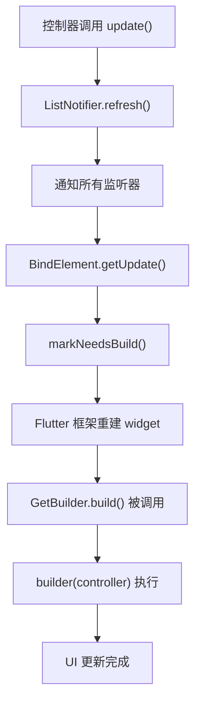

# GetBuilder 详解

## 概述

`GetBuilder` 是一个用于监听 `GetxController` 状态变化的 `StatelessWidget`。它是 GetX 状态管理系统中基于控制器更新机制的核心组件，通过 `InheritedWidget`（`Binder`）和控制器监听机制，实现当控制器调用 `update()` 方法时自动重建 widget。

`GetBuilder` 与 `Obx` 不同，它不依赖响应式变量（`.obs`），而是基于控制器的显式更新机制。当控制器调用 `update()` 方法时，所有依赖该控制器的 `GetBuilder` widget 会自动重建，从而实现 UI 的更新。

## 核心功能

`GetBuilder` 主要提供以下核心功能：

1. **控制器依赖注入**：通过 `Binder`（`InheritedWidget`）提供控制器实例
2. **自动更新机制**：当控制器调用 `update()` 时，自动触发 widget 重建
3. **选择性更新**：支持通过 `id` 参数实现选择性更新，只更新特定的 widget
4. **生命周期管理**：支持控制器的创建、订阅和销毁的完整生命周期管理
5. **全局/局部管理**：支持全局控制器和局部控制器的管理方式

## 类定义

```dart 34:87:lib/get_state_manager/src/simple/get_state.dart
class GetBuilder<T extends GetxController> extends StatelessWidget {
  final GetControllerBuilder<T> builder;
  final bool global;
  final Object? id;
  final String? tag;
  final bool autoRemove;
  final bool assignId;
  final Object Function(T value)? filter;
  final void Function(BindElement<T> state)? initState,
      dispose,
      didChangeDependencies;
  final void Function(Binder<T> oldWidget, BindElement<T> state)?
      didUpdateWidget;
  final T? init;

  const GetBuilder({
    super.key,
    this.init,
    this.global = true,
    required this.builder,
    this.autoRemove = true,
    this.assignId = false,
    this.initState,
    this.filter,
    this.tag,
    this.dispose,
    this.id,
    this.didChangeDependencies,
    this.didUpdateWidget,
  });

  @override
  Widget build(BuildContext context) {
    return Binder(
      init: init == null ? null : () => init!,
      global: global,
      autoRemove: autoRemove,
      assignId: assignId,
      initState: initState,
      filter: filter,
      tag: tag,
      dispose: dispose,
      id: id,
      lazy: false,
      didChangeDependencies: didChangeDependencies,
      didUpdateWidget: didUpdateWidget,
      child: Builder(builder: (context) {
        final controller = Bind.of<T>(context, rebuild: true);
        return builder(controller);
      }),
    );
    // return widget.builder(controller!);
  }
}
```

**设计特点**：

- **泛型约束**：`T extends GetxController` 确保只能使用 `GetxController` 及其子类
- **StatelessWidget**：继承自 `StatelessWidget`，是无状态 widget
- **常量构造函数**：使用 `const` 构造函数，支持编译时常量
- **Builder 模式**：使用 `Builder` widget 获取正确的 `BuildContext`，用于访问 `Binder`

## 参数说明

### `builder` - 构建函数

- **类型**：`GetControllerBuilder<T>`
- **必需**：是
- **说明**：接收控制器实例并返回 widget 的函数

```dart
typedef GetControllerBuilder<T extends GetLifeCycleMixin> = Widget Function(
    T controller);
```

### `init` - 初始化控制器

- **类型**：`T?`
- **默认值**：`null`
- **说明**：用于初始化控制器的实例。如果控制器已在依赖注入系统中注册，可以省略此参数

### `global` - 全局控制器

- **类型**：`bool`
- **默认值**：`true`
- **说明**：是否使用全局控制器。如果为 `true`，控制器会被注册到全局依赖注入系统；如果为 `false`，控制器仅在当前 widget 树中可用

### `id` - Widget ID

- **类型**：`Object?`
- **默认值**：`null`
- **说明**：用于选择性更新的 widget ID。当控制器调用 `update([id])` 时，只有匹配 ID 的 `GetBuilder` 会更新

### `tag` - 控制器标签

- **类型**：`String?`
- **默认值**：`null`
- **说明**：用于区分同一类型的多个控制器实例

### `autoRemove` - 自动移除

- **类型**：`bool`
- **默认值**：`true`
- **说明**：当 widget 被销毁时，是否自动从依赖注入系统中移除控制器

### `assignId` - 分配 ID

- **类型**：`bool`
- **默认值**：`false`
- **说明**：是否为控制器分配 ID

### `filter` - 过滤函数

- **类型**：`Object Function(T value)?`
- **默认值**：`null`
- **说明**：用于过滤更新条件的函数。只有当过滤结果发生变化时，widget 才会更新

### 生命周期回调参数

- **`initState`**：在 `BindElement` 初始化时调用
- **`dispose`**：在 `BindElement` 销毁时调用
- **`didChangeDependencies`**：在依赖变化时调用
- **`didUpdateWidget`**：在 widget 更新时调用

## 方法详解

### `build()` - 构建方法

```dart 65:86:lib/get_state_manager/src/simple/get_state.dart
  @override
  Widget build(BuildContext context) {
    return Binder(
      init: init == null ? null : () => init!,
      global: global,
      autoRemove: autoRemove,
      assignId: assignId,
      initState: initState,
      filter: filter,
      tag: tag,
      dispose: dispose,
      id: id,
      lazy: false,
      didChangeDependencies: didChangeDependencies,
      didUpdateWidget: didUpdateWidget,
      child: Builder(builder: (context) {
        final controller = Bind.of<T>(context, rebuild: true);
        return builder(controller);
      }),
    );
    // return widget.builder(controller!);
  }
```

**功能说明**：

- 创建 `Binder` widget，将控制器注入到 widget 树中
- 使用 `Builder` widget 获取正确的 `BuildContext`
- 通过 `Bind.of<T>(context, rebuild: true)` 获取控制器并建立依赖关系
- 调用 `builder` 函数构建 UI

**工作流程**：

1. `GetBuilder.build()` 被调用
2. 创建 `Binder` widget，传入所有配置参数
3. `Binder` 创建 `BindElement`，负责控制器的创建和管理
4. `BindElement` 初始化时，根据 `global` 参数决定控制器的创建方式
5. `Builder` widget 的 builder 函数被调用
6. `Bind.of<T>(context, rebuild: true)` 被调用：
   - 查找最近的 `Binder<T>` widget
   - 获取对应的 `BindElement<T>`
   - 调用 `context.dependOnInheritedElement()` 建立依赖关系
   - 返回控制器实例
7. `builder(controller)` 被调用，返回构建的 widget

## 与相关组件的关系

### 与 Binder 的关系

`Binder` 是 `InheritedWidget` 的子类，负责在 widget 树中提供控制器：

```dart 370:418:lib/get_state_manager/src/simple/get_state.dart
class Binder<T> extends InheritedWidget {
  /// Create an inherited widget that updates its dependents when [controller]
  /// sends notifications.
  ///
  /// The [child] argument is required
  const Binder({
    super.key,
    required super.child,
    this.init,
    this.global = true,
    this.autoRemove = true,
    this.assignId = false,
    this.lazy = true,
    this.initState,
    this.filter,
    this.tag,
    this.dispose,
    this.id,
    this.didChangeDependencies,
    this.didUpdateWidget,
    this.create,
  });

  final InitBuilder<T>? init;
  final InstanceCreateBuilderCallback? create;
  final bool global;
  final Object? id;
  final String? tag;
  final bool lazy;
  final bool autoRemove;
  final bool assignId;
  final Object Function(T value)? filter;
  final void Function(BindElement<T> state)? initState,
      dispose,
      didChangeDependencies;
  final void Function(Binder<T> oldWidget, BindElement<T> state)?
      didUpdateWidget;

  @override
  bool updateShouldNotify(Binder<T> oldWidget) {
    return oldWidget.id != id ||
        oldWidget.global != global ||
        oldWidget.autoRemove != autoRemove ||
        oldWidget.assignId != assignId;
  }

  @override
  InheritedElement createElement() => BindElement<T>(this);
}
```

**关系说明**：

- `GetBuilder` 创建 `Binder` widget
- `Binder` 通过 `InheritedWidget` 机制在 widget 树中提供控制器
- 子 widget 可以通过 `Bind.of<T>(context)` 获取控制器

### 与 BindElement 的关系

`BindElement` 是 `InheritedElement` 的子类，负责管理控制器的生命周期：

```dart 422:444:lib/get_state_manager/src/simple/get_state.dart
class BindElement<T> extends InheritedElement {
  BindElement(Binder<T> super.widget) {
    initState();
  }

  final disposers = <Disposer>[];

  InitBuilder<T>? _controllerBuilder;

  T? _controller;

  T get controller {
    if (_controller == null) {
      _controller = _controllerBuilder?.call();
      _subscribeToController();
      if (_controller == null) {
        throw BindError(controller: T, tag: widget.tag);
      }
      return _controller!;
    } else {
      return _controller!;
    }
  }
```

**关系说明**：

- `Binder` 创建 `BindElement` 实例
- `BindElement` 负责控制器的创建、订阅和销毁
- 当控制器调用 `update()` 时，`BindElement.getUpdate()` 被调用
- `BindElement` 通过 `markNeedsBuild()` 触发 widget 重建

### 与 GetxController 的关系

`GetxController` 是状态管理的核心，提供 `update()` 方法通知监听器：

```dart
abstract class GetxController extends ListNotifier with GetLifeCycleMixin {
  void update([List<Object>? ids, bool condition = true]) {
    if (!condition) {
      return;
    }
    if (ids == null) {
      refresh();
    } else {
      for (final id in ids) {
        refreshGroup(id);
      }
    }
  }
}
```

**关系说明**：

- `GetBuilder` 监听 `GetxController` 的变化
- 当控制器调用 `update()` 时，通知所有注册的监听器
- `BindElement` 作为监听器，调用 `getUpdate()` 触发重建

### 与 Obx 的区别

`GetBuilder` 和 `Obx` 是 GetX 中两种不同的状态管理方式：

| 特性 | GetBuilder | Obx |
|------|-----------|-----|
| 更新机制 | 基于控制器 `update()` 方法 | 基于响应式变量自动追踪 |
| 更新方式 | 需要手动调用 `update()` | 自动响应变化 |
| 依赖追踪 | 通过 `InheritedWidget` 机制 | 通过 `Notifier` 自动追踪 |
| 性能 | 精确控制更新时机 | 自动优化，但可能过度更新 |
| 使用场景 | 需要精确控制更新时机 | 简单的响应式状态管理 |

**选择建议**：

- 使用 `GetBuilder`：需要精确控制更新时机，或者需要选择性更新（通过 ID）
- 使用 `Obx`：简单的状态管理，不需要手动控制更新时机

## 更新机制详解

### 更新流程



### Bind.of 方法

```dart 239:264:lib/get_state_manager/src/simple/get_state.dart
  static T of<T>(
    BuildContext context, {
    bool rebuild = false,
    // Object Function(T value)? filter,
  }) {
    final inheritedElement =
        context.getElementForInheritedWidgetOfExactType<Binder<T>>()
            as BindElement<T>?;

    if (inheritedElement == null) {
      throw BindError(controller: '$T', tag: null);
    }

    if (rebuild) {
      // var newFilter = filter?.call(inheritedElement.controller!);
      // if (newFilter != null) {
      //  context.dependOnInheritedElement(inheritedElement, aspect: newFilter);
      // } else {
      context.dependOnInheritedElement(inheritedElement);
      // }
    }

    final controller = inheritedElement.controller;

    return controller;
  }
```

**功能说明**：

- 查找最近的 `Binder<T>` widget 对应的 `BindElement<T>`
- 如果 `rebuild` 为 `true`，调用 `dependOnInheritedElement()` 建立依赖关系
- 返回控制器实例

**依赖关系建立**：

- `context.dependOnInheritedElement(inheritedElement)` 将当前 widget 注册为 `BindElement` 的依赖
- 当 `BindElement` 调用 `notifyClients()` 时，所有依赖的 widget 会被通知更新

### BindElement.getUpdate 方法

```dart 589:592:lib/get_state_manager/src/simple/get_state.dart
  void getUpdate() {
    _dirty = true;
    markNeedsBuild();
  }
```

**功能说明**：

- 当控制器调用 `update()` 时，此方法被调用
- 设置 `_dirty` 标志，标记需要更新
- 调用 `markNeedsBuild()` 触发 widget 重建

## 使用场景

### 基本计数器示例

```dart
class CounterController extends GetxController {
  int count = 0;

  void increment() {
    count++;
    update(); // 通知所有依赖的 widget 更新
  }
}

// 使用 GetBuilder
GetBuilder<CounterController>(
  init: CounterController(),
  builder: (controller) => Column(
    children: [
      Text('Count: ${controller.count}'),
      ElevatedButton(
        onPressed: () => controller.increment(),
        child: Text('Increment'),
      ),
    ],
  ),
)
```

### 选择性更新示例

```dart
class UserController extends GetxController {
  String name = 'John';
  int age = 30;

  void updateName(String newName) {
    name = newName;
    update(['name']); // 只更新 ID 为 'name' 的 widget
  }

  void updateAge(int newAge) {
    age = newAge;
    update(['age']); // 只更新 ID 为 'age' 的 widget
  }
}

// 使用 GetBuilder 并指定 ID
GetBuilder<UserController>(
  id: 'name',
  builder: (controller) => Text(controller.name),
)

GetBuilder<UserController>(
  id: 'age',
  builder: (controller) => Text('${controller.age}'),
)
```

### 全局控制器示例

```dart
// 在应用启动时注册全局控制器
Get.put(UserController(), permanent: true);

// 在任意位置使用，不需要 init
GetBuilder<UserController>(
  builder: (controller) => Text(controller.name),
)
```

### 局部控制器示例

```dart
// 使用局部控制器，只在当前 widget 树中可用
GetBuilder<UserController>(
  global: false,
  init: UserController(),
  builder: (controller) => Text(controller.name),
)
```

### 条件更新示例

```dart
class FormController extends GetxController {
  String email = '';
  bool isValid = false;

  void setEmail(String value) {
    email = value;
    isValid = _validateEmail(value);
    // 只在邮箱有效时更新 UI
    update(['email'], isValid);
  }

  bool _validateEmail(String email) {
    return email.contains('@');
  }
}
```

## 代码示例

### 基本使用

```dart
class CounterController extends GetxController {
  int count = 0;

  void increment() {
    count++;
    update();
  }

  void decrement() {
    count--;
    update();
  }
}

// 在 widget 中使用
GetBuilder<CounterController>(
  init: CounterController(),
  builder: (controller) => Column(
    children: [
      Text('Count: ${controller.count}'),
      Row(
        mainAxisAlignment: MainAxisAlignment.center,
        children: [
          ElevatedButton(
            onPressed: () => controller.decrement(),
            child: Text('-'),
          ),
          SizedBox(width: 20),
          ElevatedButton(
            onPressed: () => controller.increment(),
            child: Text('+'),
          ),
        ],
      ),
    ],
  ),
)
```

### 多个 GetBuilder

```dart
class AppController extends GetxController {
  String title = 'My App';
  int counter = 0;

  void updateTitle(String newTitle) {
    title = newTitle;
    update(['title']);
  }

  void increment() {
    counter++;
    update(['counter']);
  }
}

// 使用多个 GetBuilder，每个监听不同的状态
GetBuilder<AppController>(
  id: 'title',
  init: AppController(),
  builder: (controller) => Text(controller.title),
)

GetBuilder<AppController>(
  id: 'counter',
  builder: (controller) => Text('${controller.counter}'),
)
```

### 生命周期回调示例

```dart
GetBuilder<MyController>(
  init: MyController(),
  initState: (state) {
    print('Controller initialized');
  },
  dispose: (state) {
    print('Controller disposed');
  },
  didChangeDependencies: (state) {
    print('Dependencies changed');
  },
  didUpdateWidget: (oldWidget, state) {
    print('Widget updated');
  },
  builder: (controller) => Text('Hello'),
)
```

### 过滤更新

```dart
class ProductController extends GetxController {
  List<Product> products = [];
  String? searchQuery;

  void setSearchQuery(String query) {
    searchQuery = query;
    update(['products']);
  }

  Object filter(ProductController controller) {
    // 只有当搜索查询变化时才更新
    return controller.searchQuery;
  }
}

GetBuilder<ProductController>(
  init: ProductController(),
  filter: (controller) => controller.filter(controller),
  builder: (controller) {
    final filtered = controller.products
        .where((p) => p.name.contains(controller.searchQuery ?? ''))
        .toList();
    return ListView.builder(
      itemCount: filtered.length,
      itemBuilder: (context, index) => ListTile(
        title: Text(filtered[index].name),
      ),
    );
  },
)
```

## 注意事项

### 1. 必须调用 update() 方法

`GetBuilder` 不会自动检测状态变化，必须手动调用 `update()` 方法：

```dart
// 正确示例
void increment() {
  count++;
  update(); // 必须调用
}

// 错误示例
void increment() {
  count++;
  // 忘记调用 update()，UI 不会更新
}
```

### 2. ID 的使用规范

使用 ID 进行选择性更新时，确保 `GetBuilder` 的 `id` 与 `update()` 中的 ID 一致：

```dart
// 正确示例
GetBuilder<Controller>(
  id: 'counter',
  builder: (controller) => Text('${controller.count}'),
)

controller.update(['counter']); // ID 一致

// 错误示例
GetBuilder<Controller>(
  id: 'counter',
  builder: (controller) => Text('${controller.count}'),
)

controller.update(['count']); // ID 不一致，widget 不会更新
```

### 3. init 参数的使用

`init` 参数只在第一次使用时需要设置，后续使用不需要设置：

```dart
// 第一次使用，需要 init
GetBuilder<CounterController>(
  init: CounterController(),
  builder: (controller) => Text('${controller.count}'),
)

// 后续使用，不需要 init（如果控制器已注册）
GetBuilder<CounterController>(
  builder: (controller) => Text('${controller.count}'),
)
```

### 4. 性能优化建议

- **使用 ID 进行选择性更新**：只更新需要更新的 widget，避免不必要的重建
- **合理使用 condition 参数**：避免在不需要时触发更新
- **避免在循环中频繁调用 update()**：可以批量更新后统一调用

```dart
// 性能较差
void loadData() {
  for (var item in items) {
    processItem(item);
    update(); // 每次循环都更新，性能差
  }
}

// 性能较好
void loadData() {
  for (var item in items) {
    processItem(item);
  }
  update(); // 批量处理完成后统一更新
}
```

### 5. 与响应式变量的区别

`GetBuilder` 需要手动调用 `update()`，而响应式变量（`.obs`）会自动更新：

```dart
// GetBuilder 方式
class Controller extends GetxController {
  int count = 0;
  void increment() {
    count++;
    update(); // 需要手动调用
  }
}

// 响应式变量方式（使用 Obx）
class Controller extends GetxController {
  var count = 0.obs;
  void increment() {
    count++; // 自动更新，不需要调用 update()
  }
}
```

### 6. 避免在 onInit 中调用 update()

`onInit()` 执行时 UI 可能尚未构建完成，此时调用 `update()` 可能无效：

```dart
// 不推荐
@override
void onInit() {
  super.onInit();
  loadData();
  update(); // UI 可能尚未构建，更新可能无效
}

// 推荐
@override
void onReady() {
  super.onReady();
  loadData(); // 在 onReady 中执行，UI 已构建完成
}
```

### 7. 控制器的生命周期

`GetBuilder` 会自动管理控制器的生命周期（如果 `autoRemove` 为 `true`）：

- 当 `GetBuilder` 被创建时，如果控制器未注册，会创建并注册控制器
- 当 `GetBuilder` 被销毁时，如果 `autoRemove` 为 `true`，会自动移除控制器

## 总结

`GetBuilder` 是 GetX 状态管理系统中基于控制器更新机制的核心组件。它通过 `Binder`（`InheritedWidget`）和 `BindElement` 实现控制器的依赖注入和生命周期管理，当控制器调用 `update()` 方法时，自动触发 widget 重建。

`GetBuilder` 的主要优势在于：

1. **精确控制**：可以精确控制更新时机和范围
2. **选择性更新**：通过 ID 实现选择性更新，提高性能
3. **生命周期管理**：自动管理控制器的创建和销毁
4. **灵活性**：支持全局和局部控制器管理

理解 `GetBuilder` 的工作原理对于深入理解 GetX 的状态管理系统非常重要。它展示了如何通过 `InheritedWidget` 机制实现依赖注入和状态管理，这是 GetX 状态管理系统的重要组成部分。

## 参考资料

- [GetxController 详解](lib/get_state_manager/src/simple/get_controllers.dart_getx-controller.md)
- [Binder 和 BindElement 实现](lib/get_state_manager/src/simple/get_state.dart)
- [Obx 详解](lib/get_state_manager/src/rx_flutter/rx_obx_widget.dart_obx.md)
- [Flutter InheritedWidget 文档](https://api.flutter.dev/flutter/widgets/InheritedWidget-class.html)
- [GetX 状态管理文档](https://github.com/jonataslaw/getx/blob/master/README.md#state-management)
