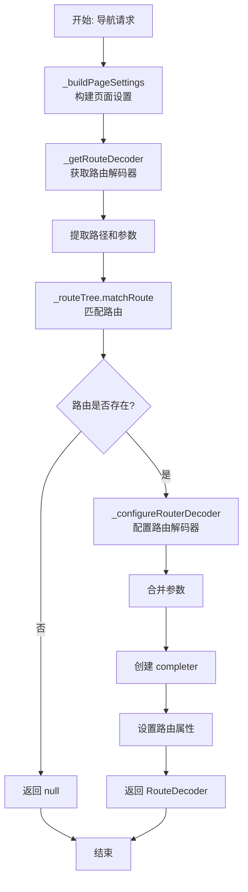

# 路由配置与解析

## 概述

路由配置与解析方法负责构建页面设置、解析路由名称、获取路由解码器以及配置路由解码器。这些方法是路由系统的底层支持，为上层导航方法提供基础功能。

## _replace 方法

```dart 644:659:lib/get_navigation/src/routes/get_router_delegate.dart
Future<T?> _replace<T>(PageSettings arguments, GetPage<T> page) async {
  final index = _activePages.length > 1 ? _activePages.length - 1 : 0;
  _routeTree.addRoute(page);
  
  final activePage = _getRouteDecoder(arguments);
  
  // final activePage = _configureRouterDecoder<T>(route!, arguments);
  
  _activePages[index] = activePage!;
  
  notifyListeners();
  final result = await activePage.route?.completer?.future as Future<T?>?;
  _routeTree.removeRoute(page);
  
  return result;
}
```

**功能**：替换指定索引的路由。

### 执行流程

1. **确定索引**：如果栈长度 > 1，使用最后一个索引；否则使用 0
2. **添加临时路由**：将 `page` 添加到路由树
3. **获取路由解码器**：使用 `_getRouteDecoder` 获取路由解码器
4. **替换路由**：在 `_activePages` 中替换指定索引的路由
5. **通知更新**：调用 `notifyListeners` 通知 UI 更新
6. **等待结果**：等待路由的 completer 完成
7. **移除临时路由**：从路由树中移除临时路由

## _replaceNamed 方法

```dart 661:669:lib/get_navigation/src/routes/get_router_delegate.dart
Future<T?> _replaceNamed<T>(RouteDecoder activePage) async {
  final index = _activePages.length > 1 ? _activePages.length - 1 : 0;
  // final activePage = _configureRouterDecoder<T>(page, arguments);
  _activePages[index] = activePage;
  
  notifyListeners();
  final result = await activePage.route?.completer?.future as Future<T?>?;
  return result;
}
```

**功能**：使用已配置的路由解码器替换路由。

### 与 _replace 的区别

- `_replace`：需要创建 `GetPage` 并临时添加到路由树
- `_replaceNamed`：直接使用已配置的 `RouteDecoder`，无需临时路由

## _cleanRouteName 方法

```dart 671:685:lib/get_navigation/src/routes/get_router_delegate.dart
/// Takes a route [name] String generated by [to], [off], [offAll]
/// (and similar context navigation methods), cleans the extra chars and
/// accommodates the format.
/// TODO: check for a more "appealing" URL naming convention.
/// `() => MyHomeScreenView` becomes `/my-home-screen-view`.
String _cleanRouteName(String name) {
  name = name.replaceAll('() => ', '');
  
  /// uncomment for URL styling.
  // name = name.paramCase!;
  if (!name.startsWith('/')) {
    name = '/$name';
  }
  return Uri.tryParse(name)?.toString() ?? name;
}
```

**功能**：清理和格式化路由名称。

### 处理步骤

1. **移除函数前缀**：移除 `'() => '` 字符串
2. **URL 样式化**（已注释）：可以取消注释使用 `paramCase` 转换
3. **添加前导斜杠**：如果路由名称不以 `/` 开头，添加它
4. **URI 验证**：尝试解析为 URI，确保格式正确

### 示例

```dart
// 输入: "() => HomePage"
// 输出: "/HomePage"

// 输入: "HomePage"
// 输出: "/HomePage"

// 输入: "/home"
// 输出: "/home"
```

## _buildPageSettings 方法

```dart 687:690:lib/get_navigation/src/routes/get_router_delegate.dart
PageSettings _buildPageSettings(String page, [Object? data]) {
  var uri = Uri.parse(page);
  return PageSettings(uri, data);
}
```

**功能**：构建 `PageSettings` 对象。

### 参数说明

- **`page`**：路由名称字符串
- **`data`**：可选的数据对象

### 返回

返回 `PageSettings` 对象，包含 URI 和数据。

## _getRouteDecoder 方法

```dart 692:706:lib/get_navigation/src/routes/get_router_delegate.dart
@protected
RouteDecoder? _getRouteDecoder<T>(PageSettings arguments) {
  var page = arguments.uri.path;
  final parameters = arguments.params;
  if (parameters.isNotEmpty) {
    final uri = Uri(path: page, queryParameters: parameters);
    page = uri.toString();
  }
  
  final decoder = _routeTree.matchRoute(page, arguments: arguments);
  final route = decoder.route;
  if (route == null) return null;
  
  return _configureRouterDecoder<T>(decoder, arguments);
}
```

**功能**：获取路由解码器，包含路由匹配和配置。

### 执行流程

1. **提取路径**：从 `arguments.uri` 提取路径
2. **处理参数**：如果有参数，构建包含查询参数的 URI
3. **匹配路由**：使用 `_routeTree.matchRoute` 匹配路由
4. **检查路由**：如果未找到路由，返回 `null`
5. **配置解码器**：调用 `_configureRouterDecoder` 配置路由解码器

## _configureRouterDecoder 方法

```dart 708:726:lib/get_navigation/src/routes/get_router_delegate.dart
@protected
RouteDecoder _configureRouterDecoder<T>(
    RouteDecoder decoder, PageSettings arguments) {
  final parameters =
      arguments.params.isEmpty ? arguments.query : arguments.params;
  arguments.params.addAll(arguments.query);
  if (decoder.parameters.isEmpty) {
    decoder.parameters.addAll(parameters);
  }
  
  decoder.route = decoder.route?.copyWith(
    completer: _activePages.isEmpty ? null : Completer<T?>(),
    arguments: arguments,
    parameters: parameters,
    key: ValueKey(arguments.name),
  );
  
  return decoder;
}
```

**功能**：配置路由解码器，设置参数、completer 等。

### 执行流程

1. **确定参数源**：如果 `arguments.params` 为空，使用 `arguments.query`；否则使用 `arguments.params`
2. **合并参数**：将 `arguments.query` 添加到 `arguments.params`
3. **设置解码器参数**：如果解码器参数为空，设置参数
4. **配置路由**：使用 `copyWith` 配置路由：
   - `completer`：如果 `_activePages` 为空，不创建 completer；否则创建新的 `Completer<T?>`
   - `arguments`：设置参数
   - `parameters`：设置 URL 参数
   - `key`：使用路由名称创建 `ValueKey`

## 执行流程图



## 关键概念

### PageSettings

`PageSettings` 包含：

- `uri`：路由 URI
- `arguments`：传递的参数
- `params`：URL 参数
- `query`：查询参数

### RouteDecoder

`RouteDecoder` 包含：

- `currentTreeBranch`：路由树分支
- `pageSettings`：页面设置
- `route`：当前路由（`GetPage`）
- `parameters`：路由参数

### Completer

`Completer` 用于：

- 等待导航结果
- 传递返回值
- 异步通信

## 使用场景

### 1. 路由替换

```dart
// 使用 _replace 替换当前路由
await _replace(
  PageSettings(Uri.parse('/new'), data),
  GetPage(name: '/new', page: () => NewPage()),
);
```

### 2. 路由解析

```dart
// 解析路由名称
final settings = _buildPageSettings('/user/123', {'id': 123});
final decoder = _getRouteDecoder(settings);
```

### 3. 路由配置

```dart
// 配置路由解码器
final configured = _configureRouterDecoder(decoder, settings);
```

## 注意事项

1. **临时路由管理**：`_replace` 会临时添加和移除路由，确保正确清理

2. **参数合并**：`_configureRouterDecoder` 会合并 `params` 和 `query`，注意参数覆盖

3. **Completer 创建**：只有在 `_activePages` 不为空时才创建 completer

4. **路由匹配**：`_getRouteDecoder` 依赖路由树匹配，确保路由已注册

5. **URI 格式**：路由名称应遵循 URI 格式，以 `/` 开头

6. **参数类型**：参数可以是任意类型，但 URL 参数必须是字符串

7. **Key 生成**：使用路由名称生成 `ValueKey`，确保路由唯一性
