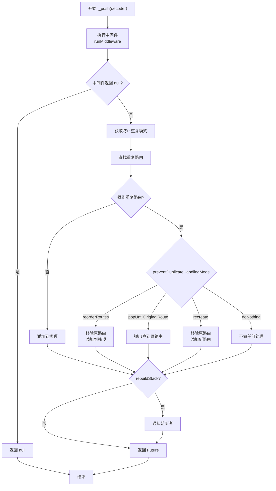
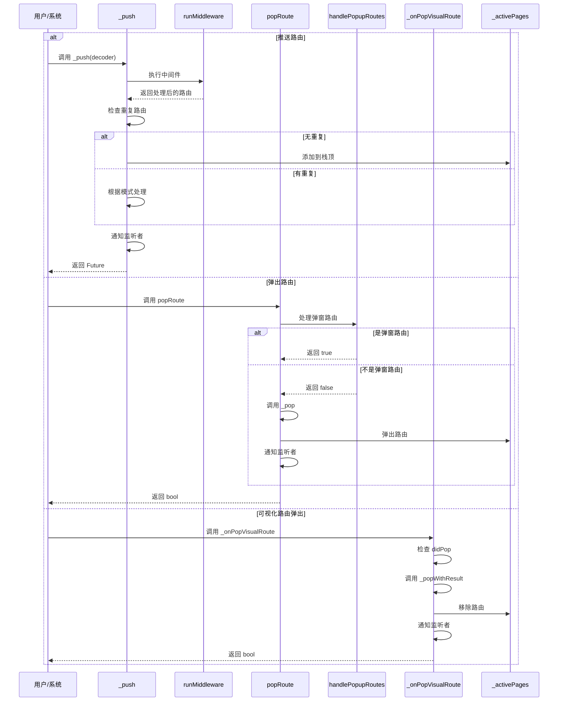

# 核心推送与路由管理

## 概述

核心推送与路由管理方法包括 `_push`、`setNewRoutePath`、`currentConfiguration`、`handlePopupRoutes`、`popRoute` 和 `_onPopVisualRoute`。这些方法是路由系统的核心，负责路由推送、状态管理和返回处理。

## _push 方法

```dart 728:768:lib/get_navigation/src/routes/get_router_delegate.dart
Future<T?> _push<T>(RouteDecoder decoder, {bool rebuildStack = true}) async {
  var res = await runMiddleware(decoder);
  if (res == null) return null;
  // final res = mid ?? decoder;
  // if (res == null) res = decoder;
  
  final preventDuplicateHandlingMode =
      res.route?.preventDuplicateHandlingMode ??
          PreventDuplicateHandlingMode.reorderRoutes;
  
  final onStackPage = _activePages
      .firstWhereOrNull((element) => element.route?.key == res.route?.key);
  
  /// There are no duplicate routes in the stack
  if (onStackPage == null) {
    _activePages.add(res);
  } else {
    /// There are duplicate routes, reorder
    switch (preventDuplicateHandlingMode) {
      case PreventDuplicateHandlingMode.doNothing:
        break;
      case PreventDuplicateHandlingMode.reorderRoutes:
        _activePages.remove(onStackPage);
        _activePages.add(res);
        break;
      case PreventDuplicateHandlingMode.popUntilOriginalRoute:
        while (_activePages.last == onStackPage) {
          _popWithResult();
        }
        break;
      case PreventDuplicateHandlingMode.recreate:
        _activePages.remove(onStackPage);
        _activePages.add(res);
    }
  }
  if (rebuildStack) {
    notifyListeners();
  }
  
  return decoder.route?.completer?.future as Future<T?>?;
}
```

**功能**：核心推送方法，将路由添加到导航栈。

### 执行流程



### 关键特性

1. **中间件集成**：所有推送都经过中间件检查
2. **重复路由处理**：支持多种重复路由处理模式
3. **可选重建**：通过 `rebuildStack` 控制是否通知 UI 更新
4. **返回 Future**：返回路由的 completer Future，支持获取导航结果

## setNewRoutePath 方法

```dart 770:779:lib/get_navigation/src/routes/get_router_delegate.dart
@override
Future<void> setNewRoutePath(RouteDecoder configuration) async {
  final page = configuration.route;
  if (page == null) {
    goToUnknownPage();
    return;
  } else {
    _push(configuration);
  }
}
```

**功能**：实现 `RouterDelegate` 接口，设置新的路由路径。

### 执行流程

1. **检查路由**：从配置中获取路由
2. **处理空路由**：如果路由为 `null`，导航到 404 页面
3. **推送路由**：否则调用 `_push` 推送路由

### 用途

- Flutter 声明式导航系统调用
- URL 变化时自动调用
- 深度链接处理

## currentConfiguration 属性

```dart 781:786:lib/get_navigation/src/routes/get_router_delegate.dart
@override
RouteDecoder? get currentConfiguration {
  if (_activePages.isEmpty) return null;
  final route = _activePages.last;
  return route;
}
```

**功能**：实现 `RouterDelegate` 接口，获取当前路由配置。

### 返回

- 如果 `_activePages` 为空，返回 `null`
- 否则返回栈顶的路由解码器

## handlePopupRoutes 方法

```dart 788:800:lib/get_navigation/src/routes/get_router_delegate.dart
Future<bool> handlePopupRoutes({
  Object? result,
}) async {
  Route? currentRoute;
  navigatorKey.currentState!.popUntil((route) {
    currentRoute = route;
    return true;
  });
  if (currentRoute is PopupRoute) {
    return await navigatorKey.currentState!.maybePop(result);
  }
  return false;
}
```

**功能**：处理弹窗路由（如对话框、底部表单等）。

### 执行流程

1. **获取当前路由**：使用 `popUntil` 获取当前路由
2. **检查类型**：如果当前路由是 `PopupRoute`，调用 `maybePop` 处理
3. **返回结果**：返回是否处理了弹窗路由

### 用途

- 优先处理弹窗路由
- 确保弹窗在页面之前关闭

## popRoute 方法

```dart 802:818:lib/get_navigation/src/routes/get_router_delegate.dart
@override
Future<bool> popRoute({
  Object? result,
  PopMode? popMode,
}) async {
  //Returning false will cause the entire app to be popped.
  final wasPopup = await handlePopupRoutes(result: result);
  if (wasPopup) return true;
  
  if (_canPop(popMode ?? backButtonPopMode)) {
    await _pop(popMode ?? backButtonPopMode, result);
    notifyListeners();
    return true;
  }
  
  return super.popRoute();
}
```

**功能**：实现 `RouterDelegate` 接口，处理路由弹出。

### 执行流程

1. **处理弹窗**：先尝试处理弹窗路由
2. **检查是否可以弹出**：如果可以弹出，调用 `_pop` 弹出路由
3. **通知更新**：调用 `notifyListeners` 通知 UI 更新
4. **返回结果**：返回是否成功弹出

### 关键逻辑

- 返回 `false` 会导致整个应用被弹出（退出应用）
- 优先处理弹窗路由
- 支持自定义 `PopMode`

## _onPopVisualRoute 方法

```dart 827:846:lib/get_navigation/src/routes/get_router_delegate.dart
bool _onPopVisualRoute(Route<dynamic> route, dynamic result) {
  final didPop = route.didPop(result);
  if (!didPop) {
    return false;
  }
  _popWithResult(result);
  // final settings = route.settings;
  // if (settings is GetPage) {
  //   final config = _activePages.cast<RouteDecoder?>().firstWhere(
  //         (element) => element?.route == settings,
  //         orElse: () => null,
  //       );
  //   if (config != null) {
  //     _removeHistoryEntry(config, result);
  //   }
  // }
  notifyListeners();
  //return !route.navigator!.userGestureInProgress;
  return true;
}
```

**功能**：处理可视化路由的弹出（由 `GetNavigator` 调用）。

### 执行流程

1. **检查弹出状态**：调用 `route.didPop` 检查路由是否已弹出
2. **处理结果**：如果未弹出，返回 `false`
3. **弹出路由**：调用 `_popWithResult` 从 `_activePages` 中移除路由
4. **通知更新**：调用 `notifyListeners` 通知 UI 更新
5. **返回结果**：返回 `true` 表示处理成功

### 用途

- `GetNavigator` 的 `onPopPage` 回调
- 处理用户手势返回
- 同步路由栈状态

## 执行流程图



## 关键特性

### 1. 中间件集成

所有路由推送都经过中间件检查，确保：

- 权限验证
- 重定向处理
- 日志记录

### 2. 重复路由处理

支持四种处理模式：

- `doNothing`：不做任何处理
- `reorderRoutes`：重新排序路由
- `popUntilOriginalRoute`：弹出直到原路由
- `recreate`：重新创建路由

### 3. 弹窗优先

`popRoute` 优先处理弹窗路由，确保：

- 对话框优先关闭
- 底部表单优先关闭
- 页面在弹窗之后关闭

### 4. 状态同步

所有操作都会调用 `notifyListeners`，确保：

- UI 及时更新
- 路由状态同步
- 导航栈一致

## 使用场景

### 1. 正常导航

```dart
// 推送新路由
await _push(routeDecoder);
```

### 2. URL 变化

```dart
// Flutter 声明式导航系统调用
await setNewRoutePath(routeDecoder);
```

### 3. 返回处理

```dart
// 用户点击返回按钮
await popRoute(result: data);
```

### 4. 手势返回

```dart
// 用户手势返回
_onPopVisualRoute(route, result);
```

## 注意事项

1. **中间件阻止**：如果中间件返回 `null`，推送会被阻止

2. **重复路由**：根据 `preventDuplicateHandlingMode` 处理重复路由

3. **弹窗优先级**：弹窗路由优先于页面路由处理

4. **状态同步**：确保 `_activePages` 与 Flutter Navigator 状态一致

5. **Completer 管理**：正确管理 completer，避免 Future 挂起

6. **返回 false**：`popRoute` 返回 `false` 会导致应用退出

7. **rebuildStack**：`_push` 的 `rebuildStack` 参数控制是否立即更新 UI
