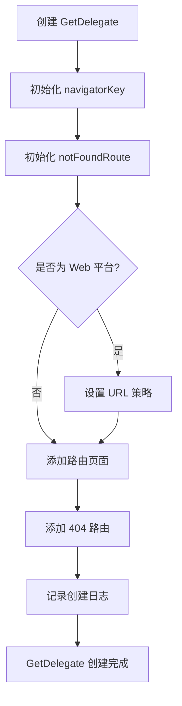

# GetDelegate 类定义与基础结构

## 概述

`GetDelegate` 是 GetX 导航系统的核心类，实现了 Flutter 的 `RouterDelegate<RouteDecoder>` 接口。它负责管理应用的路由栈、处理导航操作、执行中间件、管理页面生命周期等核心功能。本文档将详细解析类的定义、继承关系、字段定义和基础结构。

## 类定义

```dart 10:14:lib/get_navigation/src/routes/get_router_delegate.dart
class GetDelegate extends RouterDelegate<RouteDecoder>
    with
        ChangeNotifier,
        PopNavigatorRouterDelegateMixin<RouteDecoder>,
        IGetNavigation {
```

### 继承关系

`GetDelegate` 继承自 `RouterDelegate<RouteDecoder>`，这是 Flutter 框架提供的抽象类，用于在声明式导航系统中管理路由状态。泛型参数 `RouteDecoder` 表示路由配置的类型。

### Mixin 组合

`GetDelegate` 使用了三个 mixin：

1. **`ChangeNotifier`**：来自 Flutter 的 `foundation` 库，提供状态变化通知机制。当路由栈发生变化时，可以通过 `notifyListeners()` 通知监听者更新 UI。

2. **`PopNavigatorRouterDelegateMixin<RouteDecoder>`**：Flutter 提供的 mixin，为 `RouterDelegate` 提供默认的返回按钮处理逻辑。它实现了 `popRoute` 方法的基础功能。

3. **`IGetNavigation`**：GetX 定义的导航接口 mixin，定义了所有导航相关的方法签名，包括 `to`、`off`、`offAll`、`toNamed` 等方法。

## 工厂构造函数

```dart 15:34:lib/get_navigation/src/routes/get_router_delegate.dart
factory GetDelegate.createDelegate({
  GetPage<dynamic>? notFoundRoute,
  List<GetPage> pages = const [],
  List<NavigatorObserver>? navigatorObservers,
  TransitionDelegate<dynamic>? transitionDelegate,
  PopMode backButtonPopMode = PopMode.history,
  PreventDuplicateHandlingMode preventDuplicateHandlingMode =
      PreventDuplicateHandlingMode.reorderRoutes,
  GlobalKey<NavigatorState>? navigatorKey,
}) {
  return GetDelegate(
    notFoundRoute: notFoundRoute,
    navigatorObservers: navigatorObservers,
    transitionDelegate: transitionDelegate,
    backButtonPopMode: backButtonPopMode,
    preventDuplicateHandlingMode: preventDuplicateHandlingMode,
    pages: pages,
    navigatorKey: navigatorKey,
  );
}
```

### 参数说明

- **`notFoundRoute`**：可选的 404 页面配置，当路由未找到时使用
- **`pages`**：初始路由页面列表，默认为空列表
- **`navigatorObservers`**：导航观察者列表，用于监听路由变化
- **`transitionDelegate`**：转场动画委托，控制页面切换动画
- **`backButtonPopMode`**：返回按钮的弹出模式，默认为 `PopMode.history`
- **`preventDuplicateHandlingMode`**：防止重复路由的处理模式，默认为 `reorderRoutes`
- **`navigatorKey`**：Navigator 的全局键，用于控制导航栈

### 用途

工厂构造函数提供了创建 `GetDelegate` 实例的便捷方式，所有参数都有合理的默认值，简化了实例化过程。

## 字段定义

### 路由栈管理

```dart 36:48:lib/get_navigation/src/routes/get_router_delegate.dart
final List<RouteDecoder> _activePages = <RouteDecoder>[];

List<RouteDecoder> get activePages => _activePages;

final _routeTree = ParseRouteTree(routes: []);

List<GetPage> get registeredRoutes => _routeTree.routes;
```

- **`_activePages`**：私有字段，存储当前活跃的路由栈。每个元素是一个 `RouteDecoder`，包含路由的完整信息。
- **`activePages`**：公开的 getter，提供对活跃路由栈的只读访问。
- **`_routeTree`**：私有字段，路由树实例，用于路由匹配和管理。
- **`registeredRoutes`**：公开的 getter，返回所有已注册的路由列表。

### 配置字段

```dart 37:46:lib/get_navigation/src/routes/get_router_delegate.dart
final PopMode backButtonPopMode;
final PreventDuplicateHandlingMode preventDuplicateHandlingMode;

final GetPage notFoundRoute;

final List<NavigatorObserver>? navigatorObservers;
final TransitionDelegate<dynamic>? transitionDelegate;

final Iterable<GetPage> Function(RouteDecoder currentNavStack)?
    pickPagesForRootNavigator;
```

- **`backButtonPopMode`**：返回按钮的弹出模式，决定是按历史记录弹出还是按页面弹出。
- **`preventDuplicateHandlingMode`**：防止重复路由的处理模式，包括 `doNothing`、`reorderRoutes`、`popUntilOriginalRoute`、`recreate`。
- **`notFoundRoute`**：404 页面配置，当路由未找到时显示。
- **`navigatorObservers`**：可选的导航观察者列表，用于监听路由变化事件。
- **`transitionDelegate`**：可选的转场动画委托，控制页面切换动画效果。
- **`pickPagesForRootNavigator`**：可选的函数，用于自定义选择哪些页面参与根导航器。

### Navigator 相关

```dart 76:79:lib/get_navigation/src/routes/get_router_delegate.dart
@override
GlobalKey<NavigatorState> navigatorKey;

final String? restorationScopeId;
```

- **`navigatorKey`**：Navigator 的全局键，必须实现 `RouterDelegate` 接口要求。用于控制和管理导航栈。
- **`restorationScopeId`**：可选的恢复作用域 ID，用于页面状态恢复。

## 路由树管理方法

```dart 54:72:lib/get_navigation/src/routes/get_router_delegate.dart
void addPages(List<GetPage> getPages) {
  _routeTree.addRoutes(getPages);
}

void clearRouteTree() {
  _routeTree.routes.clear();
}

void addPage(GetPage getPage) {
  _routeTree.addRoute(getPage);
}

void removePage(GetPage getPage) {
  _routeTree.removeRoute(getPage);
}

RouteDecoder matchRoute(String name, {PageSettings? arguments}) {
  return _routeTree.matchRoute(name, arguments: arguments);
}
```

### 方法说明

- **`addPages`**：批量添加路由页面到路由树。
- **`clearRouteTree`**：清空路由树中的所有路由。
- **`addPage`**：添加单个路由页面到路由树。
- **`removePage`**：从路由树中移除指定的路由页面。
- **`matchRoute`**：根据路由名称匹配路由，返回 `RouteDecoder`。支持可选的 `PageSettings` 参数。

## 主构造函数

```dart 81:104:lib/get_navigation/src/routes/get_router_delegate.dart
GetDelegate({
  GetPage? notFoundRoute,
  this.navigatorObservers,
  this.transitionDelegate,
  this.backButtonPopMode = PopMode.history,
  this.preventDuplicateHandlingMode =
      PreventDuplicateHandlingMode.reorderRoutes,
  this.pickPagesForRootNavigator,
  this.restorationScopeId,
  bool showHashOnUrl = false,
  GlobalKey<NavigatorState>? navigatorKey,
  required List<GetPage> pages,
})  : navigatorKey = navigatorKey ?? GlobalKey<NavigatorState>(),
      notFoundRoute = notFoundRoute ??= GetPage(
        name: '/404',
        page: () => const Scaffold(
          body: Center(child: Text('Route not found')),
        ),
      ) {
  if (!showHashOnUrl && GetPlatform.isWeb) setUrlStrategy();
  addPages(pages);
  addPage(notFoundRoute);
  Get.log('GetDelegate is created !');
}
```

### 初始化列表

构造函数使用初始化列表来设置 `navigatorKey` 和 `notFoundRoute`：

1. **`navigatorKey`**：如果未提供，则创建一个新的 `GlobalKey<NavigatorState>`。
2. **`notFoundRoute`**：如果未提供，则创建一个默认的 404 页面，显示 "Route not found" 文本。

### 构造函数体

1. **URL 策略设置**：如果是 Web 平台且 `showHashOnUrl` 为 `false`，则设置 URL 策略（移除 URL 中的 `#`）。
2. **添加路由**：将传入的 `pages` 添加到路由树。
3. **添加 404 路由**：将 `notFoundRoute` 添加到路由树，确保未找到路由时有页面可显示。
4. **日志记录**：记录 `GetDelegate` 创建成功的日志。

## 关键概念

### RouteDecoder

`RouteDecoder` 是路由解码器，包含路由的完整信息：

- `currentTreeBranch`：当前路由树分支，包含从根到当前页面的所有路由
- `pageSettings`：页面设置，包含路由名称、参数、参数等

### PopMode

返回按钮的弹出模式枚举：

- `PopMode.history`：按历史记录弹出，移除整个历史条目
- `PopMode.page`：按页面弹出，只移除当前页面的最后一个路由节点

### PreventDuplicateHandlingMode

防止重复路由的处理模式：

- `doNothing`：不做任何处理
- `reorderRoutes`：重新排序路由，将重复的路由移到栈顶
- `popUntilOriginalRoute`：弹出直到原始路由
- `recreate`：重新创建路由

## 执行流程



## 注意事项

1. **路由树管理**：`_routeTree` 是路由匹配的核心，所有路由操作都通过它进行。

2. **活跃路由栈**：`_activePages` 存储的是当前导航栈中的所有路由，每个路由都是完整的 `RouteDecoder`。

3. **404 路由**：`notFoundRoute` 是必需的，即使未显式提供，构造函数也会创建一个默认的 404 页面。

4. **Navigator Key**：`navigatorKey` 是 `RouterDelegate` 接口要求的，必须提供。如果未提供，会自动创建。

5. **Web 平台特殊处理**：在 Web 平台上，默认会移除 URL 中的 `#`，使 URL 更美观。

6. **路由注册顺序**：先添加用户提供的路由，最后添加 404 路由，确保 404 路由不会覆盖正常路由。
