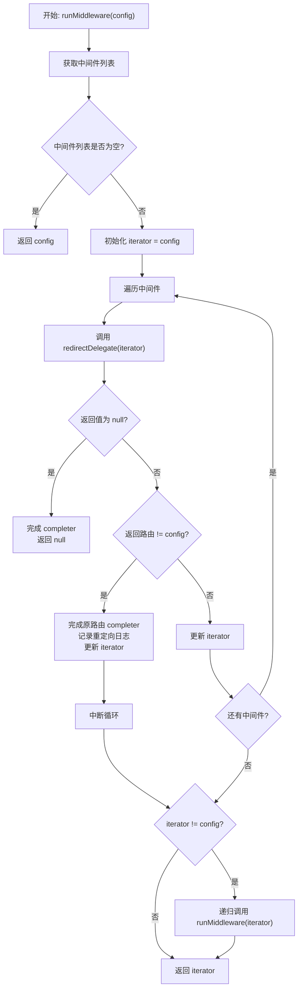

# 中间件处理机制

## 概述

中间件（Middleware）是 GetX 路由系统中的一个重要特性，允许在路由导航过程中执行自定义逻辑，如权限检查、重定向、日志记录等。`runMiddleware` 方法是中间件处理的核心，它负责执行路由树分支中最后一个路由的所有中间件，并处理重定向逻辑。

## runMiddleware 方法

```dart 106:137:lib/get_navigation/src/routes/get_router_delegate.dart
Future<RouteDecoder?> runMiddleware(RouteDecoder config) async {
  final middlewares = config.currentTreeBranch.last.middlewares;
  if (middlewares.isEmpty) {
    return config;
  }
  var iterator = config;
  for (var item in middlewares) {
    var redirectRes = await item.redirectDelegate(iterator);

    if (redirectRes == null) {
      config.route?.completer?.complete();
      return null;
    }
    if (config != redirectRes) {
      config.route?.completer?.complete();
      Get.log('Redirect to ${redirectRes.pageSettings?.name}');
    }

    iterator = redirectRes;
    // Stop the iteration over the middleware if we changed page
    // and that redirectRes is not the same as the current config.
    if (config != redirectRes) {
      break;
    }
  }
  // If the target is not the same as the source, we need
  // to run the middlewares for the new route.
  if (iterator != config) {
    return await runMiddleware(iterator);
  }
  return iterator;
}
```

## 方法解析

### 参数

- **`config`**：`RouteDecoder` 类型，包含当前路由的完整信息，包括路由树分支和页面设置。

### 返回值

- 返回 `Future<RouteDecoder?>`：
  - 如果中间件允许导航，返回处理后的 `RouteDecoder`（可能是重定向后的新路由）
  - 如果中间件阻止导航（返回 `null`），则返回 `null`

### 执行流程

#### 1. 获取中间件列表

```dart 107:109:lib/get_navigation/src/routes/get_router_delegate.dart
final middlewares = config.currentTreeBranch.last.middlewares;
if (middlewares.isEmpty) {
  return config;
}
```

- 从路由树分支的最后一个路由（当前目标路由）获取中间件列表
- 如果没有中间件，直接返回原始配置，无需处理

#### 2. 遍历中间件

```dart 111:130:lib/get_navigation/src/routes/get_router_delegate.dart
var iterator = config;
for (var item in middlewares) {
  var redirectRes = await item.redirectDelegate(iterator);

  if (redirectRes == null) {
    config.route?.completer?.complete();
    return null;
  }
  if (config != redirectRes) {
    config.route?.completer?.complete();
    Get.log('Redirect to ${redirectRes.pageSettings?.name}');
  }

  iterator = redirectRes;
  // Stop the iteration over the middleware if we changed page
  // and that redirectRes is not the same as the current config.
  if (config != redirectRes) {
    break;
  }
}
```

**关键逻辑**：

1. **调用中间件**：对每个中间件调用 `redirectDelegate` 方法，传入当前的 `iterator`（初始为 `config`）
2. **处理阻止导航**：如果中间件返回 `null`，表示阻止导航：
   - 完成当前路由的 completer（通知等待的 Future）
   - 返回 `null`，停止导航
3. **处理重定向**：如果中间件返回的路由与原始配置不同，表示发生了重定向：
   - 完成原始路由的 completer
   - 记录重定向日志
   - 更新 `iterator` 为新的路由配置
   - **中断循环**：一旦发生重定向，停止继续执行后续中间件（因为目标路由已改变）

#### 3. 递归处理重定向路由

```dart 131:136:lib/get_navigation/src/routes/get_router_delegate.dart
// If the target is not the same as the source, we need
// to run the middlewares for the new route.
if (iterator != config) {
  return await runMiddleware(iterator);
}
return iterator;
```

- 如果最终的路由配置与原始配置不同（发生了重定向），需要递归调用 `runMiddleware` 处理新路由的中间件
- 这确保了重定向后的路由也会经过中间件检查
- 如果路由未改变，直接返回处理后的配置

## 中间件接口

中间件必须实现 `GetMiddleware` 接口，其中 `redirectDelegate` 方法是关键：

```dart
FutureOr<RouteDecoder?> redirectDelegate(RouteDecoder route)
```

### 返回值说明

- **返回 `route`**：允许导航继续，使用原始路由
- **返回新的 `RouteDecoder`**：重定向到新路由
- **返回 `null`**：阻止导航，取消本次路由跳转

## 执行流程图



## 使用场景

### 1. 权限检查

```dart
class AuthMiddleware extends GetMiddleware {
  @override
  Future<RouteDecoder?> redirectDelegate(RouteDecoder route) async {
    final authService = Get.find<AuthService>();
    if (!authService.isAuthenticated) {
      // 重定向到登录页
      return RouteDecoder.fromRoute('/login');
    }
    // 允许访问
    return route;
  }
}
```

### 2. 阻止导航

```dart
class MaintenanceMiddleware extends GetMiddleware {
  @override
  Future<RouteDecoder?> redirectDelegate(RouteDecoder route) async {
    if (isMaintenanceMode) {
      // 阻止导航，返回 null
      return null;
    }
    return route;
  }
}
```

### 3. 日志记录

```dart
class LoggingMiddleware extends GetMiddleware {
  @override
  Future<RouteDecoder?> redirectDelegate(RouteDecoder route) async {
    print('Navigating to: ${route.pageSettings?.name}');
    return route; // 不改变路由，只记录日志
  }
}
```

## 关键特性

### 1. 短路执行

一旦中间件发生重定向，立即停止执行后续中间件。这是因为：

- 目标路由已改变，继续执行原路由的中间件没有意义
- 新路由会有自己的中间件链需要执行

### 2. 递归处理

重定向后的路由会递归执行中间件检查，确保：

- 重定向目标也经过中间件验证
- 支持链式重定向（A → B → C）

### 3. Completer 管理

当发生重定向或阻止导航时，会完成原始路由的 completer：

- 通知等待导航结果的代码
- 避免 Future 永远挂起

### 4. 中间件顺序

中间件按照在路由配置中的顺序执行，通常按照 `priority` 属性排序（数值越小越先执行）。

## 注意事项

1. **异步支持**：`redirectDelegate` 是异步方法，可以执行异步操作（如网络请求、数据库查询）

2. **性能考虑**：中间件会在每次路由导航时执行，应避免耗时操作

3. **递归深度**：虽然支持递归重定向，但应避免无限循环的重定向

4. **Completer 处理**：重定向时会完成原路由的 completer，确保导航结果能正确返回

5. **中间件链**：每个路由可以有多个中间件，它们按顺序执行，直到发生重定向或全部执行完毕

6. **路由树分支**：中间件来自路由树分支的最后一个路由，即当前目标路由的中间件

## 与其他方法的关系

`runMiddleware` 被以下方法调用：

- **`_unsafeHistoryAdd`**：在添加路由到历史记录前执行中间件
- **`_unsafeHistoryRemoveAt`**：在移除路由前，对前一个路由执行中间件检查
- **`_push`**：在推送新路由前执行中间件

这确保了所有路由导航操作都经过中间件验证。
