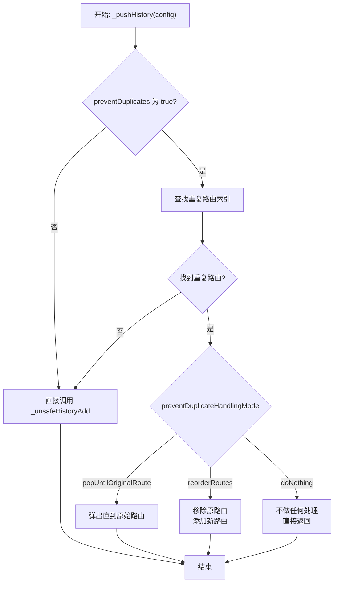
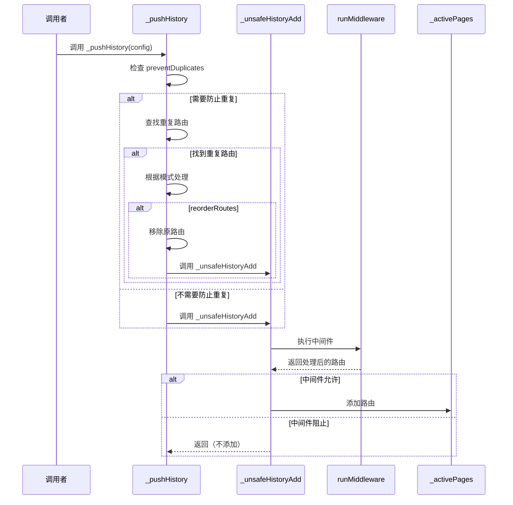

# 历史记录管理

## 概述

历史记录管理是路由系统的核心功能之一，负责维护当前活跃的路由栈（`_activePages`）。本文档解析了添加、移除路由历史记录的方法，以及防止重复路由的处理逻辑。

## 核心数据结构

历史记录存储在 `_activePages` 中：

```dart 36:36:lib/get_navigation/src/routes/get_router_delegate.dart
final List<RouteDecoder> _activePages = <RouteDecoder>[];
```

这是一个 `RouteDecoder` 列表，每个元素代表导航栈中的一个路由条目。

## 添加历史记录

### _unsafeHistoryAdd 方法

```dart 139:143:lib/get_navigation/src/routes/get_router_delegate.dart
Future<void> _unsafeHistoryAdd(RouteDecoder config) async {
  final res = await runMiddleware(config);
  if (res == null) return;
  _activePages.add(res);
}
```

**功能**：将路由配置添加到历史记录栈的末尾。

**执行流程**：

1. **执行中间件**：调用 `runMiddleware` 处理中间件逻辑（权限检查、重定向等）
2. **检查结果**：如果中间件返回 `null`（阻止导航），直接返回，不添加路由
3. **添加路由**：如果中间件允许，将处理后的路由配置添加到 `_activePages`

**注意事项**：

- 方法名中的 `_unsafe` 表示不进行重复检查，直接添加
- 实际的重复检查在 `_pushHistory` 方法中进行

### _pushHistory 方法

```dart 178:199:lib/get_navigation/src/routes/get_router_delegate.dart
Future<void> _pushHistory(RouteDecoder config) async {
  if (config.route!.preventDuplicates) {
    final originalEntryIndex = _activePages.indexWhere(
        (element) => element.pageSettings?.name == config.pageSettings?.name);
    if (originalEntryIndex >= 0) {
      switch (preventDuplicateHandlingMode) {
        case PreventDuplicateHandlingMode.popUntilOriginalRoute:
          popModeUntil(config.pageSettings!.name, popMode: PopMode.page);
          break;
        case PreventDuplicateHandlingMode.reorderRoutes:
          await _unsafeHistoryRemoveAt(originalEntryIndex, null);
          await _unsafeHistoryAdd(config);
          break;
        case PreventDuplicateHandlingMode.doNothing:
        default:
          break;
      }
      return;
    }
  }
  await _unsafeHistoryAdd(config);
}
```

**功能**：安全地添加路由到历史记录，包含重复路由处理逻辑。

**执行流程**：



**重复路由处理模式**：

1. **`popUntilOriginalRoute`**：弹出路由栈直到找到原始路由，然后停止
2. **`reorderRoutes`**：移除原始路由，将新路由添加到栈顶（重新排序）
3. **`doNothing`**：不做任何处理，直接返回（不添加新路由）

## 移除历史记录

### _unsafeHistoryRemoveAt 方法

```dart 151:164:lib/get_navigation/src/routes/get_router_delegate.dart
Future<T?> _unsafeHistoryRemoveAt<T>(int index, T result) async {
  if (index == _activePages.length - 1 && _activePages.length > 1) {
    //removing WILL update the current route
    final toCheck = _activePages[_activePages.length - 2];
    final resMiddleware = await runMiddleware(toCheck);
    if (resMiddleware == null) return null;
    _activePages[_activePages.length - 2] = resMiddleware;
  }

  final completer = _activePages.removeAt(index).route?.completer;
  if (completer?.isCompleted == false) completer!.complete(result);
  
  return completer?.future as T?;
}
```

**功能**：从指定索引位置移除路由，并处理相关逻辑。

**参数**：

- **`index`**：要移除的路由在 `_activePages` 中的索引
- **`result`**：返回给被移除路由的结果值

**返回值**：返回被移除路由的 completer 的 Future，用于获取导航结果。

**执行流程**：

1. **特殊处理最后一个路由**：
   - 如果要移除的是栈顶路由（最后一个），且栈中还有其他路由
   - 获取前一个路由（将成为新的当前路由）
   - 对前一个路由执行中间件检查
   - 如果中间件返回 `null`，阻止移除操作
   - 如果中间件允许，更新前一个路由为中间件处理后的结果

2. **移除路由**：
   - 从 `_activePages` 中移除指定索引的路由
   - 获取被移除路由的 completer

3. **完成 completer**：
   - 如果 completer 尚未完成，使用传入的 `result` 完成它
   - 这通知等待导航结果的代码

4. **返回 Future**：
   - 返回 completer 的 Future，允许调用者等待导航结果

**关键逻辑**：

- 移除栈顶路由时，需要对新栈顶路由执行中间件检查，因为该路由将变为当前路由
- 如果中间件阻止，整个移除操作被取消
- Completer 的完成确保导航结果能正确返回

## 参数访问器

```dart 166:176:lib/get_navigation/src/routes/get_router_delegate.dart
T arguments<T>() {
  return currentConfiguration?.pageSettings?.arguments as T;
}

Map<String, String> get parameters {
  return currentConfiguration?.pageSettings?.params ?? {};
}

PageSettings? get pageSettings {
  return currentConfiguration?.pageSettings;
}
```

这些方法提供了访问当前路由参数的便捷方式：

- **`arguments<T>()`**：获取当前路由的参数，支持泛型类型转换
- **`parameters`**：获取当前路由的 URL 参数（Map 格式）
- **`pageSettings`**：获取当前路由的完整页面设置

## 执行流程图



## 使用场景

### 1. 正常导航

```dart
// 用户点击导航按钮
await delegate.toNamed('/profile');
// 内部调用 _pushHistory，添加新路由到栈顶
```

### 2. 防止重复路由

```dart
// 配置路由时设置 preventDuplicates: true
GetPage(
  name: '/home',
  page: () => HomePage(),
  preventDuplicates: true,
)

// 如果用户已经在 /home，再次导航到 /home
// 根据 preventDuplicateHandlingMode 处理
```

### 3. 获取当前路由参数

```dart
// 获取当前路由的参数
final userId = delegate.arguments<String>('userId');
final params = delegate.parameters; // 获取所有 URL 参数
```

## 关键特性

### 1. 中间件集成

所有路由添加操作都经过中间件检查，确保：

- 权限验证
- 重定向处理
- 日志记录等

### 2. 重复路由处理

提供了多种重复路由处理策略，适应不同场景需求。

### 3. Completer 管理

正确管理路由的 completer，确保：

- 导航结果能正确返回
- Future 不会永远挂起
- 支持导航结果传递

### 4. 栈顶路由特殊处理

移除栈顶路由时，对新栈顶路由执行中间件检查，确保路由状态一致性。

## 注意事项

1. **线程安全**：`_activePages` 是共享状态，在多线程环境下需要注意同步

2. **中间件性能**：每次添加路由都会执行中间件，应避免耗时操作

3. **Completer 生命周期**：确保 completer 在适当时机完成，避免内存泄漏

4. **索引有效性**：`_unsafeHistoryRemoveAt` 需要确保索引有效，否则会抛出异常

5. **路由名称唯一性**：重复检查基于路由名称，确保路由名称的唯一性

6. **中间件阻止移除**：如果中间件阻止移除操作，整个操作会被取消，路由栈保持不变
