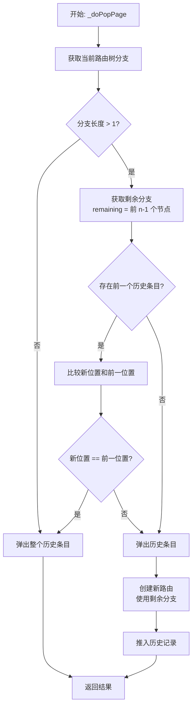
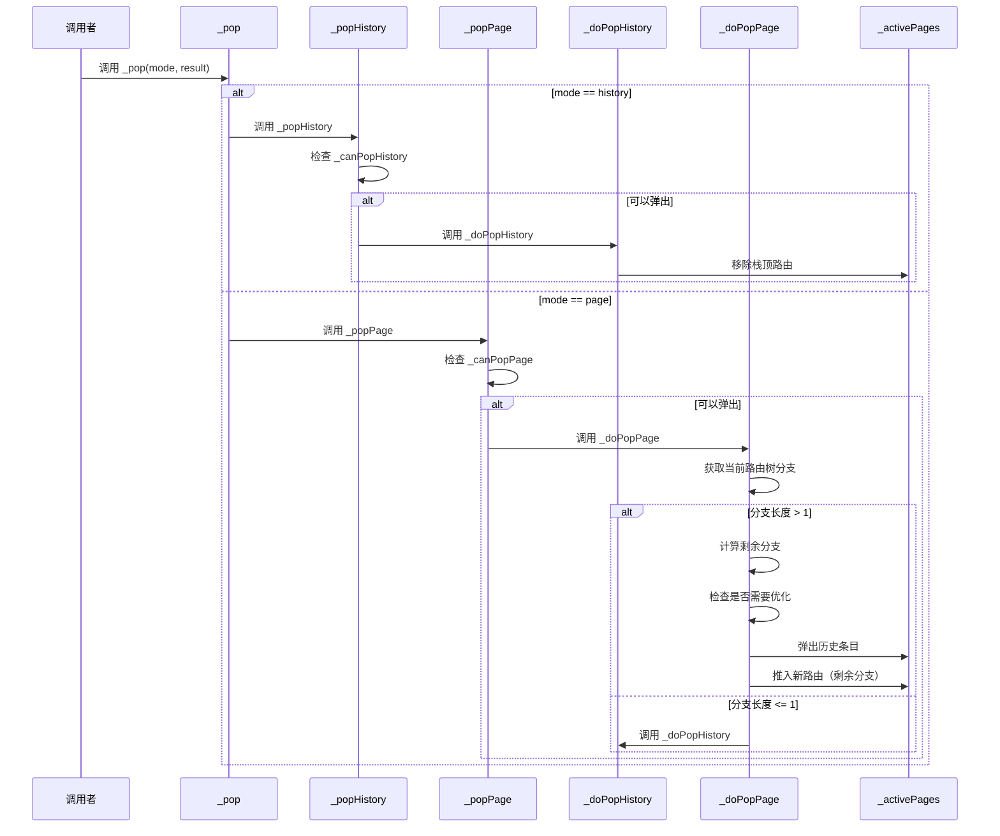

# 页面弹出操作

## 概述

页面弹出操作是路由系统的核心功能之一，负责从路由栈中移除路由。GetX 支持两种弹出模式：`PopMode.history`（按历史记录弹出）和 `PopMode.page`（按页面弹出）。本文档详细解析了各种弹出方法及其实现逻辑。

## PopMode 枚举

`PopMode` 定义了两种弹出模式：

- **`PopMode.history`**：按历史记录弹出，移除整个历史条目
- **`PopMode.page`**：按页面弹出，只移除当前路由树分支的最后一个节点

## 历史记录弹出

### _popHistory 方法

```dart 201:204:lib/get_navigation/src/routes/get_router_delegate.dart
Future<T?> _popHistory<T>(T result) async {
  if (!_canPopHistory()) return null;
  return await _doPopHistory(result);
}
```

**功能**：安全地弹出历史记录栈顶的路由。

**执行流程**：

1. **检查是否可以弹出**：调用 `_canPopHistory()` 检查是否还有路由可以弹出
2. **执行弹出**：如果可以弹出，调用 `_doPopHistory` 执行实际弹出操作

### _doPopHistory 方法

```dart 206:208:lib/get_navigation/src/routes/get_router_delegate.dart
Future<T?> _doPopHistory<T>(T result) async {
  return _unsafeHistoryRemoveAt<T>(_activePages.length - 1, result);
}
```

**功能**：执行实际的历史记录弹出操作。

**实现**：直接调用 `_unsafeHistoryRemoveAt`，移除栈顶（最后一个）路由。

### canPopHistory 相关方法

```dart 265:271:lib/get_navigation/src/routes/get_router_delegate.dart
bool _canPopHistory() {
  return _activePages.length > 1;
}

Future<bool> canPopHistory() {
  return SynchronousFuture(_canPopHistory());
}
```

**功能**：检查是否可以弹出历史记录。

**逻辑**：只有当 `_activePages` 中有超过 1 个路由时，才能弹出（至少保留一个路由作为根路由）。

## 页面弹出

### _popPage 方法

```dart 210:213:lib/get_navigation/src/routes/get_router_delegate.dart
Future<T?> _popPage<T>(T result) async {
  if (!_canPopPage()) return null;
  return await _doPopPage(result);
}
```

**功能**：安全地弹出当前路由树分支的最后一个页面节点。

**执行流程**：

1. **检查是否可以弹出**：调用 `_canPopPage()` 检查是否可以弹出页面
2. **执行弹出**：如果可以弹出，调用 `_doPopPage` 执行实际弹出操作

### _doPopPage 方法

```dart 216:250:lib/get_navigation/src/routes/get_router_delegate.dart
// returns the popped page
Future<T?> _doPopPage<T>(T result) async {
  final currentBranch = currentConfiguration?.currentTreeBranch;
  if (currentBranch != null && currentBranch.length > 1) {
    //remove last part only
    final remaining = currentBranch.take(currentBranch.length - 1);
    final prevHistoryEntry = _activePages.length > 1
        ? _activePages[_activePages.length - 2]
        : null;

    //check if current route is the same as the previous route
    if (prevHistoryEntry != null) {
      //if so, pop the entire _activePages entry
      final newLocation = remaining.last.name;
      final prevLocation = prevHistoryEntry.pageSettings?.name;
      if (newLocation == prevLocation) {
        //pop the entire _activePages entry
        return await _popHistory(result);
      }
    }

    //create a new route with the remaining tree branch
    final res = await _popHistory<T>(result);
    await _pushHistory(
      RouteDecoder(
        remaining.toList(),
        null,
        //TOOD: persist state??
      ),
    );
    return res;
  } else {
    //remove entire entry
    return await _popHistory(result);
  }
}
```

**功能**：执行实际的页面弹出操作，只移除路由树分支的最后一个节点。

**执行流程**：



**关键逻辑**：

1. **获取当前路由树分支**：从 `currentConfiguration` 获取当前路由的完整树分支

2. **检查分支长度**：
   - 如果分支长度 ≤ 1，直接弹出整个历史条目（等同于 `_popHistory`）
   - 如果分支长度 > 1，继续处理

3. **计算剩余分支**：使用 `take(currentBranch.length - 1)` 获取除最后一个节点外的所有节点

4. **优化处理**：
   - 如果存在前一个历史条目，比较新位置（剩余分支的最后一个节点）和前一位置
   - 如果两者相同，直接弹出整个历史条目（避免创建重复的路由状态）
   - 如果不同，继续处理

5. **创建新路由**：
   - 弹出当前历史条目
   - 使用剩余分支创建新的 `RouteDecoder`
   - 将新路由推入历史记录

6. **返回结果**：返回弹出操作的结果

### canPopPage 相关方法

```dart 273:281:lib/get_navigation/src/routes/get_router_delegate.dart
bool _canPopPage() {
  final currentTreeBranch = currentConfiguration?.currentTreeBranch;
  if (currentTreeBranch == null) return false;
  return currentTreeBranch.length > 1 ? true : _canPopHistory();
}

Future<bool> canPopPage() {
  return SynchronousFuture(_canPopPage());
}
```

**功能**：检查是否可以弹出页面。

**逻辑**：

1. 如果当前路由树分支为 `null`，返回 `false`
2. 如果分支长度 > 1，可以弹出页面节点，返回 `true`
3. 如果分支长度 ≤ 1，检查是否可以弹出历史记录（`_canPopHistory()`）

## 统一弹出方法

### _pop 方法

```dart 252:259:lib/get_navigation/src/routes/get_router_delegate.dart
Future<T?> _pop<T>(PopMode mode, T result) async {
  switch (mode) {
    case PopMode.history:
      return await _popHistory<T>(result);
    case PopMode.page:
      return await _popPage<T>(result);
  }
}
```

**功能**：根据 `PopMode` 选择相应的弹出方法。

**用途**：提供统一的弹出接口，根据模式调用 `_popHistory` 或 `_popPage`。

### _canPop 方法

```dart 283:291:lib/get_navigation/src/routes/get_router_delegate.dart
bool _canPop(mode) {
  switch (mode) {
    case PopMode.history:
      return _canPopHistory();
    case PopMode.page:
    default:
      return _canPopPage();
  }
}
```

**功能**：根据 `PopMode` 检查是否可以弹出。

## 公开方法

### popHistory 方法

```dart 261:263:lib/get_navigation/src/routes/get_router_delegate.dart
Future<T?> popHistory<T>(T result) async {
  return await _popHistory<T>(result);
}
```

**功能**：公开的历史记录弹出方法，供外部调用。

## 执行流程图



## PopMode 的区别

### PopMode.history

- **行为**：移除整个历史条目（`_activePages` 中的一个元素）
- **适用场景**：用户点击返回按钮，希望返回到上一个完整的页面
- **示例**：从 `/user/123/profile` 返回到 `/home`

### PopMode.page

- **行为**：只移除路由树分支的最后一个节点
- **适用场景**：嵌套路由中，只弹出当前层级的页面
- **示例**：从 `/user/123/profile` 返回到 `/user/123`（保留 `/user/123` 层级）

## 使用场景

### 1. 返回按钮处理

```dart
// 用户点击返回按钮
await delegate.popRoute(result: data, popMode: PopMode.history);
// 内部调用 _pop(PopMode.history, data)
```

### 2. 嵌套路由弹出

```dart
// 在嵌套路由中，只弹出当前层级
await delegate._pop(PopMode.page, null);
// 保留父级路由，只移除当前页面节点
```

### 3. 检查是否可以返回

```dart
// 检查是否可以弹出历史记录
if (await delegate.canPopHistory()) {
  await delegate.popHistory(result);
}

// 检查是否可以弹出页面
if (await delegate.canPopPage()) {
  // 执行页面弹出
}
```

## 关键特性

### 1. 安全性检查

所有弹出方法都先检查是否可以弹出，避免：

- 弹出最后一个路由（导致应用无路由）
- 在无效状态下弹出

### 2. 智能优化

`_doPopPage` 方法包含优化逻辑：

- 如果弹出后的位置与前一位置相同，直接弹出整个历史条目
- 避免创建重复的路由状态

### 3. 路由树分支管理

页面弹出模式支持嵌套路由：

- 只移除当前分支的最后一个节点
- 保留父级路由结构
- 创建新的路由状态

### 4. Completer 处理

弹出操作会正确完成被弹出路由的 completer：

- 通知等待导航结果的代码
- 传递返回结果

## 注意事项

1. **根路由保护**：`_canPopHistory` 确保至少保留一个路由，防止应用无路由可显示

2. **路由树分支**：`_doPopPage` 依赖于路由树分支，如果分支为 `null` 或长度为 1，会退化为历史记录弹出

3. **状态持久化**：代码中有 TODO 注释 `//TOOD: persist state??`，表示未来可能需要支持状态持久化

4. **性能考虑**：页面弹出模式需要创建新的路由状态，比历史记录弹出稍慢

5. **模式选择**：根据实际需求选择合适的弹出模式，嵌套路由使用 `PopMode.page`，普通返回使用 `PopMode.history`

6. **结果传递**：弹出操作可以传递结果值，用于页面间数据传递
