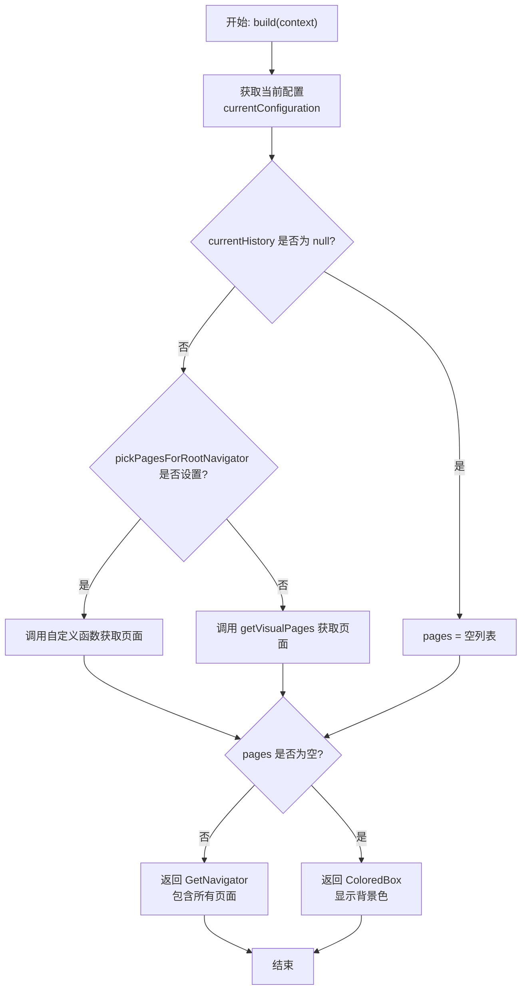
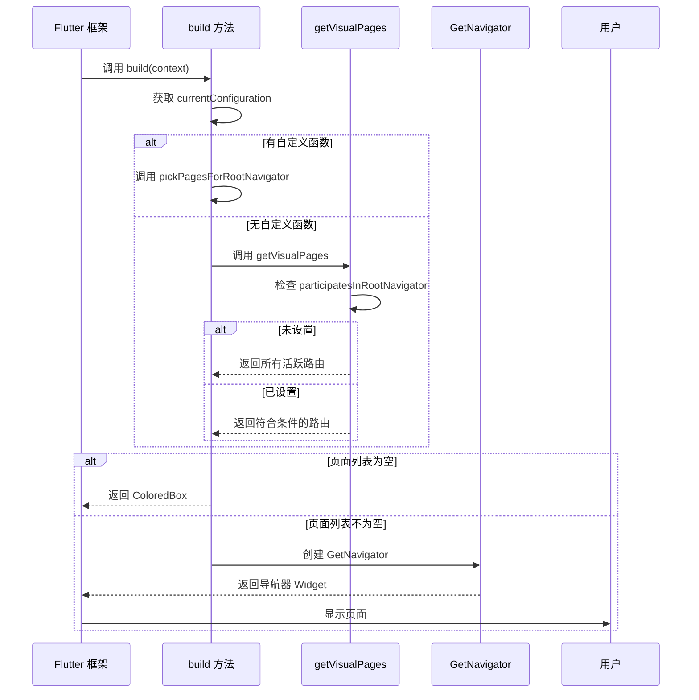

# UI 构建与可视化页面

## 概述

UI 构建是 `RouterDelegate` 接口的核心方法，负责将路由状态转换为 Flutter Widget 树。本文档解析了 `build` 方法、可视化页面获取逻辑，以及 404 页面处理机制。

## getVisualPages 方法

```dart 293:307:lib/get_navigation/src/routes/get_router_delegate.dart
/// gets the visual pages from the current _activePages entry
///
/// visual pages must have [GetPage.participatesInRootNavigator] set to true
Iterable<GetPage> getVisualPages(RouteDecoder? currentHistory) {
  final res = currentHistory!.currentTreeBranch
      .where((r) => r.participatesInRootNavigator != null);
  if (res.isEmpty) {
    //default behavior, all routes participate in root navigator
    return _activePages.map((e) => e.route!);
  } else {
    //user specified at least one participatesInRootNavigator
    return res
        .where((element) => element.participatesInRootNavigator == true);
  }
}
```

**功能**：从当前路由历史中获取应该显示在根导航器中的可视化页面。

### 执行逻辑

1. **检查 participatesInRootNavigator**：
   - 从当前路由树分支中筛选出设置了 `participatesInRootNavigator` 属性的路由
   - 如果没有任何路由设置此属性，返回空列表

2. **默认行为**：
   - 如果筛选结果为空，表示用户未指定 `participatesInRootNavigator`
   - 默认行为：所有 `_activePages` 中的路由都参与根导航器
   - 返回所有活跃路由的 `route` 属性

3. **自定义行为**：
   - 如果至少有一个路由设置了 `participatesInRootNavigator`
   - 只返回 `participatesInRootNavigator == true` 的路由
   - 这允许用户控制哪些路由显示在根导航器中

### participatesInRootNavigator 的作用

`participatesInRootNavigator` 是 `GetPage` 的一个可选属性，用于控制路由是否参与根导航器：

- **`null`**：未指定，使用默认行为
- **`true`**：参与根导航器，页面会显示
- **`false`**：不参与根导航器，页面不会显示（用于嵌套导航）

## build 方法

```dart 309:329:lib/get_navigation/src/routes/get_router_delegate.dart
@override
Widget build(BuildContext context) {
  final currentHistory = currentConfiguration;
  final pages = currentHistory == null
      ? <GetPage>[]
      : pickPagesForRootNavigator?.call(currentHistory).toList() ??
          getVisualPages(currentHistory).toList();
  if (pages.isEmpty) {
    return ColoredBox(
      color: Theme.of(context).scaffoldBackgroundColor,
    );
  }
  return GetNavigator(
    key: navigatorKey,
    onPopPage: _onPopVisualRoute,
    pages: pages,
    observers: navigatorObservers,
    transitionDelegate:
        transitionDelegate ?? const DefaultTransitionDelegate<dynamic>(),
  );
}
```

**功能**：实现 `RouterDelegate` 接口的 `build` 方法，构建导航器 Widget。

### 执行流程



### 关键步骤

1. **获取当前配置**：从 `currentConfiguration` 获取当前路由配置

2. **获取页面列表**：
   - 如果当前配置为 `null`，使用空列表
   - 如果设置了 `pickPagesForRootNavigator` 自定义函数，调用它获取页面
   - 否则，调用 `getVisualPages` 获取可视化页面

3. **处理空页面**：
   - 如果页面列表为空，返回一个 `ColoredBox`
   - 使用当前主题的背景色，避免显示空白

4. **构建导航器**：
   - 创建 `GetNavigator` Widget
   - 传入 `navigatorKey`、`onPopPage` 回调、页面列表等
   - 使用配置的 `transitionDelegate` 或默认的转场委托

### pickPagesForRootNavigator

这是一个可选的自定义函数，允许用户完全控制哪些页面参与根导航器：

```dart
final Iterable<GetPage> Function(RouteDecoder currentNavStack)?
    pickPagesForRootNavigator;
```

**用途**：

- 自定义页面选择逻辑
- 实现复杂的嵌套导航场景
- 动态控制页面显示

## goToUnknownPage 方法

```dart 331:339:lib/get_navigation/src/routes/get_router_delegate.dart
@override
Future<void> goToUnknownPage([bool clearPages = false]) async {
  if (clearPages) _activePages.clear();

  final pageSettings = _buildPageSettings(notFoundRoute.name);
  final routeDecoder = _getRouteDecoder(pageSettings);

  _push(routeDecoder!);
}
```

**功能**：导航到 404 页面（未找到路由页面）。

### 参数

- **`clearPages`**：可选参数，默认为 `false`
  - `true`：清空所有活跃页面后再导航到 404
  - `false`：保留当前页面栈，在栈顶添加 404 页面

### 执行流程

1. **清空页面栈**（可选）：如果 `clearPages` 为 `true`，清空 `_activePages`

2. **构建页面设置**：使用 `_buildPageSettings` 为 404 路由构建 `PageSettings`

3. **获取路由解码器**：使用 `_getRouteDecoder` 获取 404 路由的 `RouteDecoder`

4. **推送路由**：调用 `_push` 将 404 路由推入导航栈

### 使用场景

- 用户访问不存在的路由
- 路由匹配失败时自动调用
- 手动触发 404 页面显示

## _popWithResult 方法

```dart 341:345:lib/get_navigation/src/routes/get_router_delegate.dart
@protected
void _popWithResult<T>([T? result]) {
  final completer = _activePages.removeLast().route?.completer;
  if (completer?.isCompleted == false) completer!.complete(result);
}
```

**功能**：从路由栈中移除最后一个路由，并完成其 completer。

### 参数

- **`result`**：可选参数，传递给被弹出路由的结果值

### 执行流程

1. **移除栈顶路由**：从 `_activePages` 中移除最后一个元素

2. **获取 completer**：从被移除的路由中获取 `completer`

3. **完成 completer**：
   - 检查 completer 是否已完成
   - 如果未完成，使用传入的 `result` 完成它
   - 这通知等待导航结果的代码

### 使用场景

- 快速弹出路由（不经过中间件检查）
- 批量移除路由时使用
- 替换导航操作中使用

## GetNavigator

`GetNavigator` 是 GetX 对 Flutter `Navigator` 的封装，提供了以下特性：

- **页面列表管理**：使用 `pages` 参数管理页面列表
- **返回处理**：通过 `onPopPage` 回调处理返回操作
- **观察者支持**：支持 `NavigatorObserver` 监听路由变化
- **转场动画**：通过 `transitionDelegate` 控制页面切换动画

## 执行流程图



## 使用场景

### 1. 默认行为

```dart
// 所有路由都参与根导航器
final delegate = GetDelegate.createDelegate(
  pages: [
    GetPage(name: '/home', page: () => HomePage()),
    GetPage(name: '/profile', page: () => ProfilePage()),
  ],
);
// build 方法会显示所有活跃路由
```

### 2. 自定义页面选择

```dart
// 只显示 participatesInRootNavigator == true 的路由
final delegate = GetDelegate.createDelegate(
  pages: [
    GetPage(
      name: '/home',
      page: () => HomePage(),
      participatesInRootNavigator: true, // 显示
    ),
    GetPage(
      name: '/nested',
      page: () => NestedPage(),
      participatesInRootNavigator: false, // 不显示在根导航器
    ),
  ],
);
```

### 3. 完全自定义

```dart
// 使用自定义函数选择页面
final delegate = GetDelegate.createDelegate(
  pickPagesForRootNavigator: (currentNavStack) {
    // 自定义逻辑选择页面
    return currentNavStack.currentTreeBranch
        .where((page) => page.name.startsWith('/public'));
  },
  pages: [...],
);
```

### 4. 404 页面处理

```dart
// 路由未找到时自动调用
await delegate.toNamed('/non-existent-route');
// 内部会调用 goToUnknownPage()
```

## 关键特性

### 1. 灵活的页面选择

支持三种页面选择方式：

- 默认：所有路由都显示
- 属性控制：通过 `participatesInRootNavigator` 控制
- 完全自定义：通过 `pickPagesForRootNavigator` 函数自定义

### 2. 空状态处理

当没有页面可显示时，返回 `ColoredBox` 而不是空白，提供更好的用户体验。

### 3. 状态同步

`build` 方法会在路由状态变化时自动调用（通过 `ChangeNotifier`），确保 UI 与路由状态同步。

### 4. 嵌套导航支持

通过 `participatesInRootNavigator` 属性，支持嵌套导航场景，某些路由可以不在根导航器中显示。

## 注意事项

1. **性能考虑**：`build` 方法会在每次路由变化时调用，应避免耗时操作

2. **页面列表**：确保返回的页面列表是有效的 `GetPage` 对象

3. **Navigator Key**：`navigatorKey` 必须正确设置，用于控制导航栈

4. **空页面处理**：当页面列表为空时，会显示背景色，而不是空白屏幕

5. **自定义函数**：如果设置了 `pickPagesForRootNavigator`，`getVisualPages` 不会被调用

6. **404 路由**：`goToUnknownPage` 会使用 `notFoundRoute` 配置的页面

7. **Completer 管理**：`_popWithResult` 确保正确完成 completer，避免 Future 挂起
