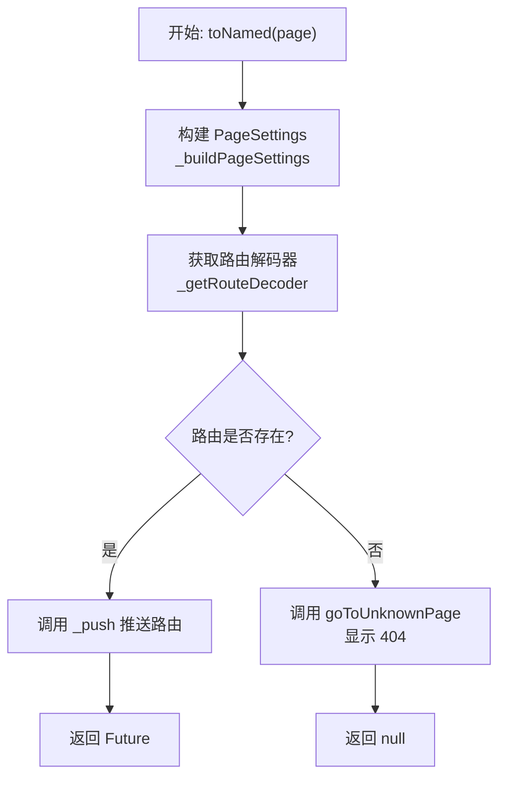
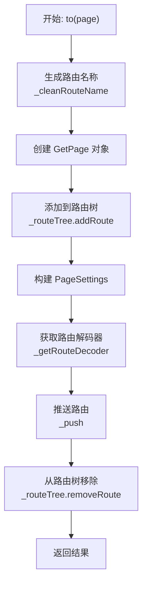
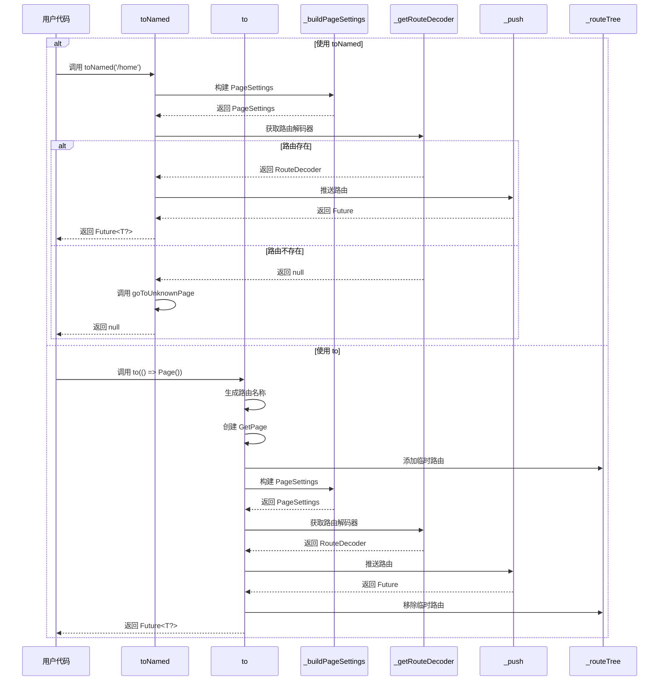

# 基础导航方法

## 概述

基础导航方法是路由系统的核心 API，提供了两种主要的导航方式：命名路由导航（`toNamed`）和页面导航（`to`）。本文档详细解析了这些方法的实现逻辑和使用场景。

## toNamed 方法

```dart 347:363:lib/get_navigation/src/routes/get_router_delegate.dart
@override
Future<T?> toNamed<T>(
  String page, {
  dynamic arguments,
  dynamic id,
  bool preventDuplicates = true,
  Map<String, String>? parameters,
}) async {
  final args = _buildPageSettings(page, arguments);
  final route = _getRouteDecoder<T>(args);
  if (route != null) {
    return _push<T>(route);
  } else {
    goToUnknownPage();
  }
  return null;
}
```

**功能**：通过路由名称导航到指定页面。

### 参数说明

- **`page`**：路由名称（必需），如 `'/home'`、`'/user/:id'`
- **`arguments`**：传递给目标页面的参数（可选）
- **`id`**：导航器 ID，用于嵌套导航（可选，当前实现未使用）
- **`preventDuplicates`**：是否防止重复路由（可选，默认 `true`）
- **`parameters`**：URL 参数（可选），如 `{'id': '123'}`

### 执行流程



### 使用示例

```dart
// 基本导航
await delegate.toNamed('/home');

// 带参数导航
await delegate.toNamed('/user/123');

// 带 arguments 导航
await delegate.toNamed('/profile', arguments: {'userId': 123});

// 带 URL 参数导航
await delegate.toNamed('/search', parameters: {'q': 'flutter'});

// 获取返回结果
final result = await delegate.toNamed<String>('/edit');
print('返回结果: $result');
```

## to 方法

```dart 365:415:lib/get_navigation/src/routes/get_router_delegate.dart
@override
Future<T?> to<T>(
  Widget Function() page, {
  bool? opaque,
  Transition? transition,
  Curve? curve,
  Duration? duration,
  String? id,
  String? routeName,
  bool fullscreenDialog = false,
  dynamic arguments,
  List<BindingsInterface> bindings = const [],
  bool preventDuplicates = true,
  bool? popGesture,
  bool showCupertinoParallax = true,
  double Function(BuildContext context)? gestureWidth,
  bool rebuildStack = true,
  PreventDuplicateHandlingMode preventDuplicateHandlingMode =
      PreventDuplicateHandlingMode.reorderRoutes,
}) async {
  routeName ??= _cleanRouteName("/${page.runtimeType}");
  // if (preventDuplicateHandlingMode ==
  //PreventDuplicateHandlingMode.Recreate) {
  //   routeName = routeName + page.hashCode.toString();
  // }

  final getPage = GetPage<T>(
    name: routeName,
    opaque: opaque ?? true,
    page: page,
    gestureWidth: gestureWidth,
    showCupertinoParallax: showCupertinoParallax,
    popGesture: popGesture ?? Get.defaultPopGesture,
    transition: transition ?? Get.defaultTransition,
    curve: curve ?? Get.defaultTransitionCurve,
    fullscreenDialog: fullscreenDialog,
    bindings: bindings,
    transitionDuration: duration ?? Get.defaultTransitionDuration,
    preventDuplicateHandlingMode: preventDuplicateHandlingMode,
  );

  _routeTree.addRoute(getPage);
  final args = _buildPageSettings(routeName, arguments);
  final route = _getRouteDecoder<T>(args);
  final result = await _push<T>(
    route!,
    rebuildStack: rebuildStack,
  );
  _routeTree.removeRoute(getPage);
  return result;
}
```

**功能**：通过 Widget 构建函数导航到页面，支持临时路由。

### 参数说明

- **`page`**：Widget 构建函数（必需）
- **`routeName`**：路由名称（可选），默认从 `page.runtimeType` 生成
- **`opaque`**：页面是否不透明（可选，默认 `true`）
- **`transition`**：转场动画类型（可选）
- **`curve`**：动画曲线（可选）
- **`duration`**：动画时长（可选）
- **`fullscreenDialog`**：是否全屏对话框（可选，默认 `false`）
- **`arguments`**：传递给页面的参数（可选）
- **`bindings`**：依赖注入绑定列表（可选）
- **`preventDuplicates`**：是否防止重复（可选，默认 `true`）
- **`popGesture`**：是否支持返回手势（可选）
- **`showCupertinoParallax`**：是否显示 Cupertino 视差效果（可选，默认 `true`）
- **`gestureWidth`**：手势宽度函数（可选）
- **`rebuildStack`**：是否重建导航栈（可选，默认 `true`）
- **`preventDuplicateHandlingMode`**：防止重复的处理模式（可选）

### 执行流程



### 关键特性

1. **临时路由**：
   - 路由在导航前添加到路由树
   - 导航完成后从路由树移除
   - 适用于一次性页面或动态页面

2. **自动路由名称**：
   - 如果未提供 `routeName`，从 `page.runtimeType` 生成
   - 格式：`"/${page.runtimeType}"`，如 `"/HomePage"`

3. **完整配置支持**：
   - 支持所有 `GetPage` 的配置选项
   - 可以自定义转场动画、手势等

### 使用示例

```dart
// 基本导航
await delegate.to(() => HomePage());

// 自定义路由名称
await delegate.to(
  () => ProfilePage(),
  routeName: '/profile',
);

// 自定义转场动画
await delegate.to(
  () => DetailPage(),
  transition: Transition.fadeIn,
  duration: Duration(milliseconds: 300),
);

// 全屏对话框
await delegate.to(
  () => FullScreenDialog(),
  fullscreenDialog: true,
);

// 带参数和绑定
await delegate.to(
  () => UserPage(),
  arguments: {'userId': 123},
  bindings: [UserBinding()],
);

// 获取返回结果
final result = await delegate.to<String>(() => EditPage());
print('编辑结果: $result');
```

## _cleanRouteName 方法

```dart 676:685:lib/get_navigation/src/routes/get_router_delegate.dart
/// Takes a route [name] String generated by [to], [off], [offAll]
/// (and similar context navigation methods), cleans the extra chars and
/// accommodates the format.
/// TODO: check for a more "appealing" URL naming convention.
/// `() => MyHomeScreenView` becomes `/my-home-screen-view`.
String _cleanRouteName(String name) {
  name = name.replaceAll('() => ', '');
  
  /// uncomment for URL styling.
  // name = name.paramCase!;
  if (!name.startsWith('/')) {
    name = '/$name';
  }
  return Uri.tryParse(name)?.toString() ?? name;
}
```

**功能**：清理和格式化路由名称。

### 处理逻辑

1. **移除函数前缀**：移除 `'() => '` 字符串
2. **URL 样式化**（已注释）：可以取消注释使用 `paramCase` 转换
3. **添加前导斜杠**：如果路由名称不以 `/` 开头，添加它
4. **URI 验证**：尝试解析为 URI，确保格式正确

### 示例

```dart
// 输入: "() => HomePage"
// 输出: "/HomePage"

// 输入: "HomePage"
// 输出: "/HomePage"

// 输入: "/home"
// 输出: "/home"
```

## 方法对比

| 特性 | toNamed | to |
|------|---------|-----|
| **路由来源** | 已注册的路由 | 临时创建的路由 |
| **路由名称** | 必需，字符串 | 可选，自动生成 |
| **路由管理** | 永久存在于路由树 | 临时添加到路由树 |
| **使用场景** | 预定义路由 | 动态页面、一次性页面 |
| **配置灵活性** | 受限于已注册路由 | 完全可配置 |

## 执行流程图



## 使用场景

### 1. 预定义路由导航

```dart
// 使用 toNamed 导航到已注册的路由
await delegate.toNamed('/home');
await delegate.toNamed('/user/123');
```

### 2. 动态页面导航

```dart
// 使用 to 导航到动态创建的页面
await delegate.to(() => DynamicPage(data: someData));
```

### 3. 带返回值的导航

```dart
// 导航到编辑页面，等待用户操作结果
final result = await delegate.toNamed<String>('/edit');
if (result == 'saved') {
  // 处理保存结果
}
```

### 4. 自定义转场动画

```dart
// 使用 to 方法自定义转场
await delegate.to(
  () => DetailPage(),
  transition: Transition.zoom,
  curve: Curves.easeInOut,
  duration: Duration(milliseconds: 500),
);
```

## 关键特性

### 1. 异步支持

两个方法都返回 `Future<T?>`，支持：

- 等待导航完成
- 获取返回结果
- 处理导航错误

### 2. 参数传递

支持多种参数传递方式：

- `arguments`：直接传递对象
- `parameters`：URL 参数（仅 `toNamed`）
- 路由参数：通过路由路径传递（如 `/user/:id`）

### 3. 防止重复

默认启用 `preventDuplicates`，避免重复导航到同一路由。

### 4. 404 处理

`toNamed` 在路由不存在时自动导航到 404 页面。

### 5. 临时路由

`to` 方法支持临时路由，适用于：

- 一次性页面
- 动态生成的页面
- 不需要持久化的页面

## 注意事项

1. **路由注册**：`toNamed` 要求路由已注册，否则会导航到 404

2. **路由名称格式**：路由名称应以 `/` 开头，如 `/home` 而不是 `home`

3. **临时路由生命周期**：`to` 方法创建的路由在导航完成后会被移除

4. **返回值类型**：使用泛型 `T` 指定返回值的类型，如 `toNamed<String>('/edit')`

5. **异步操作**：导航是异步操作，应使用 `await` 等待完成

6. **错误处理**：路由不存在或中间件阻止时，可能返回 `null`

7. **性能考虑**：频繁使用 `to` 方法创建临时路由可能影响性能，优先使用 `toNamed`
