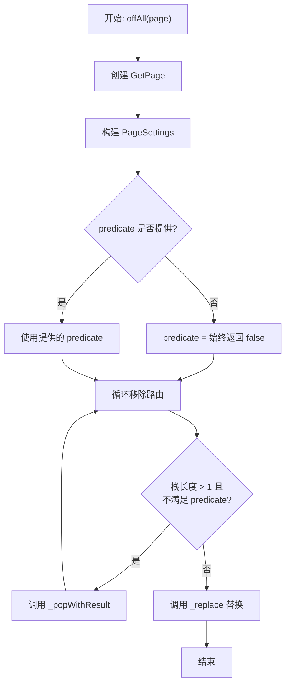

# 替换导航方法

## 概述

替换导航方法用于替换当前路由或导航栈中的路由，而不是简单地添加新路由。这些方法包括 `off`、`offAll`、`offAllNamed`、`offNamedUntil` 和 `offNamed`，它们提供了不同的替换策略和场景。

## off 方法

```dart 417:451:lib/get_navigation/src/routes/get_router_delegate.dart
@override
Future<T?> off<T>(
  Widget Function() page, {
  bool? opaque,
  Transition? transition,
  Curve? curve,
  Duration? duration,
  String? id,
  String? routeName,
  bool fullscreenDialog = false,
  dynamic arguments,
  List<BindingsInterface> bindings = const [],
  bool preventDuplicates = true,
  bool? popGesture,
  bool showCupertinoParallax = true,
  double Function(BuildContext context)? gestureWidth,
}) async {
  routeName ??= _cleanRouteName("/${page.runtimeType}");
  final route = GetPage<T>(
    name: routeName,
    opaque: opaque ?? true,
    page: page,
    gestureWidth: gestureWidth,
    showCupertinoParallax: showCupertinoParallax,
    popGesture: popGesture ?? Get.defaultPopGesture,
    transition: transition ?? Get.defaultTransition,
    curve: curve ?? Get.defaultTransitionCurve,
    fullscreenDialog: fullscreenDialog,
    bindings: bindings,
    transitionDuration: duration ?? Get.defaultTransitionDuration,
  );

  final args = _buildPageSettings(routeName, arguments);
  return _replace(args, route);
}
```

**功能**：替换当前路由（栈顶路由）为新路由。

### 执行流程

1. **生成路由名称**：如果未提供，从 `page.runtimeType` 生成
2. **创建 GetPage**：使用提供的参数创建 `GetPage` 对象
3. **构建页面设置**：使用 `_buildPageSettings` 构建 `PageSettings`
4. **替换路由**：调用 `_replace` 方法替换当前路由

### 使用场景

- 登录后替换登录页面为首页
- 表单提交后替换表单页面为结果页面
- 不需要返回上一页的场景

## offAll 方法

```dart 453:494:lib/get_navigation/src/routes/get_router_delegate.dart
@override
Future<T?>? offAll<T>(
  Widget Function() page, {
  bool Function(GetPage route)? predicate,
  bool opaque = true,
  bool? popGesture,
  String? id,
  String? routeName,
  dynamic arguments,
  List<BindingsInterface> bindings = const [],
  bool fullscreenDialog = false,
  Transition? transition,
  Curve? curve,
  Duration? duration,
  bool showCupertinoParallax = true,
  double Function(BuildContext context)? gestureWidth,
}) async {
  routeName ??= _cleanRouteName("/${page.runtimeType}");
  final route = GetPage<T>(
    name: routeName,
    opaque: opaque,
    page: page,
    gestureWidth: gestureWidth,
    showCupertinoParallax: showCupertinoParallax,
    popGesture: popGesture ?? Get.defaultPopGesture,
    transition: transition ?? Get.defaultTransition,
    curve: curve ?? Get.defaultTransitionCurve,
    fullscreenDialog: fullscreenDialog,
    bindings: bindings,
    transitionDuration: duration ?? Get.defaultTransitionDuration,
  );

  final args = _buildPageSettings(routeName, arguments);

  final newPredicate = predicate ?? (route) => false;

  while (_activePages.length > 1 && !newPredicate(_activePages.last.route!)) {
    _popWithResult();
  }

  return _replace(args, route);
}
```

**功能**：清空导航栈（除了根路由），然后替换为新路由。

### 参数说明

- **`predicate`**：可选的条件函数，用于控制哪些路由应该保留
  - 如果提供，只移除不满足条件的路由
  - 如果未提供（默认），移除所有路由（除了根路由）

### 执行流程



### 使用场景

- 登录后清空所有页面，只保留新页面
- 退出登录，清空导航栈
- 重置应用状态

## offAllNamed 方法

```dart 496:513:lib/get_navigation/src/routes/get_router_delegate.dart
@override
Future<T?>? offAllNamed<T>(
  String newRouteName, {
  // bool Function(GetPage route)? predicate,
  dynamic arguments,
  String? id,
  Map<String, String>? parameters,
}) async {
  final args = _buildPageSettings(newRouteName, arguments);
  final route = _getRouteDecoder<T>(args);
  if (route == null) return null;

  while (_activePages.length > 1) {
    _activePages.removeLast();
  }

  return _replaceNamed(route);
}
```

**功能**：清空导航栈（除了根路由），然后导航到指定的命名路由。

### 执行流程

1. **构建页面设置**：使用 `_buildPageSettings` 构建 `PageSettings`
2. **获取路由解码器**：使用 `_getRouteDecoder` 获取路由
3. **清空栈**：移除所有路由（除了根路由）
4. **替换路由**：调用 `_replaceNamed` 替换为指定路由

### 使用场景

- 使用命名路由进行替换
- 需要路由已注册的场景

## offNamedUntil 方法

```dart 515:534:lib/get_navigation/src/routes/get_router_delegate.dart
@override
Future<T?>? offNamedUntil<T>(
  String page, {
  bool Function(GetPage route)? predicate,
  dynamic arguments,
  String? id,
  Map<String, String>? parameters,
}) async {
  final args = _buildPageSettings(page, arguments);
  final route = _getRouteDecoder<T>(args);
  if (route == null) return null;

  final newPredicate = predicate ?? (route) => false;

  while (_activePages.length > 1 && !newPredicate(_activePages.last.route!)) {
    _activePages.removeLast();
  }

  return _push(route);
}
```

**功能**：移除路由直到满足条件，然后推送新路由。

### 参数说明

- **`predicate`**：条件函数，用于判断是否停止移除路由
  - 当 `predicate` 返回 `true` 时，停止移除
  - 如果未提供，默认移除所有路由（除了根路由）

### 执行流程

1. **构建页面设置**：使用 `_buildPageSettings` 构建 `PageSettings`
2. **获取路由解码器**：使用 `_getRouteDecoder` 获取路由
3. **循环移除**：移除不满足 `predicate` 的路由
4. **推送新路由**：调用 `_push` 推送新路由

### 使用场景

- 返回到特定路由，然后导航到新路由
- 清理中间页面，保留目标页面

## offNamed 方法

```dart 536:548:lib/get_navigation/src/routes/get_router_delegate.dart
@override
Future<T?> offNamed<T>(
  String page, {
  dynamic arguments,
  String? id,
  Map<String, String>? parameters,
}) async {
  final args = _buildPageSettings(page, arguments);
  final route = _getRouteDecoder<T>(args);
  if (route == null) return null;
  _popWithResult();
  return _push<T>(route);
}
```

**功能**：替换当前路由为指定的命名路由。

### 执行流程

1. **构建页面设置**：使用 `_buildPageSettings` 构建 `PageSettings`
2. **获取路由解码器**：使用 `_getRouteDecoder` 获取路由
3. **弹出当前路由**：调用 `_popWithResult` 移除当前路由
4. **推送新路由**：调用 `_push` 推送新路由

### 使用场景

- 简单的路由替换
- 使用命名路由替换当前页面

## 方法对比

| 方法 | 替换范围 | 支持条件 | 路由类型 | 使用场景 |
|------|---------|---------|---------|---------|
| `off` | 当前路由 | 否 | Widget 函数 | 替换当前页面 |
| `offAll` | 所有路由 | 是（predicate） | Widget 函数 | 清空栈后替换 |
| `offAllNamed` | 所有路由 | 否 | 命名路由 | 清空栈后导航到命名路由 |
| `offNamedUntil` | 条件移除 | 是（predicate） | 命名路由 | 条件移除后推送 |
| `offNamed` | 当前路由 | 否 | 命名路由 | 替换当前命名路由 |

## 执行流程图

```mermaid
sequenceDiagram
    participant User as 用户代码
    participant Off as off/offAll
    participant OffNamed as offNamed/offAllNamed
    participant PopWithResult as _popWithResult
    participant Replace as _replace
    participant Push as _push
    participant ActivePages as _activePages

    alt 使用 off
        User->>Off: 调用 off(() => Page())
        Off->>Off: 创建 GetPage
        Off->>Replace: 调用 _replace
        Replace-->>Off: 返回 Future
        Off-->>User: 返回 Future<T?>
    else 使用 offAll
        User->>Off: 调用 offAll(() => Page())
        Off->>Off: 创建 GetPage
        loop 移除路由
            Off->>PopWithResult: 调用 _popWithResult
            PopWithResult->>ActivePages: 移除栈顶路由
        end
        Off->>Replace: 调用 _replace
        Replace-->>Off: 返回 Future
        Off-->>User: 返回 Future<T?>
    else 使用 offNamed
        User->>OffNamed: 调用 offNamed('/home')
        OffNamed->>OffNamed: 获取路由解码器
        OffNamed->>PopWithResult: 弹出当前路由
        OffNamed->>Push: 推送新路由
        Push-->>OffNamed: 返回 Future
        OffNamed-->>User: 返回 Future<T?>
    end
```

## 使用场景

### 1. 登录后替换

```dart
// 登录成功后，替换登录页面为首页
await delegate.off(() => HomePage());
```

### 2. 清空导航栈

```dart
// 退出登录，清空所有页面
await delegate.offAll(() => LoginPage());
```

### 3. 条件移除

```dart
// 移除所有路由，直到找到首页
await delegate.offNamedUntil(
  '/profile',
  predicate: (route) => route.name == '/home',
);
```

### 4. 简单替换

```dart
// 替换当前页面为设置页面
await delegate.offNamed('/settings');
```

## 关键特性

### 1. 替换而非添加

所有方法都是替换操作，不会在栈顶添加新路由，而是替换现有路由。

### 2. 条件移除

`offAll` 和 `offNamedUntil` 支持条件函数，可以精确控制哪些路由应该保留。

### 3. 栈管理

`offAll` 和 `offAllNamed` 会清空导航栈（除了根路由），确保应用状态干净。

### 4. 路由类型支持

- Widget 函数：`off`、`offAll`
- 命名路由：`offNamed`、`offAllNamed`、`offNamedUntil`

## 注意事项

1. **根路由保护**：所有方法都会保留至少一个路由（根路由），防止应用无路由可显示

2. **路由存在性**：命名路由方法要求路由已注册，否则返回 `null`

3. **Completer 处理**：`_popWithResult` 会正确完成被移除路由的 completer

4. **性能考虑**：`offAll` 会移除多个路由，可能触发多次 UI 重建

5. **状态丢失**：替换操作会导致被替换的路由状态丢失，需要提前保存重要状态

6. **条件函数**：`predicate` 函数应该快速执行，避免阻塞 UI

7. **导航结果**：替换操作会返回新路由的 Future，可以获取导航结果
