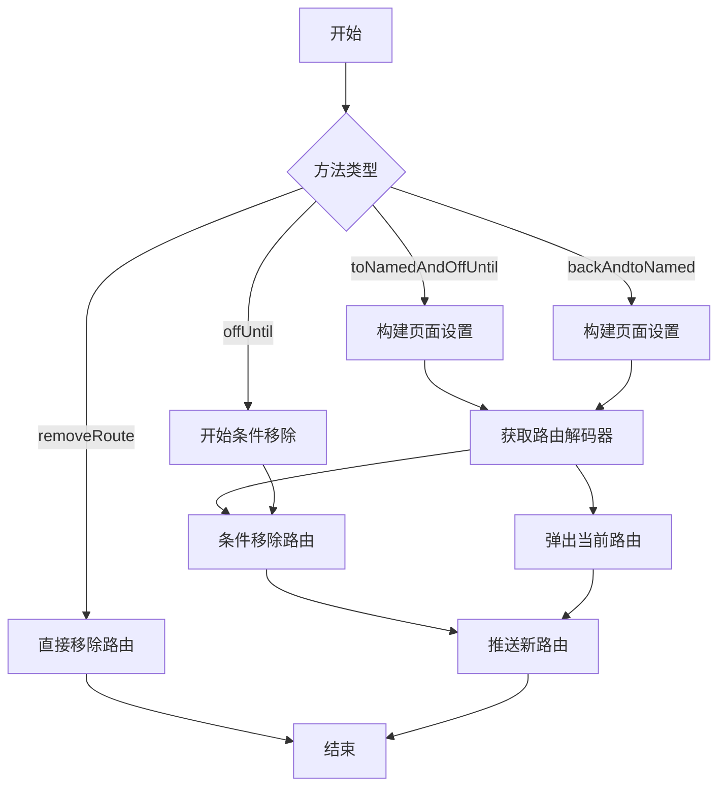

# 条件导航方法

## 概述

条件导航方法提供了基于条件函数的导航控制，允许在导航前或导航后根据条件移除路由。这些方法包括 `toNamedAndOffUntil`、`offUntil`、`removeRoute`、`canBack`、`_checkIfCanBack` 和 `backAndtoNamed`。

## toNamedAndOffUntil 方法

```dart 550:567:lib/get_navigation/src/routes/get_router_delegate.dart
@override
Future<T?> toNamedAndOffUntil<T>(
  String page,
  bool Function(GetPage) predicate, [
  Object? data,
]) async {
  final arguments = _buildPageSettings(page, data);

  final route = _getRouteDecoder<T>(arguments);

  if (route == null) return null;

  while (_activePages.isNotEmpty && !predicate(_activePages.last.route!)) {
    _popWithResult();
  }

  return _push<T>(route);
}
```

**功能**：移除路由直到满足条件，然后导航到指定命名路由。

### 参数说明

- **`page`**：目标路由名称（必需）
- **`predicate`**：条件函数（必需），返回 `true` 时停止移除
- **`data`**：可选的数据参数

### 执行流程

1. **构建页面设置**：使用 `_buildPageSettings` 构建 `PageSettings`
2. **获取路由解码器**：使用 `_getRouteDecoder` 获取目标路由
3. **条件移除**：循环移除不满足 `predicate` 的路由
4. **推送新路由**：调用 `_push` 推送目标路由

### 使用场景

```dart
// 返回到首页，然后导航到设置页
await delegate.toNamedAndOffUntil(
  '/settings',
  (route) => route.name == '/home',
);
```

## offUntil 方法

```dart 569:580:lib/get_navigation/src/routes/get_router_delegate.dart
@override
Future<T?> offUntil<T>(
  Widget Function() page,
  bool Function(GetPage) predicate, [
  Object? arguments,
]) async {
  while (_activePages.isNotEmpty && !predicate(_activePages.last.route!)) {
    _popWithResult();
  }

  return to<T>(page, arguments: arguments);
}
```

**功能**：移除路由直到满足条件，然后导航到新页面。

### 执行流程

1. **条件移除**：循环移除不满足 `predicate` 的路由
2. **导航到新页面**：调用 `to` 方法导航到新页面

### 使用场景

```dart
// 返回到登录页，然后导航到注册页
await delegate.offUntil(
  () => RegisterPage(),
  (route) => route.name == '/login',
);
```

## removeRoute 方法

```dart 582:585:lib/get_navigation/src/routes/get_router_delegate.dart
@override
void removeRoute<T>(String name) {
  _activePages.remove(RouteDecoder.fromRoute(name));
}
```

**功能**：从活跃路由栈中移除指定名称的路由。

### 使用场景

```dart
// 移除特定路由
delegate.removeRoute('/temp-page');
```

## canBack 属性

```dart 587:589:lib/get_navigation/src/routes/get_router_delegate.dart
bool get canBack {
  return _activePages.length > 1;
}
```

**功能**：检查是否可以返回（是否有路由可以弹出）。

### 逻辑

只有当 `_activePages` 中有超过 1 个路由时，才能返回。

## _checkIfCanBack 方法

```dart 591:600:lib/get_navigation/src/routes/get_router_delegate.dart
void _checkIfCanBack() {
  assert(() {
    if (!canBack) {
      final last = _activePages.last;
      final name = last.route?.name;
      throw 'The page $name cannot be popped';
    }
    return true;
  }());
}
```

**功能**：在调试模式下检查是否可以返回，如果不能则抛出异常。

### 用途

- 开发时帮助发现错误的返回操作
- 防止在根路由时尝试返回

## backAndtoNamed 方法

```dart 602:610:lib/get_navigation/src/routes/get_router_delegate.dart
@override
Future<R?> backAndtoNamed<T, R>(String page,
    {T? result, Object? arguments}) async {
  final args = _buildPageSettings(page, arguments);
  final route = _getRouteDecoder<R>(args);
  if (route == null) return null;
  _popWithResult<T>(result);
  return _push<R>(route);
}
```

**功能**：返回上一页并传递结果，然后导航到指定命名路由。

### 泛型说明

- **`T`**：返回结果的类型
- **`R`**：新路由返回值的类型

### 执行流程

1. **构建页面设置**：使用 `_buildPageSettings` 构建 `PageSettings`
2. **获取路由解码器**：使用 `_getRouteDecoder` 获取目标路由
3. **弹出当前路由**：调用 `_popWithResult` 弹出当前路由并传递结果
4. **推送新路由**：调用 `_push` 推送目标路由

### 使用场景

```dart
// 从编辑页返回并传递结果，然后导航到详情页
await delegate.backAndtoNamed<String, void>(
  '/detail',
  result: 'saved',
);
```

## 方法对比

| 方法 | 移除方式 | 导航方式 | 条件函数 | 使用场景 |
|------|---------|---------|---------|---------|
| `toNamedAndOffUntil` | 条件移除 | 命名路由 | 必需 | 条件移除后导航到命名路由 |
| `offUntil` | 条件移除 | Widget 函数 | 必需 | 条件移除后导航到新页面 |
| `removeRoute` | 直接移除 | 无 | 无 | 移除特定路由 |
| `backAndtoNamed` | 弹出当前 | 命名路由 | 无 | 返回并导航 |

## 执行流程图



## 注意事项

1. **条件函数**：`predicate` 应该快速执行，避免阻塞 UI
2. **根路由保护**：条件移除会保留至少一个路由
3. **路由存在性**：命名路由方法要求路由已注册
4. **结果传递**：`backAndtoNamed` 支持传递返回结果
