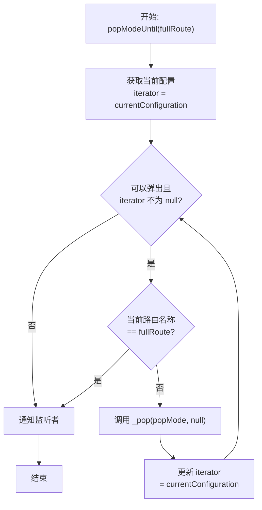
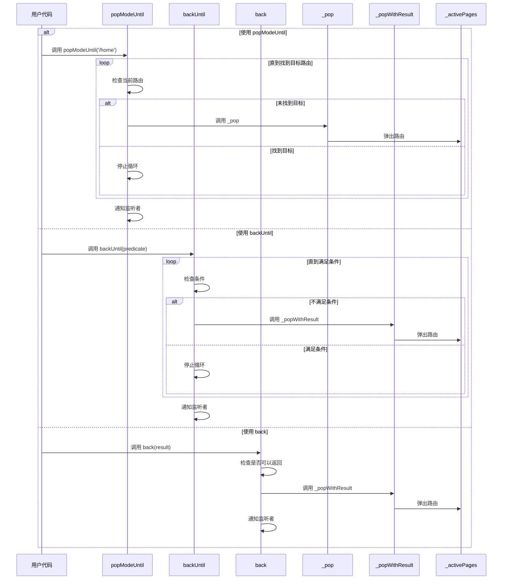

# 路由弹出与返回

## 概述

路由弹出与返回方法提供了多种方式从导航栈中移除路由，包括按模式弹出、条件弹出和直接返回。本文档解析了 `popModeUntil`、`backUntil` 和 `back` 方法的实现逻辑。

## popModeUntil 方法

```dart 612:633:lib/get_navigation/src/routes/get_router_delegate.dart
/// Removes routes according to [PopMode]
/// until it reaches the specific [fullRoute],
/// DOES NOT remove the [fullRoute]
@override
Future<void> popModeUntil(
  String fullRoute, {
  PopMode popMode = PopMode.history,
}) async {
  // remove history or page entries until you meet route
  var iterator = currentConfiguration;
  while (_canPop(popMode) && iterator != null) {
    //the next line causes wasm compile error if included in the while loop
    //https://github.com/flutter/flutter/issues/140110
    if (iterator.pageSettings?.name == fullRoute) {
      break;
    }
    await _pop(popMode, null);
    // replace iterator
    iterator = currentConfiguration;
  }
  notifyListeners();
}
```

**功能**：根据 `PopMode` 弹出路由，直到到达指定的路由（不包含该路由）。

### 参数说明

- **`fullRoute`**：目标路由名称，弹出到此路由停止（不包含）
- **`popMode`**：弹出模式，默认为 `PopMode.history`

### 执行流程



### 关键特性

1. **不包含目标路由**：注释明确说明 `DOES NOT remove the [fullRoute]`，目标路由会被保留
2. **模式支持**：支持 `PopMode.history` 和 `PopMode.page` 两种模式
3. **WASM 兼容性**：注释说明了在 while 循环中直接比较会导致 WASM 编译错误

### 使用场景

```dart
// 弹出到首页（保留首页）
await delegate.popModeUntil('/home');

// 使用页面模式弹出
await delegate.popModeUntil('/user/123', popMode: PopMode.page);
```

## backUntil 方法

```dart 635:642:lib/get_navigation/src/routes/get_router_delegate.dart
@override
void backUntil(bool Function(GetPage) predicate) {
  while (_activePages.length > 1 && !predicate(_activePages.last.route!)) {
    _popWithResult();
  }

  notifyListeners();
}
```

**功能**：弹出路由直到满足条件函数。

### 参数说明

- **`predicate`**：条件函数，返回 `true` 时停止弹出

### 执行流程

1. **条件检查**：检查栈长度和 `predicate` 条件
2. **循环弹出**：如果不满足条件，调用 `_popWithResult` 弹出路由
3. **通知更新**：调用 `notifyListeners` 通知 UI 更新

### 使用场景

```dart
// 弹出直到找到首页
delegate.backUntil((route) => route.name == '/home');

// 弹出直到找到特定类型的路由
delegate.backUntil((route) => route is HomePage);
```

## back 方法

```dart 820:825:lib/get_navigation/src/routes/get_router_delegate.dart
@override
void back<T>([T? result]) {
  _checkIfCanBack();
  _popWithResult<T>(result);
  notifyListeners();
}
```

**功能**：返回上一页，支持传递结果。

### 参数说明

- **`result`**：可选参数，传递给上一页的结果值

### 执行流程

1. **检查是否可以返回**：调用 `_checkIfCanBack` 检查（调试模式下会抛出异常）
2. **弹出路由**：调用 `_popWithResult` 弹出当前路由并传递结果
3. **通知更新**：调用 `notifyListeners` 通知 UI 更新

### 使用场景

```dart
// 基本返回
delegate.back();

// 返回并传递结果
delegate.back<String>('saved');

// 返回并传递对象
delegate.back<User>(user);
```

## 方法对比

| 方法 | 弹出方式 | 停止条件 | 模式支持 | 返回值 |
|------|---------|---------|---------|--------|
| `popModeUntil` | 按模式弹出 | 路由名称匹配 | 是 | `Future<void>` |
| `backUntil` | 直接弹出 | 条件函数 | 否 | `void` |
| `back` | 直接弹出 | 无（只弹一个） | 否 | `void` |

## 执行流程图



## 关键特性

### 1. 模式支持

`popModeUntil` 支持两种弹出模式：

- `PopMode.history`：按历史记录弹出
- `PopMode.page`：按页面弹出

### 2. 条件控制

`backUntil` 使用条件函数提供灵活的控制：

- 可以基于路由名称
- 可以基于路由类型
- 可以基于自定义逻辑

### 3. 结果传递

`back` 方法支持传递结果：

- 支持泛型类型
- 可以传递任意对象
- 上一页可以通过 Future 接收结果

### 4. 安全检查

`back` 方法包含安全检查：

- 调试模式下会检查是否可以返回
- 防止在根路由时返回

## 注意事项

1. **目标路由保留**：`popModeUntil` 不会移除目标路由，只移除目标路由之前的路由

2. **根路由保护**：所有方法都会保留至少一个路由，防止应用无路由可显示

3. **条件函数性能**：`backUntil` 的条件函数会在循环中多次调用，应快速执行

4. **WASM 兼容性**：`popModeUntil` 中的路由名称比较在 while 循环外进行，避免 WASM 编译错误

5. **异步操作**：`popModeUntil` 是异步方法，应使用 `await` 等待完成

6. **通知更新**：所有方法都会调用 `notifyListeners`，确保 UI 及时更新

7. **结果类型**：`back` 方法支持泛型，可以指定返回结果的类型
