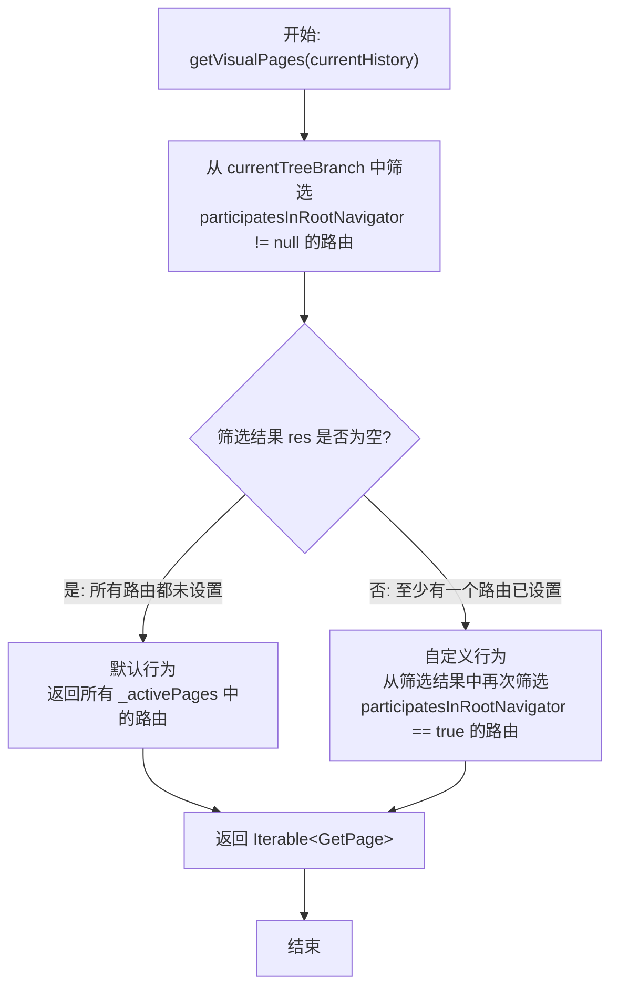

# getVisualPages 方法详解

## 概述

`getVisualPages` 是 `GetDelegate` 类中的一个关键方法，用于从当前路由历史中筛选出应该显示在根导航器（Root Navigator）中的可视化页面。该方法通过 `participatesInRootNavigator` 属性来控制哪些路由参与根导航器的页面栈，这对于实现嵌套导航、选择性页面显示等高级导航场景非常重要。

### 在 GetX 导航系统中的位置

`getVisualPages` 方法在 GetX 的导航系统中扮演着页面筛选器的角色：

- 在 `build` 方法中被调用，用于决定哪些页面应该显示在根导航器中
- 如果没有自定义的 `pickPagesForRootNavigator` 函数，则使用该方法获取可视化页面
- 与 `_activePages` 和 `RouteDecoder.currentTreeBranch` 紧密配合，实现页面栈的管理

### 与 participatesInRootNavigator 的关系

`getVisualPages` 方法的核心逻辑依赖于 `GetPage` 的 `participatesInRootNavigator` 属性：

- **`null`**（未设置）：使用默认行为，所有路由都参与根导航器
- **`true`**：明确指定该路由参与根导航器
- **`false`**：明确指定该路由不参与根导航器（通常用于嵌套导航场景）

## 方法签名与参数

```dart 293:307:lib/get_navigation/src/routes/get_router_delegate.dart
/// gets the visual pages from the current _activePages entry
///
/// visual pages must have [GetPage.participatesInRootNavigator] set to true
Iterable<GetPage> getVisualPages(RouteDecoder? currentHistory) {
  final res = currentHistory!.currentTreeBranch
      .where((r) => r.participatesInRootNavigator != null);
  if (res.isEmpty) {
    //default behavior, all routes participate in root navigator
    return _activePages.map((e) => e.route!);
  } else {
    //user specified at least one participatesInRootNavigator
    return res
        .where((element) => element.participatesInRootNavigator == true);
  }
}
```

### 参数说明

- **`currentHistory`** (`RouteDecoder?`)：当前路由配置信息
  - 包含 `currentTreeBranch` 属性，表示当前路由树分支（从根路由到当前路由的路径）
  - 如果为 `null`，方法内部会使用 `!` 操作符进行断言（实际调用时通常不为 `null`）

### 返回值说明

- **`Iterable<GetPage>`**：返回应该显示在根导航器中的页面集合
  - 默认行为：返回所有 `_activePages` 中的路由
  - 自定义行为：只返回 `participatesInRootNavigator == true` 的路由

## 核心逻辑解析

`getVisualPages` 方法的执行逻辑分为两个主要分支：

### 第一步：检查是否有路由设置了 participatesInRootNavigator

方法首先从 `currentHistory.currentTreeBranch` 中筛选出所有 `participatesInRootNavigator != null` 的路由：

```dart
final res = currentHistory!.currentTreeBranch
    .where((r) => r.participatesInRootNavigator != null);
```

这步操作用于判断用户是否显式设置了 `participatesInRootNavigator` 属性。

### 第二步：根据筛选结果选择返回策略

#### 分支 1：默认行为（所有路由都参与）

如果 `res.isEmpty`（即没有任何路由设置 `participatesInRootNavigator`），则使用默认行为：

```dart
if (res.isEmpty) {
  //default behavior, all routes participate in root navigator
  return _activePages.map((e) => e.route!);
}
```

- 返回所有 `_activePages` 中的路由
- `_activePages` 是 `GetDelegate` 中维护的活跃路由历史栈
- 所有活跃的路由都会显示在根导航器中

#### 分支 2：自定义行为（选择性参与）

如果至少有一个路由设置了 `participatesInRootNavigator`，则只返回设置为 `true` 的路由：

```dart
else {
  //user specified at least one participatesInRootNavigator
  return res
      .where((element) => element.participatesInRootNavigator == true);
}
```

- 只返回 `participatesInRootNavigator == true` 的路由
- 设置为 `false` 的路由不会出现在根导航器中
- 未设置（`null`）的路由也不会出现在根导航器中

### 执行流程图



## 关键概念说明

### RouteDecoder 和 currentTreeBranch

`RouteDecoder` 是 GetX 中表示路由配置信息的类，包含以下重要属性：

- **`currentTreeBranch`** (`List<GetPage>`)：当前路由树分支
  - 表示从根路由到当前路由的完整路径
  - 例如：如果路由路径是 `/home/profile/settings`，那么 `currentTreeBranch` 会包含 `[/home, /home/profile, /home/profile/settings]` 对应的三个 `GetPage` 对象
  - `getVisualPages` 方法从这个列表中筛选符合条件的路由

### _activePages 的作用

`_activePages` 是 `GetDelegate` 类中维护的活跃路由历史栈：

- 类型为 `List<RouteDecoder>`
- 每当用户导航到新路由时，会将新的 `RouteDecoder` 添加到 `_activePages` 中
- 在默认行为下，`getVisualPages` 返回所有 `_activePages` 中的路由，形成完整的页面栈

### participatesInRootNavigator 的三个状态

`participatesInRootNavigator` 是 `GetPage` 的一个可选属性（类型为 `bool?`），有三个可能的值：

| 值 | 含义 | 在默认行为下 | 在自定义行为下 |
|---|------|-------------|---------------|
| `null` | 未设置，使用默认行为 | 参与根导航器 | 不参与根导航器 |
| `true` | 明确指定参与根导航器 | 参与根导航器 | 参与根导航器 |
| `false` | 明确指定不参与根导航器 | 参与根导航器 | 不参与根导航器 |

**重要提示**：一旦至少有一个路由设置了 `participatesInRootNavigator`（非 `null`），则所有未设置（`null`）的路由都会被视为不参与根导航器，即使是在默认行为下它们本来会参与。

## 示例场景

下面通过三个不同的示例场景来详细说明 `getVisualPages` 方法的工作原理。

### 示例 1：默认行为场景

**场景描述**：所有路由都不设置 `participatesInRootNavigator`（值为 `null`），此时会使用默认行为，所有活跃路由都参与根导航器。

**代码示例**：

```dart
import 'package:flutter/material.dart';
import 'package:get/get.dart';

void main() {
  runApp(const MyApp());
}

class MyApp extends StatelessWidget {
  const MyApp({super.key});

  @override
  Widget build(BuildContext context) {
    return GetMaterialApp(
      title: 'getVisualPages - 示例1：默认行为',
      debugShowCheckedModeBanner: false,
      initialRoute: '/home',
      getPages: [
        // 所有路由都不设置 participatesInRootNavigator（为 null）
        // 此时会使用默认行为：所有路由都参与根导航器
        GetPage(
          name: '/home',
          page: () => const HomePage(),
        ),
        GetPage(
          name: '/products',
          page: () => const ProductsPage(),
        ),
        GetPage(
          name: '/cart',
          page: () => const CartPage(),
        ),
      ],
    );
  }
}

class HomePage extends StatelessWidget {
  const HomePage({super.key});

  @override
  Widget build(BuildContext context) {
    return Scaffold(
      appBar: AppBar(title: const Text('首页')),
      body: Center(
        child: Column(
          mainAxisAlignment: MainAxisAlignment.center,
          children: [
            const Text('当前路由: /home'),
            const SizedBox(height: 20),
            ElevatedButton(
              onPressed: () => Get.toNamed('/products'),
              child: const Text('导航到商品页'),
            ),
          ],
        ),
      ),
    );
  }
}

class ProductsPage extends StatelessWidget {
  const ProductsPage({super.key});

  @override
  Widget build(BuildContext context) {
    return Scaffold(
      appBar: AppBar(title: const Text('商品页')),
      body: Center(
        child: Column(
          mainAxisAlignment: MainAxisAlignment.center,
          children: [
            const Text('当前路由: /products'),
            const SizedBox(height: 20),
            ElevatedButton(
              onPressed: () => Get.toNamed('/cart'),
              child: const Text('导航到购物车'),
            ),
            const SizedBox(height: 10),
            ElevatedButton(
              onPressed: () => Get.back(),
              child: const Text('返回'),
            ),
          ],
        ),
      ),
    );
  }
}

class CartPage extends StatelessWidget {
  const CartPage({super.key});

  @override
  Widget build(BuildContext context) {
    return Scaffold(
      appBar: AppBar(title: const Text('购物车')),
      body: Center(
        child: Column(
          mainAxisAlignment: MainAxisAlignment.center,
          children: [
            const Text('当前路由: /cart'),
            const SizedBox(height: 20),
            ElevatedButton(
              onPressed: () => Get.back(),
              child: const Text('返回'),
            ),
          ],
        ),
      ),
    );
  }
}
```

**执行流程说明**：

1. 用户导航到 `/home`，此时 `_activePages` 包含一个路由，`getVisualPages` 返回 `[HomePage]`
2. 用户从 `/home` 导航到 `/products`，此时 `_activePages` 包含两个路由，`getVisualPages` 返回 `[HomePage, ProductsPage]`
3. 用户从 `/products` 导航到 `/cart`，此时 `_activePages` 包含三个路由，`getVisualPages` 返回 `[HomePage, ProductsPage, CartPage]`

**关键点**：

- 所有路由的 `participatesInRootNavigator` 都为 `null`
- `getVisualPages` 方法中的 `res.isEmpty` 为 `true`，进入默认行为分支
- 方法返回所有 `_activePages` 中的路由
- 用户可以正常使用返回按钮浏览整个导航历史

**预期结果**：

所有活跃路由都参与根导航器，用户可以看到完整的页面栈。当用户点击返回按钮时，会按照导航顺序逐页返回。

### 示例 2：混合设置场景

**场景描述**：部分路由设置 `participatesInRootNavigator: true`，部分设置为 `false`，部分不设置（`null`）。一旦至少有一个路由设置了该属性，则只有设置为 `true` 的路由会参与根导航器。

**代码示例**：

```dart
import 'package:flutter/material.dart';
import 'package:get/get.dart';

void main() {
  runApp(const MyApp());
}

class MyApp extends StatelessWidget {
  const MyApp({super.key});

  @override
  Widget build(BuildContext context) {
    return GetMaterialApp(
      title: 'getVisualPages - 示例2：混合设置',
      debugShowCheckedModeBanner: false,
      initialRoute: '/main',
      getPages: [
        // 主页面设置 participatesInRootNavigator: true
        // 会显示在根导航器中
        GetPage(
          name: '/main',
          page: () => const MainPage(),
          participatesInRootNavigator: true,
        ),
        // 详情页设置 participatesInRootNavigator: true
        // 会显示在根导航器中
        GetPage(
          name: '/detail',
          page: () => const DetailPage(),
          participatesInRootNavigator: true,
        ),
        // 弹窗页设置 participatesInRootNavigator: false
        // 不会显示在根导航器中
        GetPage(
          name: '/dialog',
          page: () => const DialogPage(),
          participatesInRootNavigator: false,
        ),
        // 隐藏页不设置 participatesInRootNavigator（为 null）
        // 由于至少有一个路由已设置，所以不会显示在根导航器中
        GetPage(
          name: '/hidden',
          page: () => const HiddenPage(),
        ),
      ],
    );
  }
}

class MainPage extends StatelessWidget {
  const MainPage({super.key});

  @override
  Widget build(BuildContext context) {
    return Scaffold(
      appBar: AppBar(title: const Text('主页面')),
      body: Center(
        child: Column(
          mainAxisAlignment: MainAxisAlignment.center,
          children: [
            const Text(
              '当前路由: /main\nparticipatesInRootNavigator: true',
              textAlign: TextAlign.center,
            ),
            const SizedBox(height: 20),
            ElevatedButton(
              onPressed: () => Get.toNamed('/detail'),
              child: const Text('导航到详情页 (true)'),
            ),
            const SizedBox(height: 10),
            ElevatedButton(
              onPressed: () => Get.toNamed('/dialog'),
              child: const Text('导航到弹窗页 (false)'),
            ),
            const SizedBox(height: 10),
            ElevatedButton(
              onPressed: () => Get.toNamed('/hidden'),
              child: const Text('导航到隐藏页 (null)'),
            ),
          ],
        ),
      ),
    );
  }
}

class DetailPage extends StatelessWidget {
  const DetailPage({super.key});

  @override
  Widget build(BuildContext context) {
    return Scaffold(
      appBar: AppBar(title: const Text('详情页')),
      body: Center(
        child: Column(
          mainAxisAlignment: MainAxisAlignment.center,
          children: [
            const Text(
              '当前路由: /detail\nparticipatesInRootNavigator: true',
              textAlign: TextAlign.center,
            ),
            const SizedBox(height: 20),
            ElevatedButton(
              onPressed: () => Get.back(),
              child: const Text('返回'),
            ),
          ],
        ),
      ),
    );
  }
}

class DialogPage extends StatelessWidget {
  const DialogPage({super.key});

  @override
  Widget build(BuildContext context) {
    return Scaffold(
      appBar: AppBar(title: const Text('弹窗页')),
      backgroundColor: Colors.orange.shade100,
      body: Center(
        child: Column(
          mainAxisAlignment: MainAxisAlignment.center,
          children: [
            const Text(
              '当前路由: /dialog\nparticipatesInRootNavigator: false\n不会显示在根导航器中',
              textAlign: TextAlign.center,
            ),
            const SizedBox(height: 20),
            ElevatedButton(
              onPressed: () => Get.back(),
              child: const Text('返回'),
            ),
          ],
        ),
      ),
    );
  }
}

class HiddenPage extends StatelessWidget {
  const HiddenPage({super.key});

  @override
  Widget build(BuildContext context) {
    return Scaffold(
      appBar: AppBar(title: const Text('隐藏页')),
      backgroundColor: Colors.grey.shade300,
      body: Center(
        child: Column(
          mainAxisAlignment: MainAxisAlignment.center,
          children: [
            const Text(
              '当前路由: /hidden\nparticipatesInRootNavigator: null\n不会显示在根导航器中',
              textAlign: TextAlign.center,
            ),
            const SizedBox(height: 20),
            ElevatedButton(
              onPressed: () => Get.back(),
              child: const Text('返回'),
            ),
          ],
        ),
      ),
    );
  }
}
```

**执行流程说明**：

1. 用户导航到 `/main`，由于 `MainPage` 设置了 `participatesInRootNavigator: true`，`getVisualPages` 返回 `[MainPage]`
2. 用户从 `/main` 导航到 `/detail`，由于 `DetailPage` 也设置了 `participatesInRootNavigator: true`，`getVisualPages` 返回 `[MainPage, DetailPage]`
3. 用户从 `/detail` 导航到 `/dialog`，由于 `DialogPage` 设置了 `participatesInRootNavigator: false`，`getVisualPages` 仍然返回 `[MainPage, DetailPage]`（不包含 `DialogPage`）
4. 用户从 `/main` 导航到 `/hidden`，由于 `HiddenPage` 未设置（`null`），`getVisualPages` 仍然返回 `[MainPage]`（不包含 `HiddenPage`）

**关键点**：

- 至少有一个路由（`MainPage`）设置了 `participatesInRootNavigator`（非 `null`）
- `getVisualPages` 方法中的 `res.isEmpty` 为 `false`，进入自定义行为分支
- 方法只返回 `participatesInRootNavigator == true` 的路由
- 设置为 `false` 或 `null` 的路由不会出现在根导航器中，但仍然可以导航到这些页面

**预期结果**：

只有设置为 `true` 的路由参与根导航器。当用户导航到 `/dialog` 或 `/hidden` 时，这些页面虽然可以显示，但不会出现在根导航器的页面栈中。用户点击返回按钮时，会直接返回到上一个设置为 `true` 的路由。

### 示例 3：嵌套路由场景

**场景描述**：在嵌套路由结构中（使用 `children`），父路由和子路由分别设置不同的 `participatesInRootNavigator` 值。`getVisualPages` 方法从 `currentTreeBranch` 中筛选所有符合条件的路由（包括父路由和子路由）。

**代码示例**：

```dart
import 'package:flutter/material.dart';
import 'package:get/get.dart';

void main() {
  runApp(const MyApp());
}

class MyApp extends StatelessWidget {
  const MyApp({super.key});

  @override
  Widget build(BuildContext context) {
    return GetMaterialApp(
      title: 'getVisualPages - 示例3：嵌套路由',
      debugShowCheckedModeBanner: false,
      initialRoute: '/',
      getPages: [
        // 根路由设置 participatesInRootNavigator: true
        // 会显示在根导航器中
        GetPage(
          name: '/',
          page: () => const RootPage(),
          participatesInRootNavigator: true,
          children: [
            // 首页不设置 participatesInRootNavigator（为 null）
            // 由于父路由已设置，所以不会显示在根导航器中
            GetPage(
              name: '/home',
              page: () => const HomePage(),
            ),
            // 用户页明确设置 participatesInRootNavigator: false
            // 不会显示在根导航器中
            GetPage(
              name: '/user',
              page: () => const UserPage(),
              participatesInRootNavigator: false,
            ),
            // 设置页明确设置 participatesInRootNavigator: true
            // 会显示在根导航器中
            GetPage(
              name: '/settings',
              page: () => const SettingsPage(),
              participatesInRootNavigator: true,
            ),
            // 关于页不设置 participatesInRootNavigator（为 null）
            // 由于父路由已设置，所以不会显示在根导航器中
            GetPage(
              name: '/about',
              page: () => const AboutPage(),
            ),
          ],
        ),
      ],
    );
  }
}

class RootPage extends StatelessWidget {
  const RootPage({super.key});

  @override
  Widget build(BuildContext context) {
    return Scaffold(
      appBar: AppBar(title: const Text('根页面')),
      body: Center(
        child: Column(
          mainAxisAlignment: MainAxisAlignment.center,
          children: [
            const Text(
              '当前路由: /\nparticipatesInRootNavigator: true',
              textAlign: TextAlign.center,
            ),
            const SizedBox(height: 20),
            ElevatedButton(
              onPressed: () => Get.toNamed('/home'),
              child: const Text('导航到首页 (null)'),
            ),
            const SizedBox(height: 10),
            ElevatedButton(
              onPressed: () => Get.toNamed('/user'),
              child: const Text('导航到用户页 (false)'),
            ),
            const SizedBox(height: 10),
            ElevatedButton(
              onPressed: () => Get.toNamed('/settings'),
              child: const Text('导航到设置页 (true)'),
            ),
            const SizedBox(height: 10),
            ElevatedButton(
              onPressed: () => Get.toNamed('/about'),
              child: const Text('导航到关于页 (null)'),
            ),
          ],
        ),
      ),
    );
  }
}

class HomePage extends StatelessWidget {
  const HomePage({super.key});

  @override
  Widget build(BuildContext context) {
    return Scaffold(
      appBar: AppBar(title: const Text('首页')),
      body: Center(
        child: Column(
          mainAxisAlignment: MainAxisAlignment.center,
          children: [
            const Text(
              '当前路由: /home\nparticipatesInRootNavigator: null\n不会显示在根导航器中',
              textAlign: TextAlign.center,
            ),
            const SizedBox(height: 20),
            ElevatedButton(
              onPressed: () => Get.back(),
              child: const Text('返回'),
            ),
          ],
        ),
      ),
    );
  }
}

class UserPage extends StatelessWidget {
  const UserPage({super.key});

  @override
  Widget build(BuildContext context) {
    return Scaffold(
      appBar: AppBar(title: const Text('用户页')),
      backgroundColor: Colors.red.shade100,
      body: Center(
        child: Column(
          mainAxisAlignment: MainAxisAlignment.center,
          children: [
            const Text(
              '当前路由: /user\nparticipatesInRootNavigator: false\n不会显示在根导航器中',
              textAlign: TextAlign.center,
            ),
            const SizedBox(height: 20),
            ElevatedButton(
              onPressed: () => Get.back(),
              child: const Text('返回'),
            ),
          ],
        ),
      ),
    );
  }
}

class SettingsPage extends StatelessWidget {
  const SettingsPage({super.key});

  @override
  Widget build(BuildContext context) {
    return Scaffold(
      appBar: AppBar(title: const Text('设置页')),
      body: Center(
        child: Column(
          mainAxisAlignment: MainAxisAlignment.center,
          children: [
            const Text(
              '当前路由: /settings\nparticipatesInRootNavigator: true\n会显示在根导航器中',
              textAlign: TextAlign.center,
            ),
            const SizedBox(height: 20),
            ElevatedButton(
              onPressed: () => Get.back(),
              child: const Text('返回'),
            ),
          ],
        ),
      ),
    );
  }
}

class AboutPage extends StatelessWidget {
  const AboutPage({super.key});

  @override
  Widget build(BuildContext context) {
    return Scaffold(
      appBar: AppBar(title: const Text('关于页')),
      backgroundColor: Colors.grey.shade300,
      body: Center(
        child: Column(
          mainAxisAlignment: MainAxisAlignment.center,
          children: [
            const Text(
              '当前路由: /about\nparticipatesInRootNavigator: null\n不会显示在根导航器中',
              textAlign: TextAlign.center,
            ),
            const SizedBox(height: 20),
            ElevatedButton(
              onPressed: () => Get.back(),
              child: const Text('返回'),
            ),
          ],
        ),
      ),
    );
  }
}
```

**执行流程说明**：

1. 用户导航到 `/`，`currentTreeBranch` 为 `[RootPage]`，由于 `RootPage` 设置了 `participatesInRootNavigator: true`，`getVisualPages` 返回 `[RootPage]`
2. 用户从 `/` 导航到 `/home`，`currentTreeBranch` 为 `[RootPage, HomePage]`，由于 `HomePage` 未设置（`null`），`getVisualPages` 只返回 `[RootPage]`
3. 用户从 `/` 导航到 `/user`，`currentTreeBranch` 为 `[RootPage, UserPage]`，由于 `UserPage` 设置了 `participatesInRootNavigator: false`，`getVisualPages` 只返回 `[RootPage]`
4. 用户从 `/` 导航到 `/settings`，`currentTreeBranch` 为 `[RootPage, SettingsPage]`，由于 `SettingsPage` 设置了 `participatesInRootNavigator: true`，`getVisualPages` 返回 `[RootPage, SettingsPage]`

**关键点**：

- `getVisualPages` 方法从 `currentTreeBranch`（路由树分支）中筛选路由，而不是从 `_activePages` 中筛选
- `currentTreeBranch` 包含从根路由到当前路由的完整路径
- 父路由和子路由可以独立设置 `participatesInRootNavigator`
- 只有明确设置为 `true` 的路由（包括父路由和子路由）会参与根导航器

**预期结果**：

只有 `RootPage`（父路由，设置为 `true`）和 `SettingsPage`（子路由，设置为 `true`）会显示在根导航器中。其他子路由（`HomePage`、`UserPage`、`AboutPage`）虽然可以导航到，但不会出现在根导航器的页面栈中。

## 使用场景和建议

### 何时使用默认行为

当你的应用不需要控制哪些页面显示在根导航器中时，可以使用默认行为：

- 简单的线性导航应用
- 所有页面都应该在导航栈中显示
- 不需要实现嵌套导航或特殊的路由显示逻辑

**建议**：在这种情况下，不需要设置 `participatesInRootNavigator` 属性，让 GetX 使用默认行为即可。

### 何时需要显式设置 participatesInRootNavigator

以下场景需要显式设置 `participatesInRootNavigator`：

1. **实现嵌套导航**：某些页面有自己的导航器，不希望出现在根导航器中
2. **弹窗式页面**：某些页面以弹窗形式出现，不应该出现在导航栈中
3. **临时页面**：某些临时页面（如登录页、引导页）不需要出现在导航历史中
4. **选择性页面栈**：只希望某些关键页面出现在导航栈中，简化导航历史

**建议**：一旦你决定使用 `participatesInRootNavigator`，应该为所有相关的路由都明确设置该属性，避免混用默认行为和自定义行为。

### 常见使用模式

#### 模式 1：主要页面参与，辅助页面不参与

```dart
getPages: [
  GetPage(
    name: '/home',
    page: () => HomePage(),
    participatesInRootNavigator: true, // 主要页面
  ),
  GetPage(
    name: '/profile',
    page: () => ProfilePage(),
    participatesInRootNavigator: true, // 主要页面
  ),
  GetPage(
    name: '/search-dialog',
    page: () => SearchDialogPage(),
    participatesInRootNavigator: false, // 辅助页面，不参与
  ),
]
```

#### 模式 2：嵌套导航结构

```dart
getPages: [
  GetPage(
    name: '/',
    page: () => RootPage(),
    participatesInRootNavigator: true, // 根页面参与
    children: [
      GetPage(
        name: '/home',
        page: () => HomePage(),
        participatesInRootNavigator: true, // 子页面也参与
      ),
      GetPage(
        name: '/modal',
        page: () => ModalPage(),
        participatesInRootNavigator: false, // 子页面不参与
      ),
    ],
  ),
]
```

### 注意事项和最佳实践

1. **一致性原则**：如果决定使用 `participatesInRootNavigator`，应该为所有相关路由都明确设置，避免部分路由使用默认行为，部分路由使用自定义行为，这样容易造成混淆。

2. **理解默认行为**：记住一旦至少有一个路由设置了 `participatesInRootNavigator`（非 `null`），所有未设置（`null`）的路由都不会参与根导航器，即使它们本来在默认行为下会参与。

3. **与嵌套导航器配合**：`participatesInRootNavigator: false` 通常用于嵌套导航场景，这些页面会在自己的导航器中显示，而不是在根导航器中。

4. **测试导航行为**：在使用 `participatesInRootNavigator` 后，务必测试应用的导航行为，确保返回按钮和导航历史符合预期。

5. **文档化决策**：在代码中添加注释说明为什么某个路由设置或不设置 `participatesInRootNavigator`，帮助团队成员理解导航结构。

### 与嵌套导航器的配合使用

`participatesInRootNavigator` 最常见的用途是与嵌套导航器（Nested Navigator）配合使用：

- 设置为 `false` 的页面通常会在自己的 `Navigator` 中显示
- 这些页面不会出现在根导航器的页面栈中
- 这样可以实现更复杂的导航结构，如底部导航栏配合页面内的导航

示例：

```dart
// 根导航器管理主要页面
GetPage(
  name: '/main',
  page: () => MainPage(),
  participatesInRootNavigator: true,
),
// 子页面在 MainPage 内部的导航器中管理
GetPage(
  name: '/main/sub',
  page: () => SubPage(),
  participatesInRootNavigator: false, // 不参与根导航器
),
```

## 总结

`getVisualPages` 方法是 GetX 导航系统中用于控制哪些页面显示在根导航器中的核心方法。它通过 `participatesInRootNavigator` 属性实现了灵活的页面筛选机制：

- **默认行为**：当所有路由都不设置 `participatesInRootNavigator` 时，所有活跃路由都参与根导航器
- **自定义行为**：当至少有一个路由设置了 `participatesInRootNavigator` 时，只有设置为 `true` 的路由参与根导航器
- **嵌套支持**：方法从 `currentTreeBranch` 中筛选路由，支持嵌套路由结构

理解这个方法的工作原理，有助于你在实际项目中实现更复杂和灵活的导航结构。
