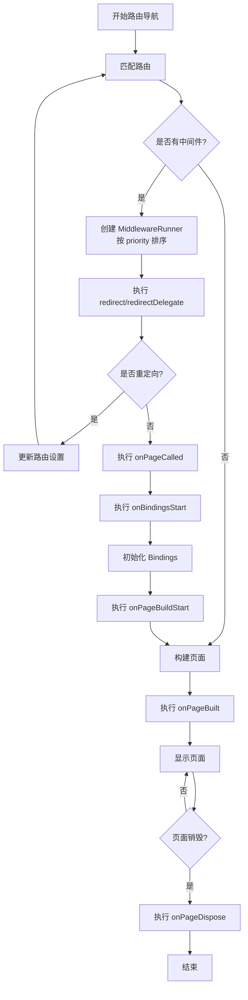

# route_middleware.dart 路由中间件系统详解

## 概述

`route_middleware.dart` 文件实现了 GetX 框架的路由中间件系统，提供了强大的路由拦截和修改能力。通过中间件机制，开发者可以在路由导航的各个生命周期阶段进行自定义处理，实现认证检查、权限验证、页面配置修改等功能。

### 核心组件

该文件包含三个主要类：

1. **GetMiddleware** - 抽象中间件基类，定义了中间件的生命周期钩子
2. **MiddlewareRunner** - 中间件执行器，负责按优先级排序和执行中间件
3. **PageRedirect** - 页面重定向处理器，处理路由重定向逻辑

### 使用场景

- **身份认证**：检查用户登录状态，未登录时重定向到登录页
- **权限控制**：根据用户权限决定是否允许访问特定页面
- **页面配置**：动态修改页面标题、绑定等配置信息
- **数据预处理**：在页面构建前进行数据准备
- **日志记录**：记录路由导航行为
- **页面装饰**：在页面构建后添加统一的装饰组件

## GetMiddleware 抽象类

`GetMiddleware` 是路由中间件的抽象基类，定义了中间件的标准接口和生命周期方法。

```dart 11:28:lib/get_navigation/src/routes/route_middleware.dart
abstract class GetMiddleware {
  GetMiddleware({this.priority = 0});

  /// The Order of the Middlewares to run.
  ///
  /// {@tool snippet}
  /// This Middewares will be called in this order.
  /// ```dart
  /// final middlewares = [
  ///   GetMiddleware(priority: 2),
  ///   GetMiddleware(priority: 5),
  ///   GetMiddleware(priority: 4),
  ///   GetMiddleware(priority: -8),
  /// ];
  /// ```
  ///  -8 => 2 => 4 => 5
  /// {@end-tool}
  final int priority;
```

### Priority 优先级机制

`priority` 属性决定了中间件的执行顺序。数值越小，优先级越高，越先执行。

**执行顺序示例**：

```dart
final middlewares = [
  GetMiddleware(priority: 2),
  GetMiddleware(priority: 5),
  GetMiddleware(priority: 4),
  GetMiddleware(priority: -8),
];
// 实际执行顺序：-8 => 2 => 4 => 5
```

### 生命周期方法

中间件提供了 7 个生命周期钩子方法，按照以下顺序执行：

```
redirect -> onPageCalled -> onBindingsStart -> 
onPageBuildStart -> onPageBuilt -> onPageDispose
```

#### 1. redirect - 路由重定向（旧版）

```dart 30:42:lib/get_navigation/src/routes/route_middleware.dart
  /// This function will be called when the page of
  /// the called route is being searched for.
  /// It take RouteSettings as a result an redirect to the new settings or
  /// give it null and there will be no redirecting.
  /// {@tool snippet}
  /// ```dart
  /// GetPage redirect(String route) {
  ///   final authService = Get.find<AuthService>();
  ///   return authService.authed.value ? null : RouteSettings(name: '/login');
  /// }
  /// ```
  /// {@end-tool}
  RouteSettings? redirect(String? route) => null;
```

**作用**：在路由匹配阶段进行重定向检查。如果返回 `RouteSettings`，则重定向到指定路由；返回 `null` 表示不重定向。

**使用场景**：简单的同步重定向逻辑。

#### 2. redirectDelegate - 路由重定向（新版，支持异步）

```dart 44:61:lib/get_navigation/src/routes/route_middleware.dart
  /// Similar to [redirect],
  /// This function will be called when the router delegate changes the
  /// current route.
  ///
  /// The default implmentation is to navigate to
  /// the input route, with no redirection.
  ///
  /// if this returns null, the navigation is stopped,
  /// and no new routes are pushed.
  /// {@tool snippet}
  /// ```dart
  /// GetNavConfig? redirect(GetNavConfig route) {
  ///   final authService = Get.find<AuthService>();
  ///   return authService.authed.value ? null : RouteSettings(name: '/login');
  /// }
  /// ```
  /// {@end-tool}
  FutureOr<RouteDecoder?> redirectDelegate(RouteDecoder route) => (route);
```

**作用**：在新版路由系统中进行重定向，支持异步操作。返回 `null` 会停止导航。

**使用示例**：

```dart
class AuthMiddleware extends GetMiddleware {
  @override
  Future<RouteDecoder?> redirectDelegate(RouteDecoder route) async {
    if (!AuthService.to.isLoggedInValue) {
      return RouteDecoder.fromRoute('/login');
    }
    return await super.redirectDelegate(route);
  }
}
```

#### 3. onPageCalled - 页面调用时修改页面配置

```dart 63:73:lib/get_navigation/src/routes/route_middleware.dart
  /// This function will be called when this Page is called
  /// you can use it to change something about the page or give it new page
  /// {@tool snippet}
  /// ```dart
  /// GetPage onPageCalled(GetPage page) {
  ///   final authService = Get.find<AuthService>();
  ///   return page.copyWith(title: 'Welcome ${authService.UserName}');
  /// }
  /// ```
  /// {@end-tool}
  GetPage? onPageCalled(GetPage? page) => page;
```

**作用**：在页面被调用时，可以修改页面配置或返回新的页面配置。

**使用场景**：

- 动态修改页面标题
- 根据用户信息调整页面配置
- 替换整个页面配置

#### 4. onBindingsStart - 绑定初始化前修改

```dart 75:88:lib/get_navigation/src/routes/route_middleware.dart
  /// This function will be called right before the [BindingsInterface] are initialize.
  /// Here you can change [BindingsInterface] for this page
  /// {@tool snippet}
  /// ```dart
  /// List<Bindings> onBindingsStart(List<Bindings> bindings) {
  ///   final authService = Get.find<AuthService>();
  ///   if (authService.isAdmin) {
  ///     bindings.add(AdminBinding());
  ///   }
  ///   return bindings;
  /// }
  /// ```
  /// {@end-tool}
  List<R>? onBindingsStart<R>(List<R>? bindings) => bindings;
```

**作用**：在依赖注入绑定初始化之前，可以添加、移除或修改绑定列表。

**使用场景**：

- 根据用户角色动态添加绑定
- 条件性地注入不同的服务
- 添加额外的数据绑定

#### 5. onPageBuildStart - 页面构建开始

```dart 90:91:lib/get_navigation/src/routes/route_middleware.dart
  /// This function will be called right after the [BindingsInterface] are initialize.
  GetPageBuilder? onPageBuildStart(GetPageBuilder? page) => page;
```

**作用**：在绑定初始化完成后、页面构建开始前调用，可以修改页面构建器。

#### 6. onPageBuilt - 页面构建完成后修改 Widget

```dart 93:96:lib/get_navigation/src/routes/route_middleware.dart
  /// This function will be called right after the
  /// GetPage.page function is called and will give you the result
  /// of the function. and take the widget that will be showed.
  Widget onPageBuilt(Widget page) => page;
```

**作用**：在页面 Widget 构建完成后，可以对其进行包装或修改。

**使用场景**：

- 添加全局装饰（如主题、布局）
- 包装错误边界
- 添加统一的导航栏或底部栏

#### 7. onPageDispose - 页面销毁时清理

```dart 98:98:lib/get_navigation/src/routes/route_middleware.dart
  void onPageDispose() {}
```

**作用**：在页面被销毁时调用，用于清理资源。

**使用场景**：

- 取消网络请求
- 清理定时器
- 释放资源

## MiddlewareRunner 类

`MiddlewareRunner` 是中间件执行器，负责管理中间件的执行顺序和生命周期调用。

```dart 101:110:lib/get_navigation/src/routes/route_middleware.dart
class MiddlewareRunner {
  MiddlewareRunner(List<GetMiddleware>? middlewares)
      : _middlewares = middlewares != null
            ? (List.of(middlewares)..sort(_compareMiddleware))
            : const [];

  final List<GetMiddleware> _middlewares;

  static int _compareMiddleware(GetMiddleware a, GetMiddleware b) =>
      a.priority.compareTo(b.priority);
```

### 核心特性

1. **自动排序**：构造函数中自动按 `priority` 对中间件进行排序
2. **空值处理**：如果传入 `null`，则使用空列表
3. **不可变列表**：使用 `const []` 作为默认值，确保线程安全

### 执行方法

#### runOnPageCalled

```dart 112:117:lib/get_navigation/src/routes/route_middleware.dart
  GetPage? runOnPageCalled(GetPage? page) {
    for (final middleware in _middlewares) {
      page = middleware.onPageCalled(page);
    }
    return page;
  }
```

按优先级顺序执行所有中间件的 `onPageCalled` 方法，每个中间件可以修改页面配置。

#### runRedirect

```dart 119:127:lib/get_navigation/src/routes/route_middleware.dart
  RouteSettings? runRedirect(String? route) {
    for (final middleware in _middlewares) {
      final redirectTo = middleware.redirect(route);
      if (redirectTo != null) {
        return redirectTo;
      }
    }
    return null;
  }
```

按优先级顺序检查重定向，一旦有中间件返回非 `null` 的重定向目标，立即返回，后续中间件不再执行。

#### runOnBindingsStart

```dart 129:134:lib/get_navigation/src/routes/route_middleware.dart
  List<R>? runOnBindingsStart<R>(List<R>? bindings) {
    for (final middleware in _middlewares) {
      bindings = middleware.onBindingsStart(bindings);
    }
    return bindings;
  }
```

按顺序执行所有中间件的 `onBindingsStart` 方法，每个中间件可以修改绑定列表。

#### runOnPageBuildStart

```dart 136:141:lib/get_navigation/src/routes/route_middleware.dart
  GetPageBuilder? runOnPageBuildStart(GetPageBuilder? page) {
    for (final middleware in _middlewares) {
      page = middleware.onPageBuildStart(page);
    }
    return page;
  }
```

按顺序执行所有中间件的 `onPageBuildStart` 方法。

#### runOnPageBuilt

```dart 143:148:lib/get_navigation/src/routes/route_middleware.dart
  Widget runOnPageBuilt(Widget page) {
    for (final middleware in _middlewares) {
      page = middleware.onPageBuilt(page);
    }
    return page;
  }
```

按顺序执行所有中间件的 `onPageBuilt` 方法，每个中间件可以包装或修改 Widget。

#### runOnPageDispose

```dart 150:154:lib/get_navigation/src/routes/route_middleware.dart
  void runOnPageDispose() {
    for (final middleware in _middlewares) {
      middleware.onPageDispose();
    }
  }
```

按顺序执行所有中间件的 `onPageDispose` 方法，用于清理资源。

## PageRedirect 类

`PageRedirect` 负责处理页面重定向逻辑，包括路由匹配、重定向检查和页面参数处理。

```dart 157:168:lib/get_navigation/src/routes/route_middleware.dart
class PageRedirect {
  GetPage? route;
  GetPage? unknownRoute;
  RouteSettings? settings;
  bool isUnknown;

  PageRedirect({
    this.route,
    this.unknownRoute,
    this.isUnknown = false,
    this.settings,
  });
```

### 核心属性

- `route` - 当前匹配的路由
- `unknownRoute` - 未知路由（404 页面）
- `settings` - 路由设置
- `isUnknown` - 是否为未知路由

### getPageToRoute 方法

```dart 170:202:lib/get_navigation/src/routes/route_middleware.dart
  // redirect all pages that needes redirecting
  GetPageRoute<T> getPageToRoute<T>(
      GetPage rou, GetPage? unk, BuildContext context) {
    while (needRecheck(context)) {}
    final r = (isUnknown ? unk : rou)!;

    return GetPageRoute<T>(
      page: r.page,
      parameter: r.parameters,
      alignment: r.alignment,
      title: r.title,
      maintainState: r.maintainState,
      routeName: r.name,
      settings: r,
      curve: r.curve,
      showCupertinoParallax: r.showCupertinoParallax,
      gestureWidth: r.gestureWidth,
      opaque: r.opaque,
      customTransition: r.customTransition,
      bindings: r.bindings,
      binding: r.binding,
      binds: r.binds,
      transitionDuration: r.transitionDuration ?? Get.defaultTransitionDuration,
      reverseTransitionDuration:
          r.reverseTransitionDuration ?? Get.defaultTransitionDuration,
      // performIncomeAnimation: _r.performIncomeAnimation,
      // performOutGoingAnimation: _r.performOutGoingAnimation,
      transition: r.transition,
      popGesture: r.popGesture,
      fullscreenDialog: r.fullscreenDialog,
      middlewares: r.middlewares,
    );
  }
```

**作用**：将 `GetPage` 转换为 `GetPageRoute`。在转换前，通过 `while (needRecheck(context)) {}` 循环检查重定向，直到没有中间件需要重定向为止。

### needRecheck 方法 - 重定向检查机制

```dart 204:232:lib/get_navigation/src/routes/route_middleware.dart
  /// check if redirect is needed
  bool needRecheck(BuildContext context) {
    if (settings == null && route != null) {
      settings = route;
    }
    final match = context.delegate.matchRoute(settings!.name!);

    // No Match found
    if (match.route == null) {
      isUnknown = true;
      return false;
    }

    // No middlewares found return match.
    if (match.route!.middlewares.isEmpty) {
      return false;
    }

    final runner = MiddlewareRunner(match.route!.middlewares);
    route = runner.runOnPageCalled(match.route);
    addPageParameter(route!);

    final newSettings = runner.runRedirect(settings!.name);
    if (newSettings == null) {
      return false;
    }
    settings = newSettings;
    return true;
  }
```

**执行流程**：

1. 如果 `settings` 为 `null`，使用 `route` 初始化
2. 通过路由委托匹配路由
3. 如果未找到匹配，标记为未知路由，返回 `false`
4. 如果没有中间件，返回 `false`（无需重定向）
5. 创建 `MiddlewareRunner` 并执行中间件
6. 执行 `onPageCalled` 和 `runRedirect`
7. 如果有重定向，更新 `settings` 并返回 `true`（需要重新检查）
8. 如果没有重定向，返回 `false`（检查完成）

**循环重定向处理**：通过 `while (needRecheck(context)) {}` 实现，直到所有中间件都不再重定向为止。

### addPageParameter 方法

```dart 234:240:lib/get_navigation/src/routes/route_middleware.dart
  void addPageParameter(GetPage route) {
    if (route.parameters == null) return;

    final parameters = Map<String, String?>.from(Get.parameters);
    parameters.addEntries(route.parameters!.entries);
    // Get.parameters = parameters;
  }
```

**作用**：将路由参数合并到全局参数中。注意：当前实现中合并后的参数并未赋值回 `Get.parameters`（代码被注释）。

## 使用示例

### 认证中间件示例

```dart
class EnsureAuthMiddleware extends GetMiddleware {
  @override
  Future<RouteDecoder?> redirectDelegate(RouteDecoder route) async {
    if (!AuthService.to.isLoggedInValue) {
      final newRoute = Routes.LOGIN_THEN(route.pageSettings!.name);
      return RouteDecoder.fromRoute(newRoute);
    }
    return await super.redirectDelegate(route);
  }
}

class EnsureNotAuthedMiddleware extends GetMiddleware {
  @override
  Future<RouteDecoder?> redirectDelegate(RouteDecoder route) async {
    if (AuthService.to.isLoggedInValue) {
      // 已登录用户不应访问登录页
      return null; // 停止导航
    }
    return await super.redirectDelegate(route);
  }
}
```

### 多中间件优先级示例

```dart
GetPage(
  name: '/admin',
  page: () => AdminPage(),
  middlewares: [
    LoggingMiddleware(priority: -10),      // 最先执行：记录日志
    AuthMiddleware(priority: 0),            // 其次：检查认证
    PermissionMiddleware(priority: 5),      // 最后：检查权限
  ],
);
```

### 动态修改页面配置

```dart
class TitleMiddleware extends GetMiddleware {
  @override
  GetPage? onPageCalled(GetPage? page) {
    if (page != null) {
      final userName = Get.find<UserService>().userName;
      return page.copyWith(title: '欢迎，$userName');
    }
    return page;
  }
}
```

### 条件性添加绑定

```dart
class AdminBindingMiddleware extends GetMiddleware {
  @override
  List<Bindings>? onBindingsStart(List<Bindings>? bindings) {
    final authService = Get.find<AuthService>();
    if (authService.isAdmin) {
      bindings ??= [];
      bindings.add(AdminBinding());
    }
    return bindings;
  }
}
```

## 中间件执行流程图

以下流程图展示了中间件在路由导航过程中的完整执行流程：



## 注意事项和最佳实践

### 优先级设置建议

1. **认证检查**：使用较低优先级（如 `-10`），确保最先执行
2. **权限检查**：使用中等优先级（如 `0`），在认证之后执行
3. **日志记录**：使用最低优先级（如 `-20`），确保最先记录
4. **页面装饰**：使用较高优先级（如 `10`），最后执行

### 性能考虑

1. **避免阻塞操作**：`redirect` 和 `redirectDelegate` 中避免执行耗时操作
2. **异步处理**：需要异步操作时，使用 `redirectDelegate` 而非 `redirect`
3. **缓存检查结果**：对于重复的认证/权限检查，考虑缓存结果

### 常见错误和解决方案

#### 错误 1：重定向循环

**问题**：中间件 A 重定向到路由 B，路由 B 的中间件又重定向回路由 A，造成无限循环。

**解决方案**：

- 在重定向前检查目标路由
- 使用标志位防止循环重定向
- 限制重定向次数

#### 错误 2：优先级设置不当

**问题**：权限检查在认证检查之前执行，导致未登录用户也能通过权限检查。

**解决方案**：

- 确保认证检查的优先级低于权限检查
- 在权限检查中先验证用户是否已登录

#### 错误 3：在 onPageDispose 中访问已销毁的资源

**问题**：页面销毁后，某些资源可能已经不可用。

**解决方案**：

- 在 `onPageDispose` 中进行空值检查
- 使用安全的方式访问资源

### 最佳实践总结

1. **单一职责**：每个中间件只负责一个功能（认证、权限、日志等）
2. **可测试性**：中间件应该是纯函数，易于单元测试
3. **错误处理**：在中间件中妥善处理异常情况
4. **文档注释**：为自定义中间件添加清晰的文档说明
5. **性能监控**：监控中间件的执行时间，避免性能瓶颈

## 总结

`route_middleware.dart` 提供了强大的路由中间件系统，通过 7 个生命周期钩子，开发者可以在路由导航的各个阶段进行自定义处理。`MiddlewareRunner` 确保中间件按优先级正确执行，`PageRedirect` 处理复杂的重定向逻辑。合理使用中间件可以大大简化路由管理，提高代码的可维护性和可扩展性。
