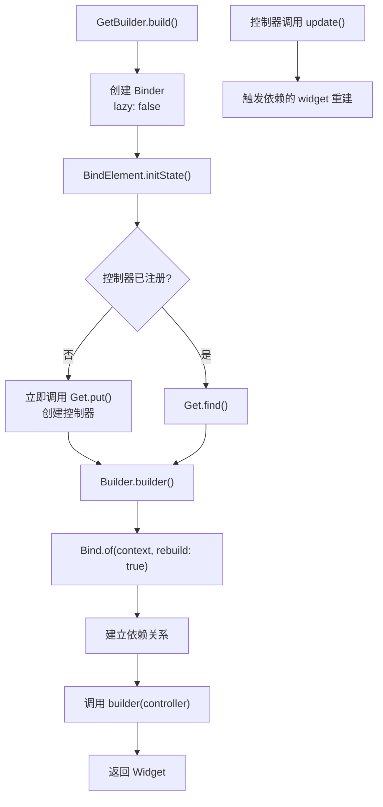
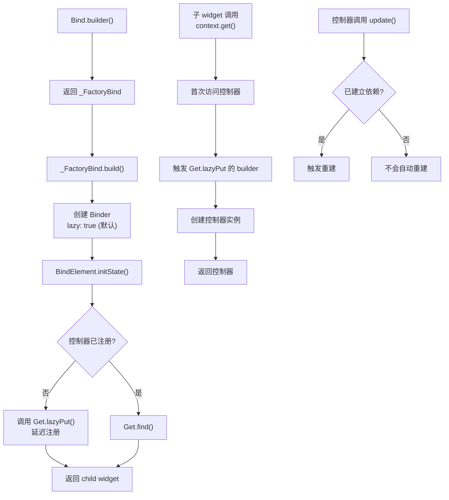

# Bind.builder 与 GetBuilder 注册控制器区别详解

## 概述

`Bind.builder` 和 `GetBuilder` 都是 GetX 中用于注册控制器和管理依赖注入的组件，但它们在使用方式、初始化机制和灵活性方面存在重要区别。本文档将从源码层面深入分析这两种方式的差异，帮助开发者根据实际场景选择合适的方式。

### 定位

- **GetBuilder**：一个具体的 Widget 类，专门用于需要立即创建控制器并构建 UI 的场景，提供了简化的 API 和自动重建机制。

- **Bind.builder**：一个工厂方法，返回 `_FactoryBind` 实例，提供了更灵活的控制器注册方式，支持延迟创建和多种初始化模式。

## 源码对比分析

### GetBuilder 实现

```dart 34:87:lib/get_state_manager/src/simple/get_state.dart
class GetBuilder<T extends GetxController> extends StatelessWidget {
  final GetControllerBuilder<T> builder;
  final bool global;
  final Object? id;
  final String? tag;
  final bool autoRemove;
  final bool assignId;
  final Object Function(T value)? filter;
  final void Function(BindElement<T> state)? initState,
      dispose,
      didChangeDependencies;
  final void Function(Binder<T> oldWidget, BindElement<T> state)?
      didUpdateWidget;
  final T? init;

  const GetBuilder({
    super.key,
    this.init,
    this.global = true,
    required this.builder,
    this.autoRemove = true,
    this.assignId = false,
    this.initState,
    this.filter,
    this.tag,
    this.dispose,
    this.id,
    this.didChangeDependencies,
    this.didUpdateWidget,
  });

  @override
  Widget build(BuildContext context) {
    return Binder(
      init: init == null ? null : () => init!,
      global: global,
      autoRemove: autoRemove,
      assignId: assignId,
      initState: initState,
      filter: filter,
      tag: tag,
      dispose: dispose,
      id: id,
      lazy: false,
      didChangeDependencies: didChangeDependencies,
      didUpdateWidget: didUpdateWidget,
      child: Builder(builder: (context) {
        final controller = Bind.of<T>(context, rebuild: true);
        return builder(controller);
      }),
    );
    // return widget.builder(controller!);
  }
}
```

**关键点**：

1. **lazy 参数固定为 false**：在第 61 行，`lazy: false` 是硬编码的，意味着控制器会立即创建。

2. **只支持 init 初始化**：只接受 `T? init` 参数，不支持 `create` 回调。

3. **自动重建机制**：在第 65 行，`Bind.of<T>(context, rebuild: true)` 中的 `rebuild: true` 会自动建立依赖关系，当控制器调用 `update()` 时会触发重建。

4. **直接返回 Widget**：在第 66 行，直接调用 `builder(controller)` 返回构建的 Widget。

### Bind.builder 实现

```dart 207:237:lib/get_state_manager/src/simple/get_state.dart
  factory Bind.builder({
    Widget? child,
    InitBuilder<T>? init,
    InstanceCreateBuilderCallback<T>? create,
    bool global = true,
    bool autoRemove = true,
    bool assignId = false,
    Object Function(T value)? filter,
    String? tag,
    Object? id,
    void Function(BindElement<T> state)? initState,
    void Function(BindElement<T> state)? dispose,
    void Function(BindElement<T> state)? didChangeDependencies,
    void Function(Binder<T> oldWidget, BindElement<T> state)? didUpdateWidget,
  }) =>
      _FactoryBind<T>(
        // key: key,
        init: init,
        create: create,
        global: global,
        autoRemove: autoRemove,
        assignId: assignId,
        initState: initState,
        filter: filter,
        tag: tag,
        dispose: dispose,
        id: id,
        didChangeDependencies: didChangeDependencies,
        didUpdateWidget: didUpdateWidget,
        child: child,
      );
```

```dart 336:352:lib/get_state_manager/src/simple/get_state.dart
  @override
  Widget build(BuildContext context) {
    return Binder<T>(
      create: create,
      global: global,
      autoRemove: autoRemove,
      assignId: assignId,
      initState: initState,
      filter: filter,
      tag: tag,
      dispose: dispose,
      id: id,
      didChangeDependencies: didChangeDependencies,
      didUpdateWidget: didUpdateWidget,
      child: child!,
    );
  }
```

**关键点**：

1. **lazy 默认为 true**：`_FactoryBind` 的 `build` 方法中创建 `Binder` 时没有显式设置 `lazy` 参数，而 `Binder` 的默认值是 `lazy: true`（见第 382 行），这意味着控制器会延迟创建。

2. **支持两种初始化方式**：
   - `init`：直接提供控制器实例的构建函数
   - `create`：提供 `InstanceCreateBuilderCallback`，可以访问 `BindElement` 进行更复杂的初始化

3. **需要手动获取控制器**：子 widget 需要通过 `Bind.of<T>(context)` 或 `context.get<T>()` 来获取控制器，不会自动建立重建依赖。

4. **更灵活的配置**：支持 `create` 回调，可以在创建控制器时访问 `BindElement`，实现更复杂的初始化逻辑。

### Binder 中的 lazy 参数影响

```dart 452:489:lib/get_state_manager/src/simple/get_state.dart
  void initState() {
    widget.initState?.call(this);

    var isRegistered = Get.isRegistered<T>(tag: widget.tag);

    if (widget.global) {
      if (isRegistered) {
        if (Get.isPrepared<T>(tag: widget.tag)) {
          _isCreator = true;
        } else {
          _isCreator = false;
        }

        _controllerBuilder = () => Get.find<T>(tag: widget.tag);
      } else {
        _controllerBuilder =
            () => (widget.create?.call(this) ?? widget.init?.call());
        _isCreator = true;
        if (widget.lazy) {
          Get.lazyPut<T>(_controllerBuilder!, tag: widget.tag);
        } else {
          Get.put<T>(_controllerBuilder!(), tag: widget.tag);
        }
      }
    } else {
      if (widget.create != null) {
        _controllerBuilder = () => widget.create!.call(this);
        Get.spawn<T>(_controllerBuilder!, tag: widget.tag, permanent: false);
      } else {
        _controllerBuilder = widget.init;
      }
      _controllerBuilder =
          (widget.create != null ? () => widget.create!.call(this) : null) ??
              widget.init;
      _isCreator = true;
      _needStart = true;
    }
  }
```

**关键逻辑**：

- **lazy: false**（GetBuilder）：在第 176 行，立即调用 `Get.put<T>(_controllerBuilder!(), tag: widget.tag)`，控制器立即创建并注册。

- **lazy: true**（Bind.builder 默认）：在第 174 行，调用 `Get.lazyPut<T>(_controllerBuilder!, tag: widget.tag)`，控制器延迟创建，只有在首次访问时才会创建。

## 核心区别总结

| 特性 | GetBuilder | Bind.builder |
|------|-----------|--------------|
| **类型** | 具体的 Widget 类 | 工厂方法，返回 `_FactoryBind` |
| **lazy 参数** | 固定为 `false`（立即创建） | 默认为 `true`（延迟创建） |
| **初始化方式** | 只支持 `init`（直接传入控制器实例） | 支持 `init` 和 `create` 两种方式 |
| **自动重建** | 自动建立依赖关系（`rebuild: true`） | 需要手动调用 `Bind.of<T>(context, rebuild: true)` |
| **使用方式** | 直接作为 Widget 使用，传入 `builder` 回调 | 作为 Widget 包装器，子 widget 需要手动获取控制器 |
| **灵活性** | 相对简单，适合标准场景 | 更灵活，适合复杂场景 |
| **适用场景** | 需要立即创建控制器并自动重建 UI | 需要延迟创建或复杂初始化逻辑 |

## 使用场景

### 使用 GetBuilder 的场景

1. **简单的状态管理**：控制器需要立即创建，UI 需要自动响应控制器更新。

2. **标准 CRUD 操作**：列表展示、表单编辑等常见场景。

3. **快速开发**：不需要复杂的初始化逻辑，希望代码简洁。

**示例**：

```dart
GetBuilder<CounterController>(
  init: CounterController(),
  builder: (controller) {
    return Text('Count: ${controller.count}');
  },
)
```

### 使用 Bind.builder 的场景

1. **延迟创建**：控制器创建成本高，希望延迟到真正需要时才创建。

2. **复杂初始化**：需要在创建控制器时访问 `BindElement`，进行依赖注入或复杂配置。

3. **局部作用域**：使用 `global: false` 创建局部作用域的控制器。

4. **多个子 widget 共享控制器**：多个子 widget 需要访问同一个控制器，但不需要自动重建。

**示例**：

```dart
// 延迟创建
Bind.builder<DataController>(
  init: () => DataController(),
  child: MyWidget(),
)

// 复杂初始化
Bind.builder<ComplexController>(
  create: (element) {
    final service = Get.find<DataService>();
    return ComplexController(service: service);
  },
  global: false,
  child: MyWidget(),
)

// 在子 widget 中获取控制器
class MyWidget extends StatelessWidget {
  @override
  Widget build(BuildContext context) {
    final controller = context.get<DataController>();
    return Text('Data: ${controller.data}');
  }
}
```

## 代码示例对比

### 示例 1：基本使用

**GetBuilder 方式**：

```dart
class CounterPage extends StatelessWidget {
  @override
  Widget build(BuildContext context) {
    return Scaffold(
      body: GetBuilder<CounterController>(
        init: CounterController(),
        builder: (controller) {
          return Center(
            child: Column(
              mainAxisAlignment: MainAxisAlignment.center,
              children: [
                Text('Count: ${controller.count}'),
                ElevatedButton(
                  onPressed: () => controller.increment(),
                  child: Text('Increment'),
                ),
              ],
            ),
          );
        },
      ),
    );
  }
}
```

**Bind.builder 方式**：

```dart
class CounterPage extends StatelessWidget {
  @override
  Widget build(BuildContext context) {
    return Scaffold(
      body: Bind.builder<CounterController>(
        init: () => CounterController(),
        child: CounterView(),
      ),
    );
  }
}

class CounterView extends StatelessWidget {
  @override
  Widget build(BuildContext context) {
    final controller = context.get<CounterController>();
    return Center(
      child: Column(
        mainAxisAlignment: MainAxisAlignment.center,
        children: [
          Text('Count: ${controller.count}'),
          ElevatedButton(
            onPressed: () => controller.increment(),
            child: Text('Increment'),
          ),
        ],
      ),
    );
  }
}
```

### 示例 2：延迟创建

**GetBuilder**：无法实现延迟创建，因为 `lazy` 固定为 `false`。

**Bind.builder**：支持延迟创建。

```dart
// 控制器只有在首次访问时才会创建
Bind.builder<HeavyController>(
  init: () => HeavyController(), // 延迟创建
  child: MyWidget(),
)
```

### 示例 3：复杂初始化

**GetBuilder**：无法实现，因为不支持 `create` 回调。

**Bind.builder**：支持复杂初始化。

```dart
Bind.builder<OrderController>(
  create: (element) {
    // 可以访问 BindElement，进行依赖注入
    final userService = Get.find<UserService>();
    final paymentService = Get.find<PaymentService>();
    return OrderController(
      userService: userService,
      paymentService: paymentService,
    );
  },
  global: false, // 局部作用域
  child: OrderPage(),
)
```

## 执行流程对比

### GetBuilder 执行流程



### Bind.builder 执行流程



## 总结

`GetBuilder` 和 `Bind.builder` 各有优势，选择哪种方式取决于具体需求：

- **选择 GetBuilder**：当你需要简单的状态管理，控制器需要立即创建，并且希望 UI 自动响应控制器更新时。

- **选择 Bind.builder**：当你需要延迟创建控制器、进行复杂的初始化逻辑、或者需要更灵活的控制时。

理解这两种方式的区别有助于在合适的场景使用合适的工具，提高代码的可维护性和性能。
